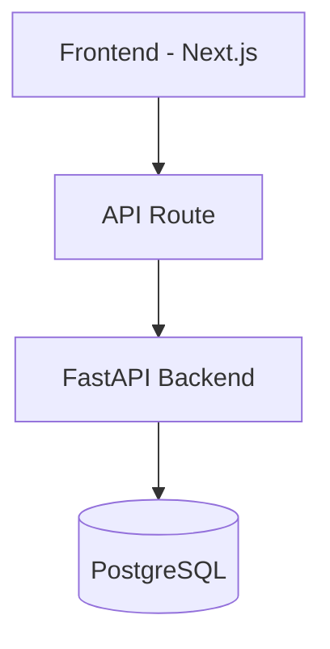

## Goal

Create a detailed, actionable implementation plan for: **`${input:PlanPurpose}`**

Save the output to: `docs/features/<feature-name>/implementation-plan.md`

## Plan Structure

```markdown
---
goal: <Concise title>
version: 1.0
date_created: YYYY-MM-DD
status: 'Planned'
tags: [feature|refactor|infrastructure|migration]
---

# Implementation Plan: <Title>


## 1. Requirements & Constraints

- **REQ-001**: <Requirement>
- **SEC-001**: <Security requirement>
- **CON-001**: <Constraint>

## 2. Implementation Steps

### Phase 1: <Phase Name>

- GOAL-001: <What this phase achieves>

| Task | Description | File(s) | Completed |
|------|-------------|---------|-----------|
| TASK-001 | Description | `path/to/file.ts` | |
| TASK-002 | Description | `path/to/route.py` | |

### Phase 2: <Phase Name>

...

## 3. Architecture Diagram



## 4. API Design

- `POST /api/v1/<resource>` — description
- Request: `{ field: type }`
- Response: `{ field: type }`

## 5. Database Changes

- New table/column: description
- Alembic migration: `alembic revision --autogenerate -m "add_<feature>"`
- Indexes needed: list

## 6. Frontend Changes

- New components: list
- Store changes (Zustand): list
- Routes affected: list

## 7. Testing

| Test | Type | File |
|------|------|------|
| TEST-001 | pytest unit | `backend/tests/test_<feature>.py` |
| TEST-002 | Playwright E2E | `frontend/tests/e2e/<feature>.spec.ts` |

## 8. Risks & Assumptions

- **RISK-001**: <Risk and mitigation>
- **ASSUMPTION-001**: <Assumption>

## 9. Dependencies

- **DEP-001**: <Library or service required>
```

## Tips

- Keep tasks atomic — one task = one file or one function changed.
- Reference exact file paths (`src/app/api/...`, `backend/app/services/...`).
- For DB changes, always include the Alembic migration step.
- For new API endpoints, define the full request/response schema.
- Security requirements must be explicit (auth check, rate limit, input validation).

Source: [github/awesome-copilot — create-implementation-plan](https://github.com/github/awesome-copilot/tree/main/skills/create-implementation-plan)
