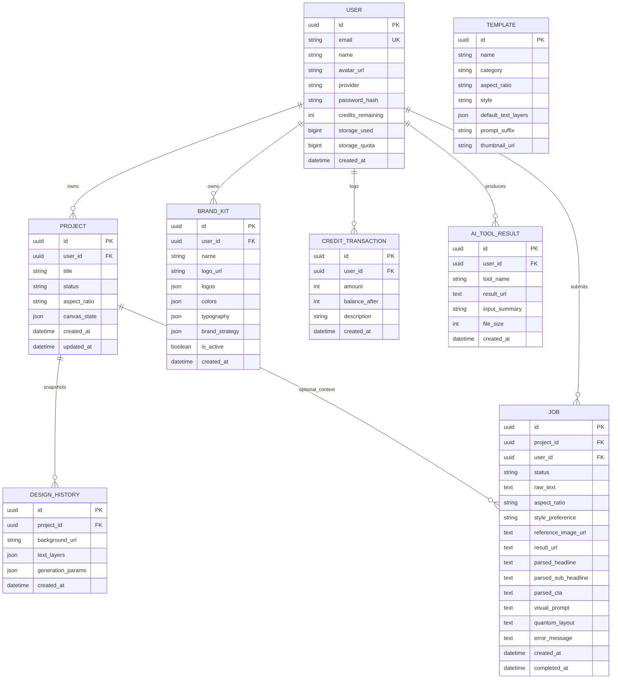

# SmartDesign Studio — Data Model Overview

> Status: Draft v1  
> Last updated: 2026-03-23

Dokumen ini merangkum model data backend yang saat ini terdefinisi di `backend/app/models/`.

Tujuan dokumen:
- memberi gambaran entity inti dan relasinya,
- membantu onboarding developer,
- menjadi referensi sebelum membuat migration baru,
- mempermudah feature planning seperti credit system, template marketplace, analytics, dan chat-to-design.

## Related docs

- [System Architecture](../architecture/system-architecture.md)
- [Deployment Topology](../architecture/deployment-topology.md)
- [Design Generation Sequence](../architecture/design-generation-sequence.md)
- [Platform Hardening Plan](../features/platform-hardening/implementation-plan.md)
- [Template Marketplace Plan](../features/template-marketplace/implementation-plan.md)

---

## 1. Prinsip Model Data Saat Ini

Data model SmartDesign Studio saat ini berpusat pada beberapa domain utama:

1. **Identity & account** — `User`
2. **Project editing** — `Project`, `DesignHistory`
3. **Async generation tracking** — `Job`
4. **Reusable assets** — `Template`, `BrandKit`
5. **Usage & monetization** — `CreditTransaction`
6. **AI tool outputs** — `AiToolResult`

Secara umum:
- **PostgreSQL** menyimpan metadata, state, dan audit record,
- **Object storage** menyimpan file image/asset aktual,
- tabel database menyimpan URL, state JSON, dan jejak transaksi.

---

## 2. Entity Relationship Diagram

---

## 3. Entity Catalog

## 3.1 `User`

Representasi akun utama pengguna.

### Fungsi bisnis

- identitas user,
- sumber kepemilikan project dan brand kit,
- penyimpan saldo credit aktif,
- penyimpan kuota storage,
- root entity untuk delete account.

### Field penting

| Field | Type | Catatan |
|---|---|---|
| `id` | UUID | primary key |
| `email` | String | unik, indexed |
| `name` | String | nama tampilan user |
| `avatar_url` | String? | URL avatar |
| `provider` | String | default `google` |
| `password_hash` | String? | opsional untuk auth non-OAuth |
| `credits_remaining` | Integer | saldo credit aktif |
| `storage_used` | BigInteger | penggunaan storage aktual |
| `storage_quota` | BigInteger | default 100 MB untuk free tier |
| `created_at` | DateTime | waktu akun dibuat |

### Relasi

- 1 user → banyak `Project`
- 1 user → banyak `BrandKit`
- 1 user → banyak `CreditTransaction`
- 1 user → banyak `AiToolResult`
- 1 user → banyak `Job`

### Catatan penting

- `credits_remaining` adalah **current balance**, bukan ledger lengkap.
- histori perubahan credit disimpan terpisah di `CreditTransaction`.
- penghapusan user memerlukan perhatian khusus karena tidak semua FK punya `ondelete="CASCADE"`.

---

## 3.2 `Project`

Entity utama untuk desain yang sedang atau sudah diedit user.

### Fungsi bisnis

- menyimpan kanvas aktif,
- menjadi anchor untuk history/snapshot,
- menjadi konteks opsional untuk job generasi desain,
- menjadi unit kerja utama di editor.

### Field penting

| Field | Type | Catatan |
|---|---|---|
| `id` | UUID | primary key |
| `user_id` | UUID | FK ke `users.id`, `ondelete=CASCADE` |
| `title` | String | default `Untitled Design` |
| `status` | String | default `draft` |
| `aspect_ratio` | String | contoh `1:1`, `9:16` |
| `canvas_state` | JSON? | state editor yang tersimpan |
| `created_at` | DateTime | created timestamp |
| `updated_at` | DateTime | auto update timestamp |

### Relasi

- banyak `Project` dimiliki satu `User`
- satu `Project` punya banyak `DesignHistory`
- satu `Project` dapat punya banyak `Job` terkait

### Catatan desain

- `canvas_state` disimpan sebagai JSON agar fleksibel terhadap struktur editor.
- pendekatan ini cepat untuk iterasi produk, tetapi perlu disiplin versi schema bila format editor terus berkembang.

---

## 3.3 `DesignHistory`

Snapshot histori perubahan/generasi pada sebuah project.

### Fungsi bisnis

- menyimpan state historis desain,
- mendukung undo/version timeline di level backend,
- menyimpan parameter generasi terkait snapshot tertentu.

### Field penting

| Field | Type | Catatan |
|---|---|---|
| `id` | UUID | primary key |
| `project_id` | UUID | FK ke `projects.id`, `ondelete=CASCADE` |
| `background_url` | String | asset background untuk snapshot |
| `text_layers` | JSON | representasi layer teks |
| `generation_params` | JSON? | parameter generasi bila ada |
| `created_at` | DateTime | waktu snapshot dibuat |

### Relasi

- banyak `DesignHistory` milik satu `Project`

### Catatan desain

- tabel ini lebih mirip **snapshot log** daripada event sourcing penuh.
- saat fitur collaboration atau version restore berkembang, tabel ini mungkin perlu metadata tambahan seperti `author_id`, `change_type`, atau `restored_from_history_id`.

---

## 3.4 `Job`

Tracker untuk pipeline generasi desain asynchronous.

### Fungsi bisnis

- melacak permintaan generasi desain,
- menyimpan input dan output job,
- menyimpan status pipeline,
- menyimpan hasil parsing AI dan quantum layout untuk observability/replay sederhana.

### Field penting

| Field | Type | Catatan |
|---|---|---|
| `id` | UUID | primary key |
| `project_id` | UUID? | FK opsional ke project |
| `user_id` | UUID | FK ke user |
| `status` | String | `queued`, `processing`, `completed`, `failed` |
| `raw_text` | Text | brief asli dari user |
| `aspect_ratio` | String | rasio output |
| `style_preference` | String | style yang dipilih |
| `reference_image_url` | Text? | optional reference |
| `result_url` | Text? | URL hasil final |
| `parsed_headline` | Text? | hasil parsing |
| `parsed_sub_headline` | Text? | hasil parsing |
| `parsed_cta` | Text? | hasil parsing |
| `visual_prompt` | Text? | prompt visual final |
| `quantum_layout` | Text? | hasil optimizer |
| `error_message` | Text? | detail error internal |
| `created_at` | DateTime | waktu job dibuat |
| `completed_at` | DateTime? | waktu selesai/gagal |

### Relasi

- banyak `Job` milik satu `User`
- sebuah `Job` dapat terkait ke satu `Project`

### Catatan penting

- `Job.user_id` **tidak** memakai `ondelete=CASCADE`.
- karena itu, delete account saat ini melakukan cleanup manual untuk job sebelum user dihapus.
- `Job` menyimpan cukup banyak field derivatif agar proses polling/debugging lebih mudah tanpa harus recompute.

---

## 3.5 `Template`

Template desain reusable yang dapat dipilih user.

### Fungsi bisnis

- menyediakan titik awal desain yang lebih cepat,
- mengelompokkan template berdasarkan kategori,
- menyimpan default text layout dan style dasar.

### Field penting

| Field | Type | Catatan |
|---|---|---|
| `id` | UUID | primary key |
| `name` | String | nama template |
| `category` | String | indexed |
| `aspect_ratio` | String | rasio template |
| `style` | String | style preset |
| `default_text_layers` | JSON | layer teks default |
| `prompt_suffix` | String? | tambahan prompt untuk AI |
| `thumbnail_url` | String? | preview asset |

### Catatan desain

- saat ini `Template` belum terhubung ke `User`; artinya masih model template sistem/global.
- roadmap `community template submission` kemungkinan akan membutuhkan tabel tambahan seperti `template_submissions`, `template_versions`, atau ownership field baru.

---

## 3.6 `BrandKit`

Profil identitas merek per user.

### Fungsi bisnis

- menyimpan warna brand,
- menyimpan satu atau banyak logo,
- menyimpan pilihan tipografi,
- menjadi konteks untuk prompt enrichment dan konsistensi visual.

### Field penting

| Field | Type | Catatan |
|---|---|---|
| `id` | UUID | primary key |
| `user_id` | UUID | FK ke `users.id`, `ondelete=CASCADE` |
| `name` | String | nama brand kit |
| `logo_url` | String? | field legacy/single-logo fallback |
| `logos` | JSON? | list URL logo |
| `colors` | JSON | daftar warna hex |
| `typography` | JSON? | font pair/config |
| `brand_strategy` | JSON? | strategy report / notes |
| `is_active` | Boolean | active kit toggle |
| `created_at` | DateTime | timestamp |

### Relasi

- banyak `BrandKit` milik satu `User`

### Catatan desain

- ada jejak evolusi model: `logo_url` dipertahankan untuk kompatibilitas, sementara `logos` sudah mendukung multi-logo.
- API saat ini juga menerapkan batas jumlah brand kit untuk free tier.

---

## 3.7 `CreditTransaction`

Ledger histori perubahan saldo credit user.

### Fungsi bisnis

- audit perubahan credit,
- sumber histori di halaman user,
- penjelas setiap debit/refund/top-up bonus.

### Field penting

| Field | Type | Catatan |
|---|---|---|
| `id` | UUID | primary key |
| `user_id` | UUID | FK ke `users.id`, `ondelete=CASCADE`, indexed |
| `amount` | Integer | positif/negatif |
| `balance_after` | Integer | saldo setelah transaksi |
| `description` | String | alasan perubahan |
| `created_at` | DateTime | timestamp |

### Relasi

- banyak `CreditTransaction` milik satu `User`

### Catatan desain

- kombinasi `User.credits_remaining` + `CreditTransaction` membentuk pola **balance + ledger**.
- ini cukup praktis untuk aplikasi SaaS kredit, selama semua mutation lewat service tunggal yang konsisten.

---

## 3.8 `AiToolResult`

Histori hasil tool AI di luar flow generasi desain utama.

### Fungsi bisnis

- menyimpan hasil background swap, upscale, retouch, watermark, dan tool lainnya,
- memungkinkan gallery hasil per user,
- menyimpan metadata ringkas input/output.

### Field penting

| Field | Type | Catatan |
|---|---|---|
| `id` | UUID | primary key |
| `user_id` | UUID | FK ke `users.id`, `ondelete=CASCADE` |
| `tool_name` | String(50) | indexed |
| `result_url` | Text | URL hasil |
| `input_summary` | String(200)? | ringkasan input |
| `file_size` | Integer | ukuran file output |
| `created_at` | DateTime | timestamp |

### Relasi

- banyak `AiToolResult` milik satu `User`

---

## 4. Ownership & Cascade Rules

Berikut ringkasan perilaku kepemilikan data:

| Child table | Parent | Cascade behavior |
|---|---|---|
| `projects` | `users` | DB cascade (`ondelete=CASCADE`) |
| `design_history` | `projects` | DB cascade (`ondelete=CASCADE`) |
| `brand_kits` | `users` | DB cascade (`ondelete=CASCADE`) |
| `credit_transactions` | `users` | DB cascade (`ondelete=CASCADE`) |
| `ai_tool_results` | `users` | DB cascade (`ondelete=CASCADE`) |
| `jobs` | `users` | **manual cleanup needed** |
| `jobs` | `projects` | FK ada, tanpa keterangan cascade eksplisit di model |

### Implikasi

- delete user relatif aman untuk sebagian besar entity,
- tetapi `Job` masih menjadi pengecualian penting,
- jika volume job makin besar, manual delete pada account removal bisa menjadi bottleneck dan layak dimigrasikan ke cascade atau soft delete strategy.

---

## 5. JSON-heavy Columns

Beberapa kolom sengaja dibuat fleksibel dengan tipe `JSON`:

| Table | Column | Tujuan |
|---|---|---|
| `projects` | `canvas_state` | state editor lengkap |
| `design_history` | `text_layers` | snapshot layer teks |
| `design_history` | `generation_params` | parameter generasi |
| `templates` | `default_text_layers` | konfigurasi layer default |
| `brand_kits` | `logos` | daftar logo |
| `brand_kits` | `colors` | daftar warna |
| `brand_kits` | `typography` | pengaturan font |
| `brand_kits` | `brand_strategy` | output strategy/analysis |

### Kelebihan

- cepat untuk iterasi fitur,
- schema payload lebih fleksibel,
- cocok untuk editor/canvas yang strukturnya sering berubah.

### Risiko

- validasi lintas versi lebih sulit,
- query analytics ke dalam JSON bisa makin mahal,
- integritas struktur bergantung pada application-layer validation.

### Rekomendasi

Jika format JSON mulai stabil dan sering dipakai lintas fitur, pertimbangkan:
- menambah `schema_version`,
- membuat Pydantic schema eksplisit untuk payload tersimpan,
- menormalisasi bagian yang sering di-query.

---

## 6. Business Domain Mapping

### Identity & billing
- `User`
- `CreditTransaction`

### Editor & project persistence
- `Project`
- `DesignHistory`

### AI generation orchestration
- `Job`
- `AiToolResult`

### Brand & reusable assets
- `BrandKit`
- `Template`

Mapping ini berguna saat memecah service layer, menulis test, atau menyusun roadmap migrasi schema.

---

## 7. Current Strengths

Model saat ini sudah cukup baik untuk tahap produk yang sedang tumbuh karena:

- entity inti sudah terpisah per domain,
- audit credit sudah ada,
- history desain sudah punya tempat sendiri,
- async job tracking sudah terisolasi,
- asset file tidak disimpan sebagai blob database,
- banyak field fleksibel memakai JSON untuk mendukung iterasi cepat.

---

## 8. Known Gaps & Future Schema Candidates

Berdasarkan roadmap dan docs bisnis, entity berikut kemungkinan akan dibutuhkan:

### Untuk `Template Marketplace`
- `community_templates`
- `template_submission_reviews`
- `template_favorites`
- `template_usage_stats`

### Untuk `Chat-to-Design`
- `chat_sessions`
- `chat_messages`
- `intent_parse_logs`
- `user_brand_profiles` atau perluasan `BrandKit`

### Untuk `Real-time Collaboration`
- `project_collaborators`
- `project_comments`
- `share_links`
- `presence_sessions`

### Untuk `Analytics Dashboard`
- `design_metrics`
- `utm_links`
- `download_events`
- `campaign_variants`

### Untuk payment/plan system
- `subscriptions`
- `plans`
- `payment_transactions`
- `daily_credit_claims`

---

## 9. Migration Priorities yang Layak Dipertimbangkan

1. Tambahkan aturan relasi yang lebih eksplisit untuk `Job`  
   Agar lifecycle delete user/project lebih aman.

2. Tambahkan `schema_version` pada payload JSON kritikal  
   Terutama untuk `canvas_state` dan `text_layers`.

3. Definisikan ownership template lebih jauh  
   Jika roadmap community template dijalankan.

4. Pisahkan storage metadata bila dibutuhkan  
   Saat kuota storage dan cleanup file makin kompleks.

5. Pertimbangkan soft delete untuk entity tertentu  
   Khususnya bila audit, restore, atau compliance mulai penting.

---

## 10. Ringkasan

Data model SmartDesign Studio saat ini dibangun di atas fondasi yang pragmatis:
- `User` sebagai root ownership,
- `Project` sebagai pusat state editor,
- `DesignHistory` sebagai snapshot log,
- `Job` sebagai tracker proses generasi async,
- `BrandKit` dan `Template` sebagai reusable design context,
- `CreditTransaction` sebagai audit ledger,
- `AiToolResult` sebagai histori tool AI.

Model ini sudah cukup untuk menopang fitur yang ada sekarang. Untuk fase berikutnya, fokus schema evolution paling penting ada pada:
- kolaborasi,
- monetisasi/payment,
- template marketplace,
- analytics,
- dan chat-to-design memory/persistence.
