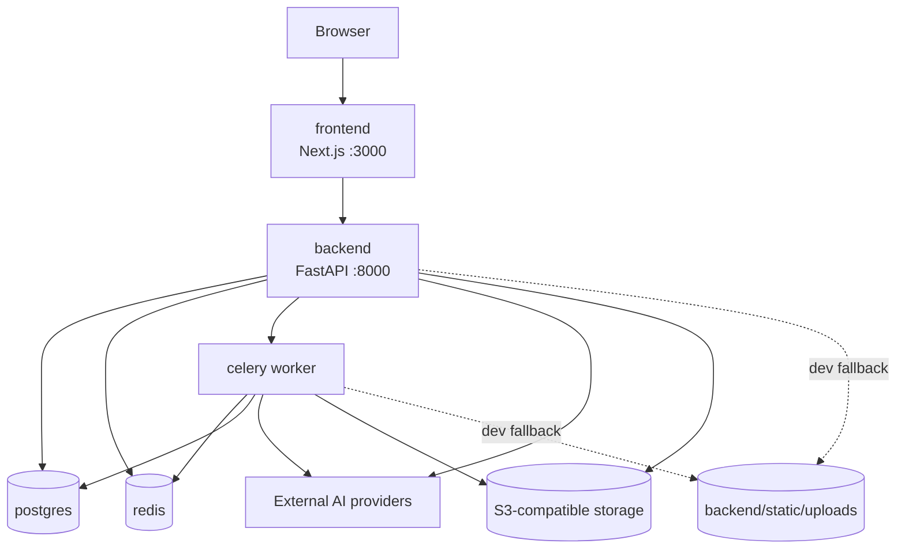
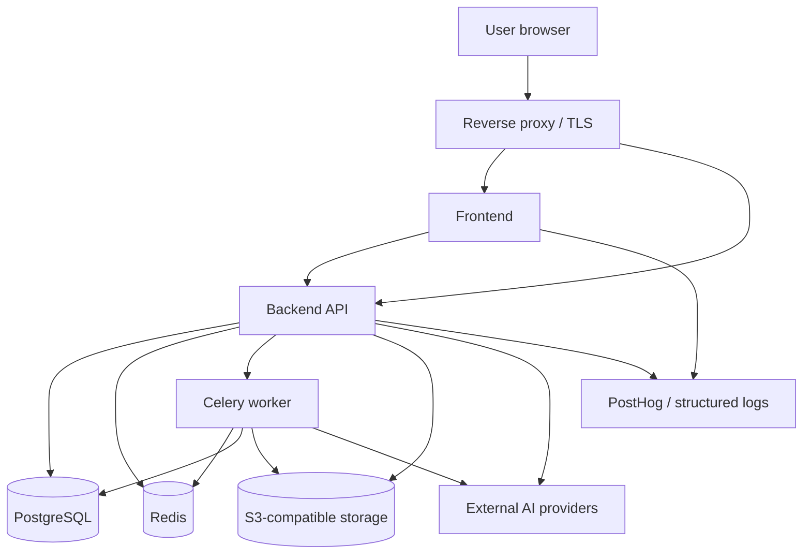

# SmartDesign Studio — Deployment Topology

Last updated: 2026-05-12

This document describes the current runtime topology for paid-beta operations. The legacy `quantum-engine` folder remains in the repository for reference/tests, but it is not part of the active Docker Compose runtime. Layout optimization runs in-process through backend services such as `backend/app/services/placement_engine.py` and `backend/app/services/quantum_service.py`.

## Runtime Services

The current Compose stack has five active services:

| Service | Container port | Host port | Role |
| --- | ---: | ---: | --- |
| `frontend` | 3000 | 3000 | Next.js UI |
| `backend` | 8000 | 8000 | FastAPI API and orchestration |
| `celery` | none | none | Background AI/design worker |
| `postgres` | 5432 | 5433 | Primary relational database |
| `redis` | 6379 | 6380 | Celery broker/result backend and rate-limit store |

## Local Development

Local development exposes frontend, backend, Postgres, and Redis to the host for debugging. The worker has no public port. Local static uploads are a fallback only; staging and production should use S3-compatible object storage.

## Production Intent

Production should expose only the reverse proxy/ingress publicly. Backend, worker, database, Redis, and internal operator endpoints should remain private or token-protected. Database and Redis must not be exposed to the public internet.

## Stateful Components

- PostgreSQL stores users, projects, jobs, credit transactions, AI usage ledger, feedback, and beta operations data.
- Redis supports Celery and rate limiting.
- S3-compatible storage stores uploaded/generated assets.
- `backend/static/uploads` is a local fallback and should not be treated as durable production storage.

## Required Runtime Guardrails

When `ENVIRONMENT=staging`, `ENVIRONMENT=production`, or `REQUIRE_PRODUCTION_SECRETS=true`, the backend now fails startup if required provider, storage, payment, and internal-token settings are missing. See `backend/app/core/config.py`.

## Deployment Checklist

- Run Alembic migrations before serving traffic.
- Confirm `INTERNAL_METRICS_TOKEN` is set before enabling `/operator`.
- Confirm `FAL_KEY`, `OPENROUTER_API_KEY`, S3 credentials, and payment secrets are present in staging/production.
- Keep `USE_CELERY=true` only when Redis and the worker are healthy.
- Keep a rollback target commit or image tag for each paid-beta deployment.
