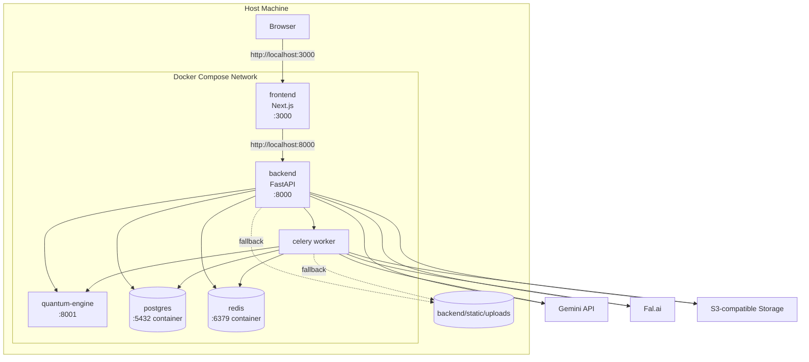
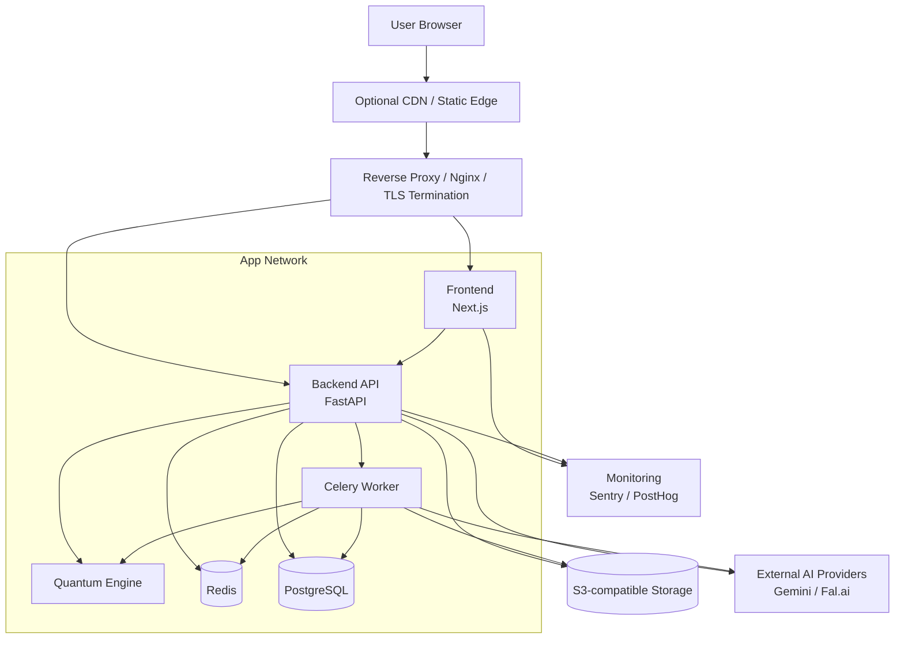

# SmartDesign Studio — Deployment Topology

> Status: Draft v1  
> Last updated: 2026-03-23

Dokumen ini menjelaskan topologi deployment SmartDesign Studio untuk dua konteks utama:
- **local development topology**
- **target production topology**

Dokumen ini disusun berdasarkan implementasi saat ini di repository, terutama dari:
- `docker-compose.yml`
- `frontend/Dockerfile`
- `backend/Dockerfile`
- `quantum-engine/Dockerfile`
- `README.md`

## Related docs

- [System Architecture](../architecture/system-architecture.md)
- [Data Model Overview](../architecture/data-model.md)
- [Design Generation Sequence](../architecture/design-generation-sequence.md)
- [Platform Hardening Plan](../features/platform-hardening/implementation-plan.md)

---

## 1. Tujuan Deployment Topology

Deployment topology membantu menjawab hal-hal berikut:
- service apa saja yang berjalan,
- service mana yang exposed ke host/public,
- alur komunikasi antar service,
- boundary internal vs external,
- komponen mana yang stateful dan perlu perhatian operasional.

---

## 2. Current Service Topology

Dari `docker-compose.yml`, stack runtime lokal terdiri dari 6 service:

| Service | Container Port | Host Port | Role |
|---|---:|---:|---|
| `frontend` | 3000 | 3000 | UI App / Next.js |
| `backend` | 8000 | 8000 | API utama / FastAPI |
| `quantum-engine` | 8001 | 8001 | optimizer microservice |
| `postgres` | 5432 | 5433 | relational database |
| `redis` | 6379 | 6380 | queue + rate limit store |
| `celery` | - | - | background worker |

### Stateful vs stateless

**Stateful components**
- PostgreSQL
- Redis
- object storage eksternal / fallback local uploads

**Mostly stateless components**
- Frontend
- Backend API
- Celery worker
- Quantum Engine

Catatan: backend menjadi semi-stateful secara operasional jika local fallback upload dipakai, karena file akan masuk ke `backend/static/uploads/`.

---

## 3. Local Development Topology

### Karakteristik local dev

- semua service dijalankan lewat satu `docker compose up -d --build`,
- frontend dan backend sama-sama exposed ke host,
- database dan redis juga exposed ke host untuk debugging lokal,
- worker tidak punya port publik karena hanya memproses queue,
- quantum-engine exposed ke host untuk debugging/inspection manual,
- object storage bisa memakai cloud sungguhan atau fallback local upload.

### Kelebihan

- cepat untuk onboarding,
- mudah di-debug dari mesin lokal,
- parity antar developer cukup baik,
- failure surface tiap service bisa diuji secara independen.

### Trade-off

- local topology lebih terbuka daripada production,
- beberapa fallback dev tidak ideal untuk deployment nyata,
- backend dan frontend terhubung lewat host port, bukan ingress tunggal.

---

## 4. Production Topology (Target)

`README.md` menunjukkan niat deployment production dengan reverse proxy/SSL di depan aplikasi. Model operasional yang masuk akal untuk stack ini adalah sebagai berikut.

### Prinsip production topology

- **hanya reverse proxy/ingress** yang seharusnya exposed ke internet,
- frontend, backend, celery, quantum-engine, redis, dan postgres idealnya berada di jaringan privat,
- database dan redis tidak diexpose langsung ke publik,
- object storage dan provider AI tetap menjadi dependency eksternal,
- monitoring terhubung outbound dari aplikasi.

---

## 5. Public vs Private Network Boundaries

### Public-facing boundary

Komponen yang layak diakses publik:
- domain frontend utama,
- endpoint backend yang diproxy lewat reverse proxy,
- static/public asset yang memang perlu diakses user,
- object storage public URL bila asset memang ditujukan publik.

### Private/internal boundary

Komponen yang seharusnya private:
- PostgreSQL
- Redis
- Celery worker
- Quantum Engine
- internal admin/debug endpoint bila ada

### Kenapa penting

Pemisahan ini membatasi blast radius dan menurunkan risiko:
- unauthorized DB access,
- queue poisoning,
- internal service probing,
- data exfiltration dari service yang tidak perlu public exposure.

---

## 6. Container Build Topology

## 6.1 Frontend Image

Frontend menggunakan **multi-stage Docker build**:
- base
- deps
- builder
- runner

### Implikasi

- image runtime lebih kecil dibanding build-in-place,
- hasil `Next.js standalone` memudahkan deployment,
- container runtime berjalan sebagai user non-root (`nextjs`).

### Kekuatan

- praktik deployment frontend sudah relatif baik,
- cocok untuk container platform modern,
- startup runtime sederhana (`node server.js`).

---

## 6.2 Backend Image

Backend saat ini menggunakan single-stage build berbasis `python:3.10-slim`.

### Implikasi

- sederhana dan mudah dipahami,
- tetapi image berpotensi lebih besar,
- dependency build dan runtime masih bercampur,
- container saat ini belum jelas dijalankan sebagai non-root.

### Catatan

Ini masih layak untuk tahap sekarang, tetapi untuk production hardening sebaiknya dipindah ke multi-stage build dan non-root user.

---

## 6.3 Quantum Engine Image

Quantum engine memakai single-stage build tetapi sudah menjalankan runtime sebagai non-root user (`appuser`).

### Implikasi

- lebih aman dibanding backend utama,
- dependency compile tetap masuk ke image runtime,
- masih bisa dioptimalkan jika build toolchain dapat dipisah.

---

## 7. Runtime Communication Paths

### Frontend → Backend

- protokol: HTTP/JSON
- fungsi: auth-aware API access, project data, generation trigger, polling job, CRUD user/project/template/brand kit

### Backend → PostgreSQL

- fungsi: persistent state utama
- dependency kritikal: tanpa DB, hampir semua fitur utama terhenti

### Backend → Redis

- fungsi: broker Celery dan rate limit store
- jika Redis gagal:
  - async queue dapat terganggu,
  - rate limiting dapat fail-open sesuai implementasi tertentu.

### Backend/Celery → Quantum Engine

- protokol: internal HTTP
- fungsi: optimize layout/logo placement
- ada fallback path bila service ini gagal.

### Backend/Celery → External AI Providers

- fungsi: brief parsing, copywriting, image generation, image tools
- dependency ini berpengaruh besar terhadap latensi dan biaya.

### Backend/Celery → Object Storage

- fungsi: persist image output dan upload asset
- ada fallback ke local filesystem bila kredensial/object storage gagal di environment dev.

---

## 8. Deployment Modes

## 8.1 Full local stack

Digunakan saat developer ingin menjalankan seluruh aplikasi di mesin lokal.

Cocok untuk:
- end-to-end manual testing,
- debugging integrasi multi-service,
- validasi Docker image dan network.

## 8.2 Hybrid development

Mode ini umum terjadi walau tidak selalu didokumentasikan eksplisit:
- frontend jalan lokal non-container,
- backend/redis/postgres jalan via Docker,
- atau sebaliknya.

Cocok untuk:
- iterasi frontend cepat,
- debugging Python lebih nyaman,
- penghematan resource mesin.

## 8.3 Production single-host compose

Untuk tahap awal, stack ini bisa dijalankan di satu host VM dengan:
- reverse proxy,
- docker compose,
- persistent volumes,
- env vars dari secret store/server config.

Ini masuk akal untuk MVP atau early growth.

## 8.4 Future split-host / managed services

Saat traffic meningkat, topologi bisa berevolusi menjadi:
- frontend di platform app hosting/CDN,
- backend + celery di compute terpisah,
- PostgreSQL managed,
- Redis managed,
- object storage tetap eksternal,
- queue/worker autoscaling terpisah.

Arsitektur aplikasi saat ini sudah cukup modular untuk transisi ini.

---

## 9. Persistence Topology

| Komponen | Persistence |
|---|---|
| PostgreSQL | named volume `pgdata` / managed DB storage |
| Redis | in-memory + optional persistence sesuai config |
| Generated uploads | object storage atau fallback local filesystem |
| Next.js runtime | ephemeral container filesystem |
| Celery worker state | ephemeral, source of truth tetap Redis + DB |

### Catatan penting

Jika fallback local upload dipakai di production tanpa shared volume/object storage, maka:
- asset bisa hilang saat redeploy,
- multi-instance backend akan inkonsisten,
- URL file menjadi tidak portable.

Karena itu fallback local storage sebaiknya dianggap **dev-only safety net**.

---

## 10. Health, Liveness, dan Failure Domains

### Health checks yang sudah terlihat

Di `docker-compose.yml`:
- Postgres punya healthcheck
- Redis punya healthcheck
- backend dan celery bergantung pada kondisi healthy untuk Postgres dan Redis

Service health endpoint yang ada:
- backend: `/health`
- quantum-engine: `/health`

### Failure domains

| Komponen gagal | Dampak |
|---|---|
| Frontend | UI tidak tersedia, API mungkin tetap hidup |
| Backend | semua workflow user terganggu |
| Celery | async generation backlog/mandek, CRUD lain masih bisa hidup |
| Redis | queue dan rate limit terganggu |
| PostgreSQL | hampir seluruh sistem lumpuh |
| Quantum Engine | generation tetap bisa lanjut dengan fallback terbatas |
| External AI provider | fitur AI tertentu gagal atau melambat |
| Object storage | upload/persist asset terganggu |

---

## 11. Security Posture by Topology

### Sudah baik / potensial baik

- frontend runtime non-root,
- quantum-engine runtime non-root,
- reverse proxy pattern memisahkan public ingress dari private services,
- service internal bisa ditempatkan di private network.

### Perlu diperkuat

- backend container sebaiknya non-root,
- database/redis sebaiknya tidak dibuka ke internet di production,
- secret management jangan mengandalkan file env yang tidak terkontrol,
- tambahkan resource limits untuk container production,
- tambahkan healthcheck untuk backend, frontend, quantum-engine, dan celery worker.

---

## 12. Recommended Production Hardening

1. **Tambahkan reverse proxy formal**  
   Sertakan routing yang jelas untuk frontend dan `/api`.

2. **Pakai managed Postgres/Redis bila memungkinkan**  
   Mengurangi beban operasional backup, failover, dan patching.

3. **Ubah backend ke image non-root + multi-stage**  
   Untuk security dan image size.

4. **Anggap local upload fallback hanya untuk dev**  
   Pastikan production selalu ke object storage.

5. **Tambahkan observability baseline**  
   Metrics, structured logs, request correlation, error alerts.

6. **Set resource limits**  
   Terutama backend, celery, quantum-engine karena beban AI/image bisa tinggi.

7. **Pisahkan env per environment**  
   dev, staging, production harus punya boundary secret dan endpoint yang jelas.

---

## 13. Topology Evolution Path

### Stage 1 — Current
- docker compose multi-service
- single environment oriented
- sebagian service exposed ke host untuk dev convenience

### Stage 2 — Hardened production
- reverse proxy + private service network
- object storage wajib
- secret handling lebih ketat
- non-root dan healthchecks lengkap

### Stage 3 — Scaled topology
- frontend terpisah dari backend compute
- celery autoscaling
- managed Redis/Postgres
- optional job priority queues
- background workloads dipisah berdasarkan jenis tool/generation

---

## 14. Ringkasan

Topologi deployment SmartDesign Studio saat ini sudah cukup baik untuk fase produk berkembang karena:
- komponen utama sudah dipisah jelas,
- async processing sudah dipisah ke worker,
- optimizer dipisah ke microservice,
- frontend sudah siap dengan build container yang modern.

Untuk production jangka menengah, fokus terpenting ada pada:
- private networking,
- hardening container backend,
- healthchecks yang lebih lengkap,
- object storage yang wajib,
- dan pengurangan paparan port yang tidak perlu.
