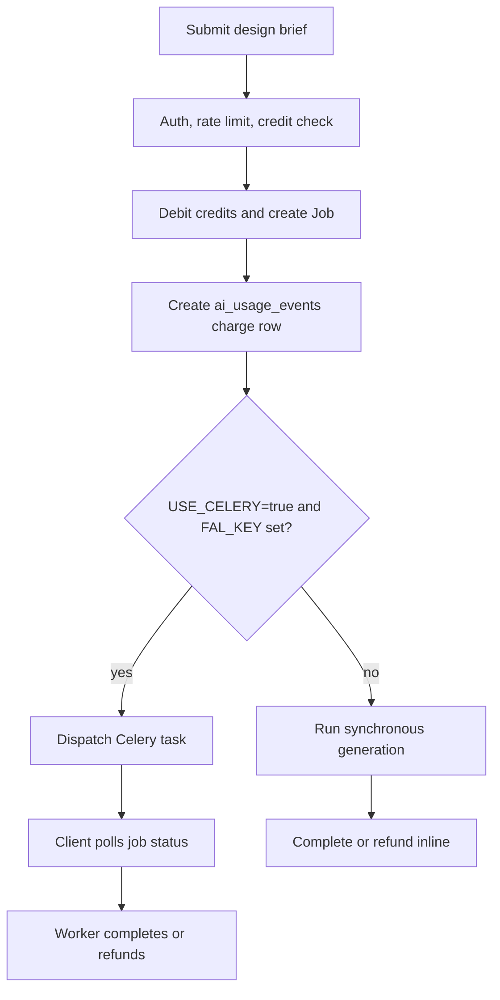
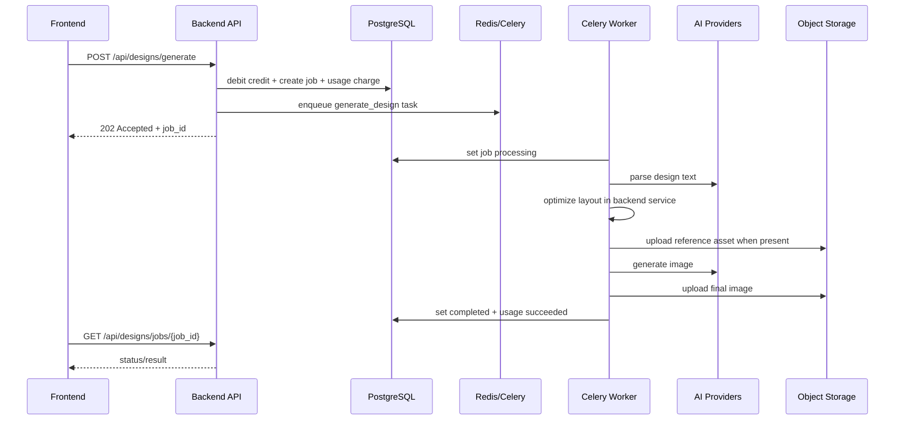

# SmartDesign Studio — Design Generation Sequence

Last updated: 2026-05-12

This document describes the current `POST /api/designs/generate` flow. Layout optimization is in-process inside backend services; there is no active external layout microservice in Docker Compose.

## Decision Flow

## Actors

| Actor | Role |
| --- | --- |
| Frontend | Sends generate request and polls status |
| Backend API | Validates request, debits credits, creates job, records usage charge |
| PostgreSQL | Stores job state, credits, AI usage, and feedback |
| Redis/Celery | Runs async generation when enabled |
| Backend layout services | Build and validate layout suggestions in-process |
| AI providers | Parse copy/briefs and generate imagery |
| Object storage | Stores reference and generated assets |

## Request Lifecycle

1. User submits a design request.
2. Backend validates identity, rate limit, and available credits.
3. Backend debits credits through `credit_transactions`.
4. Backend creates a `jobs` row with `queued` status.
5. Backend creates an `ai_usage_events` row with `charged` status.
6. Backend loads brand kit context when requested.
7. Backend either dispatches Celery or runs the synchronous fallback.

## Async Worker Lifecycle

## Refund Rules

Credit debit happens before generation, so system/provider failures must refund. The refund lifecycle is now visible through both:

- `credit_transactions` for balance movement,
- `ai_usage_events` for operation, provider/model, status, error, and refund transaction correlation.

AI tool jobs use the ledger to detect whether a refund already exists before issuing another refund. Legacy `_refunded` payload flags are retained only as backward-compatible markers.

## Completion States

| State | Meaning |
| --- | --- |
| `queued` | Job accepted and waiting |
| `processing` | Worker or sync path is active |
| `completed` | Result URL is ready |
| `failed` | Job failed and should include an error message |

## Operator Visibility

Operators can inspect aggregate health through `/api/internal/operator-summary` and `/operator`, including job counts, usage status, credits consumed/refunded, cost fields, payments, and export feedback.
