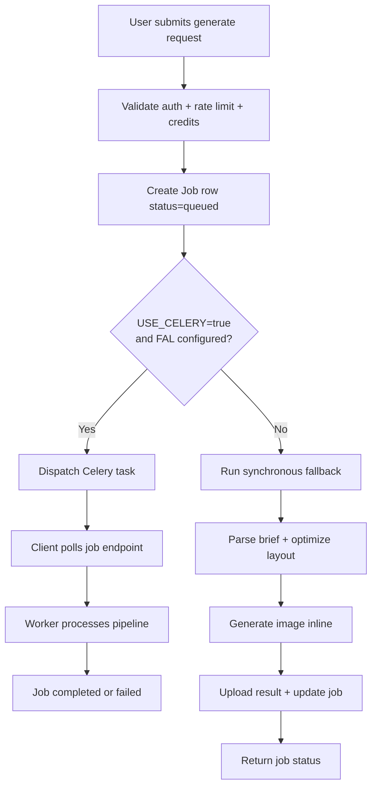
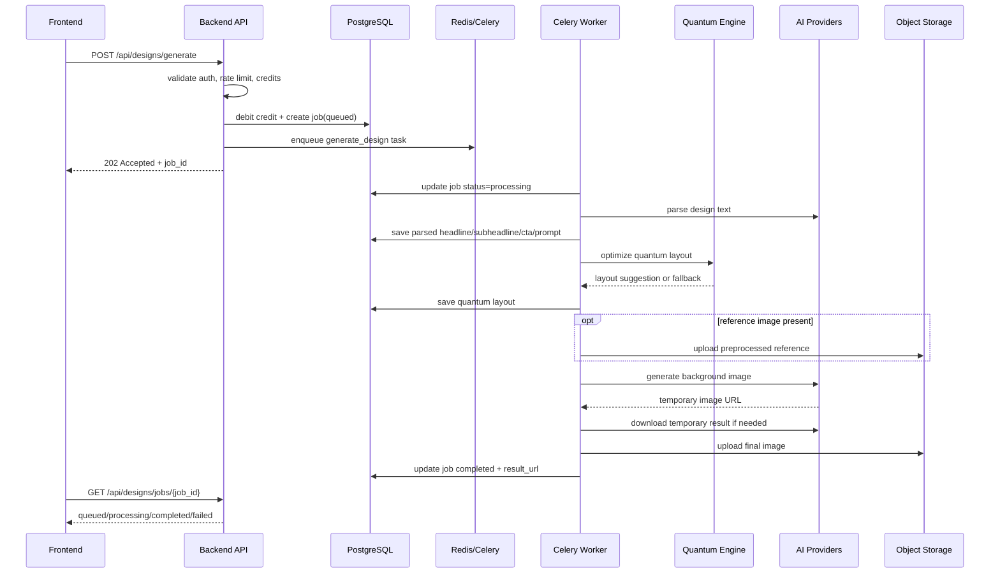
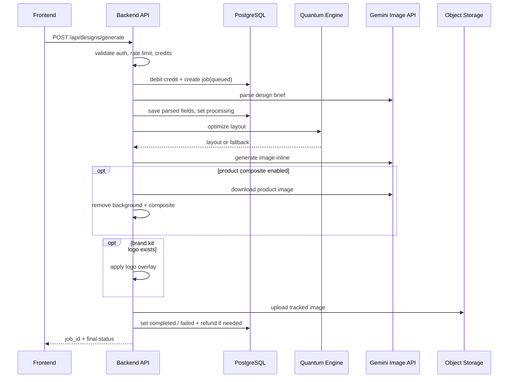
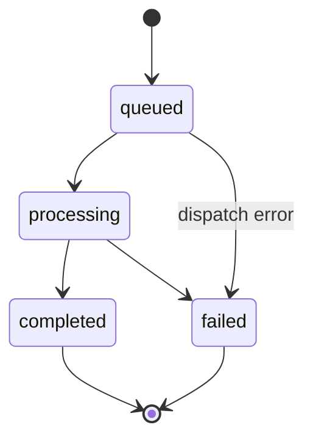

# SmartDesign Studio — Design Generation Sequence

> Status: Draft v1  
> Last updated: 2026-03-23

Dokumen ini memetakan urutan proses fitur `generate design` berdasarkan implementasi saat ini, terutama dari:
- `backend/app/api/designs_routers/generation.py`
- `backend/app/workers/tasks.py`
- `backend/app/services/quantum_service.py`
- `backend/app/services/storage_service.py`

Fokus dokumen ini adalah alur `POST /api/designs/generate`.

## Related docs

- [System Architecture](../architecture/system-architecture.md)
- [Data Model Overview](../architecture/data-model.md)
- [Deployment Topology](../architecture/deployment-topology.md)
- [Platform Hardening Plan](../features/platform-hardening/implementation-plan.md)

---

## 1. Tujuan Flow

Flow ini mengubah brief teks user menjadi hasil desain/gambar yang dapat:
- dipreview,
- dipolling statusnya,
- disimpan sebagai asset final,
- dilanjutkan ke editor.

Sistem saat ini mendukung **dua jalur eksekusi**:

1. **Asynchronous path** → Celery + external image provider
2. **Synchronous fallback path** → inline processing dengan Gemini image generation

Pemilihan jalur ditentukan oleh konfigurasi environment dan ketersediaan provider.

---

## 2. High-Level Decision Flow

---

## 3. Actors

| Actor | Peran |
|---|---|
| Frontend | mengirim request generate dan polling status job |
| Backend API | validasi, debit credit, create job, memilih mode eksekusi |
| PostgreSQL | menyimpan job state dan metadata hasil |
| Redis | broker/result backend Celery, juga dipakai di area lain untuk rate limiting |
| Celery Worker | menjalankan pipeline async |
| Quantum Engine | menghitung layout optimization |
| AI Providers | text parsing dan image generation |
| Object Storage | menyimpan hasil final dan reference asset |

---

## 4. Entry Point

Endpoint utama:
- `POST /api/designs/generate`

### Tanggung jawab entry point

- pastikan user terautentikasi,
- terapkan rate limiting dependency,
- cek saldo credit,
- langsung debit credit untuk memulai job,
- buat record `Job` dengan status awal `queued`,
- muat konteks `BrandKit` bila diminta,
- pilih jalur async atau sync.

---

## 5. Detailed Request Lifecycle

## 5.1 Validasi awal

Saat request masuk, backend melakukan validasi berikut:

1. user identity tersedia,
2. rate limit dependency lolos,
3. credit mencukupi untuk `COST_GENERATE_DESIGN`.

Jika credit tidak cukup:
- request gagal,
- job tidak dibuat,
- tidak ada debit credit.

---

## 5.2 Debit credit di awal

Jika valid, backend langsung mengurangi saldo credit user dan mencatat transaksi.

### Alasan desain ini

- mencegah user mengirim job tanpa biaya,
- mempermudah kontrol monetisasi,
- refund bisa diproses eksplisit saat terjadi kegagalan.

### Risiko yang harus dijaga

Karena debit terjadi sebelum seluruh pipeline selesai, maka semua jalur gagal harus konsisten memberi refund bila kegagalan berasal dari sistem/provider.

---

## 5.3 Pembuatan `Job`

Backend membuat row `Job` dengan data awal seperti:
- `raw_text`
- `aspect_ratio`
- `style_preference`
- `reference_image_url`
- `user_id`
- `status = queued`

### Peran `Job`

- correlation object untuk polling,
- tempat observability terhadap pipeline,
- rekam jejak input dan output utama,
- pegangan UI untuk status user-facing.

---

## 5.4 Enrichment dari `BrandKit`

Jika request membawa `brand_kit_id`, backend mencoba memuat:
- daftar warna brand,
- pengaturan typography,
- strict brand suffix untuk memperketat prompt.

### Tujuannya

- membuat hasil lebih konsisten dengan identitas brand,
- mengurangi improvisasi warna/font oleh model,
- menyiapkan fondasi untuk fitur on-brand generation yang lebih kuat.

Jika loading brand kit gagal:
- request tidak langsung dibatalkan,
- backend mencatat error dan tetap lanjut tanpa enrichment penuh.

---

## 6. Path A — Asynchronous Celery Flow

Jalur ini aktif bila:
- `FAL_KEY` tersedia, dan
- `USE_CELERY=true`

### Response awal

Backend segera mengembalikan:
- `job_id`
- `status = queued`
- pesan bahwa frontend perlu polling endpoint job.

### Sequence diagram

---

## 7. Async Worker Internal Steps

Di dalam worker, pipeline berjalan kira-kira seperti ini.

### Step 1 — status jadi `processing`
Worker langsung menandai job sedang diproses.

### Step 2 — parse brief teks
Worker memanggil `parse_design_text()` untuk menghasilkan:
- headline,
- sub headline,
- CTA,
- visual prompt,
- komponen prompt lain jika tersedia.

### Step 3 — simpan hasil parsing
Worker menyimpan hasil parsing ke tabel `jobs` agar status job lebih informatif.

### Step 4 — quantum layout optimization
Worker memanggil `optimize_quantum_layout()` untuk menghitung saran penempatan elemen teks.

Jika optimizer tersedia dan sukses:
- hasilnya disimpan ke `job.quantum_layout`

Jika gagal:
- worker melanjutkan flow dengan fallback
- generation tetap bisa selesai tanpa menghentikan seluruh proses.

### Step 5 — preprocess reference image
Jika user menyertakan reference image:
- worker download image,
- resize / preprocess sesuai aspect ratio,
- upload reference yang sudah diproses ke storage.

### Step 6 — generate image
Worker memanggil provider image generation dengan:
- visual prompt final,
- style,
- aspect ratio,
- optional reference image,
- brand context bila ada.

### Step 7 — persist final image
Hasil image dari provider diunduh lalu di-upload ulang ke storage milik platform.

### Kenapa di-upload ulang?

- menghindari ketergantungan pada temporary CDN provider,
- URL hasil menjadi lebih stabil,
- lifecycle asset bisa lebih terkontrol.

### Step 8 — close job
Jika sukses:
- `status = completed`
- `result_url` terisi
- `completed_at` terisi

Jika gagal:
- `status = failed`
- `error_message` terisi
- credit di-refund pada jalur yang relevan.

---

## 8. Async Failure Handling

Jika worker gagal di tengah pipeline:
- job ditandai `failed`,
- error message disimpan,
- user dapat menerima refund credit melalui service credit log,
- error dilempar ulang agar tercatat di worker logs/monitoring.

### Failure domain async yang umum

- parse AI gagal,
- provider image generation timeout/gagal,
- reference download gagal,
- storage upload gagal,
- quantum-engine tidak tersedia,
- database update gagal.

### Desain penting

Quantum optimization diperlakukan sebagai enhancement, bukan hard dependency absolut. Ini keputusan yang baik untuk menjaga completion rate.

---

## 9. Path B — Synchronous Fallback Flow

Jalur ini dipakai saat Celery+Fal tidak aktif. Backend memproses job langsung di request lifecycle.

### Kapan dipakai

- worker tidak diaktifkan,
- `FAL_KEY` tidak tersedia,
- sistem memilih Gemini inline generation.

### Konsekuensi

- request HTTP lebih panjang,
- latensi ke user lebih tinggi,
- cocok sebagai fallback atau environment sederhana,
- tetap menyimpan hasil ke `Job` sehingga UI tidak perlu berubah total.

### Sequence diagram

---

## 10. Sync Internal Steps

### Step 1 — parse text
Backend memanggil parser untuk membentuk:
- headline,
- subheadline,
- CTA,
- visual prompt.

### Step 2 — set job ke `processing`
Job diupdate agar UI/persistence tetap konsisten dengan async path.

### Step 3 — quantum layout
Backend memanggil optimizer sebelum image generation.

### Step 4 — pilih model image generation
Pemilihan model ditentukan oleh konteks:
- bila `integrated_text=true`, backend memakai model yang mendukung typography integrated rendering,
- bila tidak, backend memakai model yang fokus pada background graphic generation tanpa teks.

### Step 5 — bangun enhanced prompt
Prompt builder menggabungkan:
- visual prompt final,
- style suffix,
- text instruction,
- strict brand suffix bila ada.

### Step 6 — generate image
Backend memanggil model Gemini yang sesuai.

### Step 7 — optional product composite
Jika request meminta `remove_product_bg` dan menyediakan `product_image_url`:
- product image didownload,
- background produk dihapus,
- produk dikomposisikan ke background hasil generate.

Jika composite gagal:
- backend fallback ke background mentah,
- flow tidak selalu dibatalkan total.

### Step 8 — optional brand kit logo overlay
Jika brand kit tersedia, logo dapat diterapkan ke hasil akhir sebelum upload.

### Step 9 — upload tracked image
Image final di-upload ke storage melalui jalur yang juga memperhitungkan storage quota/user tracking.

### Step 10 — finalize job
Jika image berhasil:
- `status = completed`
- `result_url` disimpan
- `completed_at` disimpan

Jika image tidak tersedia atau ditolak provider:
- `status = failed`
- user dapat menerima refund sesuai penyebab kegagalan.

---

## 11. Sync Failure Handling

Beberapa jalur gagal yang terlihat di kode:

### A. Gagal dispatch task async
Jika task Celery gagal dikirim:
- job ditandai failed,
- credit di-refund,
- API mengembalikan internal server error.

### B. Prompt ditolak sistem AI
Jika provider tidak mengembalikan image bytes:
- job ditandai failed,
- error message user-facing diisi,
- credit di-refund.

### C. Sistem error umum
Jika exception lain terjadi:
- job ditandai failed,
- credit di-refund,
- error dilempar sebagai internal server error.

### D. Kegagalan komposit produk
- dicatat di log,
- flow tetap lanjut memakai background mentah.

Ini menunjukkan ada perbedaan antara:
- **fatal errors** → job gagal,
- **degradable errors** → quality turun tetapi flow tetap selesai.

---

## 12. Job Status State Machine

### Interpretasi state

- `queued`: job sudah tercatat, belum selesai diproses
- `processing`: pipeline sedang berjalan
- `completed`: hasil final tersedia
- `failed`: pipeline berhenti dan memiliki `error_message`

---

## 13. Credit & Refund Semantics

### Pola saat ini

1. debit credit dilakukan **di awal**,
2. refund dilakukan **secara eksplisit** pada jalur error tertentu.

### Kelebihan

- sederhana untuk dipahami,
- cocok dengan model SaaS berbasis credit,
- meminimalkan abuse sebelum job dibuat.

### Yang perlu dijaga

- semua jalur gagal harus konsisten refund,
- perlu ada idempotency atau guard bila retry di masa depan ditambahkan,
- audit transaction harus tetap sinkron dengan status job.

---

## 14. Observability Points

Field `Job` yang membantu observability:
- `status`
- `parsed_headline`
- `parsed_sub_headline`
- `parsed_cta`
- `visual_prompt`
- `quantum_layout`
- `result_url`
- `error_message`
- `created_at`
- `completed_at`

### Kenapa ini penting

- memudahkan debugging user complaint,
- memudahkan support untuk tahu job gagal di tahap mana,
- memberi jejak cukup untuk evaluasi pipeline tanpa membaca seluruh log mentah.

---

## 15. Architectural Strengths of Current Flow

1. **UI tetap seragam karena berbasis `Job`**  
   Sync dan async sama-sama memakai objek status yang sama.

2. **Quantum engine bersifat enhancement, bukan SPOF absolut**  
   Ini meningkatkan resilience.

3. **Asset final dire-upload ke storage milik sendiri**  
   Mengurangi ketergantungan pada URL provider eksternal.

4. **Credit logging sudah diintegrasikan ke flow**  
   Mendukung monetisasi yang konsisten.

5. **Brand kit sudah masuk ke prompt path**  
   Fondasi bagus untuk on-brand generation.

---

## 16. Current Weak Spots / Improvement Opportunities

1. **Sync fallback bisa memiliki latency tinggi**  
   Untuk traffic besar, jalur ini tidak ideal sebagai mode utama.

2. **Refund logic tersebar di beberapa cabang**  
   Potensi inkonsistensi meningkat saat flow bertambah kompleks.

3. **Job state masih relatif sederhana**  
   Belum ada sub-stage seperti `parsed`, `generating`, `uploading`, `refunding`.

4. **Reference preprocessing dan provider calls belum terdokumentasi sebagai retry policy**  
   Ini penting untuk reliability tuning.

5. **Brand kit loading failure saat ini cenderung degrade silently**  
   Secara UX, mungkin perlu status/warning lebih eksplisit nanti.

---

## 17. Suggested Next Evolution

### A. Tambah granular stage metadata
Contoh:
- `current_stage`
- `stage_progress`
- `provider_name`
- `retry_count`

### B. Satukan refund orchestration
Buat helper tunggal agar semua failure path memakai mekanisme yang sama.

### C. Tambah event/audit trail per job
Berguna untuk support, analytics, dan SLA internal.

### D. Pisahkan pipeline steps ke service boundaries yang lebih tegas
Agar testing dan observability lebih mudah saat fitur makin banyak.

### E. Tambah timeout/retry policy yang terdokumentasi
Khusus untuk external AI provider, storage, dan quantum engine.

---

## 18. Ringkasan

Flow `generate design` saat ini sudah cukup matang untuk produk AI yang sedang berkembang:
- request tervalidasi dan dibebankan credit di awal,
- semua job memakai entitas `Job` yang konsisten,
- tersedia jalur async dan sync fallback,
- quantum optimization dan brand kit sudah terintegrasi,
- kegagalan besar memiliki mekanisme refund di banyak jalur.

Fokus peningkatan berikutnya sebaiknya ada pada:
- stage granularity,
- konsistensi refund,
- observability pipeline,
- dan pemisahan concern retry/error policy.
