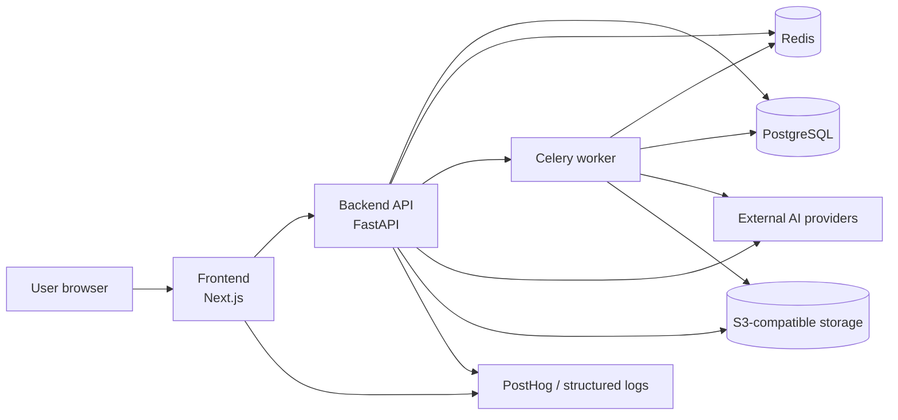

# SmartDesign Studio — System Architecture

Last updated: 2026-05-12

SmartDesign Studio is an AI-assisted design product for Indonesian sellers and small businesses. The current architecture is centered on a Next.js frontend, FastAPI backend, Celery worker, PostgreSQL, Redis, S3-compatible storage, and external AI providers. The legacy `quantum-engine` folder is not an active runtime service; layout optimization is handled inside backend services.

## High-Level Architecture

## Service Inventory

| Service | Role | Source of truth |
| --- | --- | --- |
| Frontend | Product UI, editor, auth session, PostHog client events | `frontend/` |
| Backend API | Auth, projects, credits, jobs, uploads, payment, internal metrics | `backend/app/` |
| Celery worker | Long-running AI generation and tool jobs | `backend/app/workers/` |
| PostgreSQL | Primary app, billing, usage, feedback, and job state | `backend/app/models/` |
| Redis | Celery broker/result backend and rate limiting | `backend/app/core/redis.py` |
| Object storage | Uploaded/generated assets | `backend/app/services/storage_service.py` |
| External AI providers | LLM parsing and image generation | `backend/app/services/` |

## Frontend Layer

The frontend uses Next.js App Router, React, TypeScript, Tailwind, Zustand, React Konva, and PostHog. It owns:

- public landing and authenticated product routes,
- create flow and editor experience,
- project/library/settings surfaces,
- client-side funnel events through `frontend/src/lib/analytics/events.ts`,
- the internal `/operator` dashboard gated by `X-Internal-Token`.

Frontend code does not call AI providers directly. Business operations go through backend APIs.

## Backend Layer

The backend uses FastAPI and SQLAlchemy async sessions. It owns:

- authentication and user upsert,
- project, history, folders, brand kits, templates, and referrals,
- credit debit/refund transactions,
- `ai_usage_events` for provider/model/cost/refund auditability,
- upload validation, quota-aware storage helpers, and local fallback storage,
- internal metrics endpoints for paid-beta operations.

## Async Processing

Long-running AI work can run through Celery when `USE_CELERY=true` and provider credentials are configured. Redis backs the queue. The worker updates job status and records usage/refund lifecycle into the ledger.

## Data And Observability

Key operational tables:

- `users`
- `projects`
- `jobs`
- `ai_tool_jobs`
- `credit_transactions`
- `ai_usage_events`
- `storage_purchases`
- `design_feedback`

Key beta surfaces:

- PostHog frontend funnel events,
- `/api/internal/operator-summary`,
- `/operator` dashboard,
- structured backend logs with request IDs.

## Runtime Guardrails

Staging/production startup fails loudly when required settings are missing. This prevents accidental paid-beta runs with mock/local behavior, missing storage credentials, missing provider keys, or an unprotected internal dashboard.
