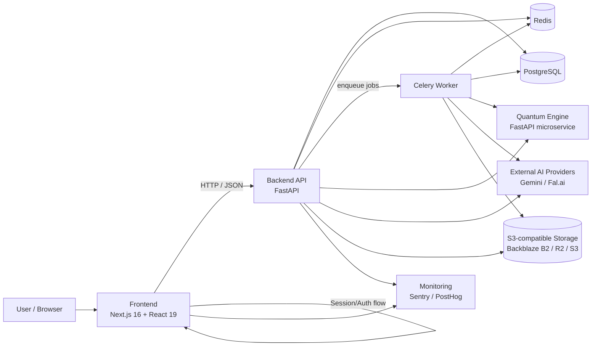
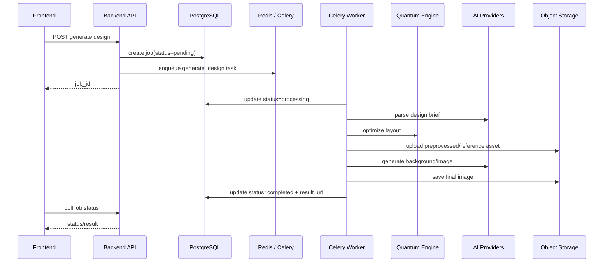
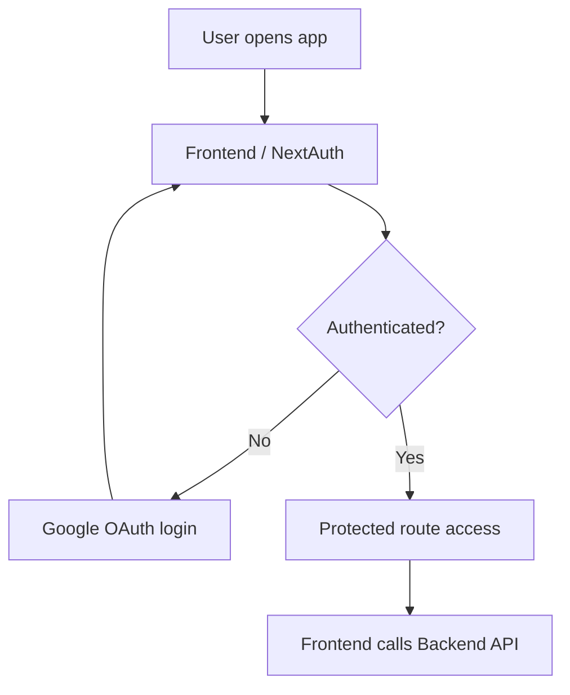

# SmartDesign Studio — System Architecture

> Status: Draft v1  
> Last updated: 2026-03-23

Dokumen ini merangkum arsitektur sistem saat ini berdasarkan implementasi yang ada di repository, terutama dari:
- `docker-compose.yml`
- `backend/app/main.py`
- `backend/app/workers/`
- `backend/app/services/`
- `frontend/package.json`
- `frontend/src/middleware.ts`
- `quantum-engine/app/main.py`

## Related docs

- [Data Model Overview](../architecture/data-model.md)
- [Deployment Topology](../architecture/deployment-topology.md)
- [Design Generation Sequence](../architecture/design-generation-sequence.md)
- [Platform Hardening Plan](../features/platform-hardening/implementation-plan.md)

---

## 1. Tujuan Arsitektur

SmartDesign Studio adalah platform desain berbasis AI untuk UMKM dengan tiga kapabilitas utama:

1. **Design generation** dari brief teks menjadi visual siap edit
2. **AI photo tools** seperti background swap, retouch, upscale, inpaint, outpaint, watermark, dan batch processing
3. **Canvas editing** berbasis web untuk menyempurnakan hasil desain

Arsitektur dipisah menjadi beberapa service agar:
- frontend tetap fokus pada experience dan editor interaktif,
- backend fokus pada orchestration, auth, business rules, dan persistence,
- workload berat/asinkron diproses oleh worker,
- eksperimen layout optimization dapat diisolasi di microservice terpisah.

---

## 2. High-Level Architecture

### Inti arsitektur

- **Frontend** adalah entry point user.
- **Backend API** menjadi pusat orchestration untuk auth, project, brand kit, template, history, user, dan AI tools.
- **Celery worker** menangani pekerjaan generasi desain yang berat dan berjalan asynchronous.
- **Redis** dipakai sebagai broker/result backend Celery dan juga rate limiting.
- **PostgreSQL** menyimpan data aplikasi utama.
- **Quantum Engine** adalah microservice terpisah untuk layout optimization.
- **S3-compatible storage** menyimpan asset hasil upload dan hasil generasi.
- **Provider AI eksternal** dipakai untuk text parsing, prompt enrichment, dan image generation.

---

## 3. Service Inventory

| Service | Port | Peran utama | Source of truth |
|---|---:|---|---|
| Frontend | 3000 | UI App Router, auth session, editor, dashboard | `frontend/` |
| Backend API | 8000 | REST API, business logic, persistence, orchestration | `backend/app/` |
| Celery Worker | - | Async pipeline untuk design generation | `backend/app/workers/` |
| Quantum Engine | 8001 | Layout optimization microservice | `quantum-engine/app/` |
| PostgreSQL | 5432 (container) / 5433 (host) | Primary relational database | `docker-compose.yml` |
| Redis | 6379 (container) / 6380 (host) | Queue broker, result backend, rate limiting | `docker-compose.yml` |

---

## 4. Frontend Layer

Frontend dibangun dengan **Next.js 16 App Router**, **React 19**, **TypeScript**, **Tailwind CSS v4**, **Zustand**, dan **React Konva**.

### Tanggung jawab frontend

- login dan session handling via **next-auth**,
- halaman protected untuk workflow utama (`/projects`, `/create`, `/edit`, `/settings`),
- canvas editor interaktif,
- preview hasil generasi,
- interaksi dengan backend via HTTP API,
- monitoring client-side via Sentry dan PostHog.

### Catatan arsitektural

- Route protection dilakukan di middleware NextAuth.
- Editor berjalan di client component, sedangkan route dan fetching tertentu dapat memakai server component.
- Frontend tidak langsung memanggil provider AI; semua request bisnis tetap melalui backend.

---

## 5. Backend API Layer

Backend utama dibangun dengan **FastAPI** dan berperan sebagai pusat domain logic.

### Router/domain yang saat ini terdaftar

- Authentication
- Designs
- Templates
- Projects
- Users
- History
- Brand Kits
- AI Tools
- Ad Creator
- Health

### Tanggung jawab backend

- autentikasi dan identitas user,
- validasi request/response,
- pengelolaan project, template, history, dan brand kit,
- pengelolaan credit / quota / rate limiting,
- orkestrasi AI pipeline,
- persistence ke PostgreSQL,
- upload/download asset ke object storage,
- fallback local static storage saat S3 belum tersedia.

### Middleware & operational concerns

- **CORS middleware** untuk komunikasi dengan frontend,
- **request ID middleware** untuk traceability,
- **structured logging middleware** untuk observability,
- **global exception handler** untuk response error yang konsisten,
- **Sentry** untuk error tracking ketika DSN tersedia.

---

## 6. Async Processing dengan Celery

Proses generasi desain penuh tidak selalu dijalankan inline. Saat `USE_CELERY=true` dan provider terkait tersedia, backend akan mengirim pekerjaan ke Celery.

### Pipeline async saat ini

1. simpan job ke database,
2. parse brief teks dengan service LLM,
3. jalankan **quantum layout optimization**,
4. preprocess reference image bila ada,
5. generate image via provider eksternal,
6. upload hasil final ke storage,
7. update status job di database,
8. refund credit bila job gagal pada kondisi tertentu.

### Alasan pemisahan worker

- menghindari request HTTP panjang,
- menjaga respons API tetap cepat,
- memisahkan retry/failure surface,
- lebih mudah diskalakan untuk workload AI.

---

## 7. Quantum Engine Microservice

Quantum Engine adalah service FastAPI terpisah yang menerima request optimasi layout melalui HTTP internal.

### Tanggung jawab

- menerima elemen layout dan dimensi canvas,
- menghitung variasi penempatan elemen,
- mengembalikan skor/energi dan waktu solver,
- memungkinkan eksperimen optimizer tanpa mengganggu backend utama.

### Karakteristik

- dipisahkan sebagai service tersendiri,
- saat ini diakses lewat URL internal container network,
- backend melakukan fallback bila service tidak tersedia atau gagal,
- cocok untuk eksperimen algoritmik yang independen dari domain CRUD utama.

---

## 8. Data & Storage Architecture

### PostgreSQL

PostgreSQL adalah sumber data utama untuk entitas aplikasi seperti:
- users,
- projects,
- history,
- templates,
- jobs,
- brand kits,
- credit-related records.

### Redis

Redis memiliki dua fungsi utama:
- **broker + result backend** untuk Celery,
- **rate limiting store** untuk request throttling.

### Object Storage

File image dan asset tidak disimpan di database. Backend mengunggah ke storage S3-compatible.

Strategi penyimpanan:
- production/staging: **Backblaze B2 / R2 / AWS S3** via API kompatibel S3,
- local/dev fallback: file disimpan ke `backend/static/uploads/` lalu di-mount lewat FastAPI static files.

Ini memberi dua keuntungan:
- dev tetap jalan tanpa kredensial cloud lengkap,
- asset besar tidak membebani PostgreSQL.

---

## 9. Integrasi Eksternal

| Integrasi | Fungsi |
|---|---|
| Google Gemini | parsing brief, copywriting, ekstraksi brand/color, enrichment |
| Fal.ai | image generation dan beberapa AI image workflows |
| S3-compatible storage | penyimpanan asset publik |
| Google OAuth | login user via NextAuth |
| Sentry | error tracking frontend/backend |
| PostHog | analytics produk di frontend |

### Prinsip integrasi

- frontend tidak memegang API key provider AI,
- backend menjadi lapisan kontrol biaya, logging, dan kebijakan akses,
- hasil provider eksternal dire-upload ke storage milik platform agar URL lebih stabil dan dapat dikontrol.

---

## 10. Auth & Request Flow

### Auth flow ringkas

### Boundary auth

- session/login utama dikelola di frontend dengan **NextAuth**,
- backend memverifikasi identitas user sesuai mekanisme auth yang aktif,
- protected route di frontend mencegah user anonim masuk ke workflow inti,
- authorization tetap harus dianggap sebagai tanggung jawab server-side untuk resource sensitif.

---

## 11. Core Runtime Flows

### A. Design generation flow

1. User mengisi brief di frontend.
2. Frontend mengirim request ke backend.
3. Backend membuat job dan mengecek policy seperti auth, credit, dan rate limiting.
4. Worker menjalankan parsing, optimization, generation, dan persistence.
5. Frontend melakukan polling status job.
6. Hasil akhir dibuka di preview/editor.

### B. AI tools flow

1. User upload image atau mengirim parameter tool.
2. Backend validasi ukuran, auth, dan credit.
3. Backend memanggil service lokal atau provider eksternal.
4. Result image disimpan ke object storage.
5. URL final dikembalikan ke frontend.

### C. Canvas project flow

1. User membuka project di frontend editor.
2. Frontend memuat state project dari backend.
3. Perubahan desain dapat disimpan sebagai project/history.
4. Export akhir dilakukan dari frontend/editor sesuai format yang didukung.

---

## 12. Deployment View

### Local development

Topologi lokal saat ini mengikuti `docker-compose.yml`:
- postgres
- redis
- backend
- celery
- quantum-engine
- frontend

### Production intent

Dokumen `README.md` menyebut reverse proxy/SSL sebagai lapisan depan deployment produksi. Secara arsitektural, ini berarti:
- browser mengakses satu domain publik,
- reverse proxy meneruskan traffic ke frontend dan backend,
- backend tetap berbicara ke Redis/Postgres/storage/provider AI melalui jaringan privat/terkontrol.

Dengan kata lain, **runtime production** dapat memiliki lapisan ingress tambahan, tetapi **domain boundary utama aplikasi** tetap sama seperti diagram high-level di atas.

---

## 13. Security & Reliability Notes

### Positif yang sudah terlihat

- pemisahan service mengurangi blast radius,
- backend punya global exception handling,
- request ID dan structured logging sudah ada,
- asset storage dipisahkan dari database,
- workload berat dipindahkan ke worker,
- ada health endpoint untuk backend dan quantum engine.

### Area yang perlu dijaga saat sistem berkembang

- jangan expose credential AI/storage ke frontend,
- pastikan validasi authorization tetap server-side,
- batasi CORS production ke origin eksplisit,
- tambahkan retry/backoff policy yang terukur untuk provider eksternal,
- pastikan task failure selalu sinkron dengan credit refund/log audit,
- pertimbangkan timeout dan circuit breaker untuk komunikasi ke provider AI dan Quantum Engine.

---

## 14. Current Architectural Decisions

### ADR ringkas

1. **Frontend dan backend dipisah** untuk menjaga UI/editor dan domain API tetap independen.
2. **Celery + Redis dipakai** untuk AI generation yang berat dan asynchronous.
3. **Quantum optimization dipecah menjadi microservice** agar eksperimen solver tidak mengganggu backend utama.
4. **S3-compatible storage dipakai untuk asset**, bukan database blob.
5. **Fallback local storage** tetap dipertahankan untuk developer experience dan ketahanan dev environment.

---

## 15. Known Gaps / Next Docs to Add

Setelah dokumen ini, dokumentasi yang paling layak ditambahkan adalah:

1. **docs/architecture/data-model.md**  
   Ringkasan entity utama: `User`, `Project`, `History`, `Job`, `Template`, `BrandKit`, credit ledger.

2. **docs/architecture/design-generation-sequence.md**  
   Versi lebih detail khusus pipeline generate design + failure handling + refund path.

3. **docs/architecture/deployment-topology.md**  
   Pisahkan local dev topology dan production topology agar tidak tercampur.

4. **docs/api/backend-boundaries.md**  
   Mapping route FastAPI ke domain service dan ownership module.

---

## 16. Ringkasan

Arsitektur SmartDesign Studio saat ini sudah menunjukkan pola yang sehat untuk produk AI berbasis desain:
- **UI/editor interaktif** di frontend,
- **business orchestration** di backend,
- **heavy async jobs** di Celery worker,
- **specialized optimizer** di microservice quantum-engine,
- **persistent state** di PostgreSQL,
- **ephemeral/queue concerns** di Redis,
- **asset storage** di object storage,
- **AI inference** melalui provider eksternal.

Struktur ini cukup kuat untuk mendukung pengembangan fitur berikutnya seperti Chat-to-Design, multi-format batch generation, template marketplace, dan analytics layer tanpa harus mengubah fondasi arsitektur secara total.
