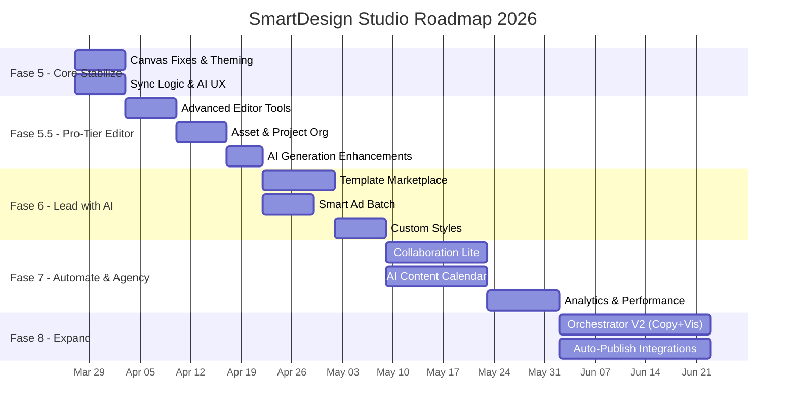

# 🗺️ Strategic Roadmap — SmartDesign Studio
> Berdasarkan Competitive Analysis | Maret 2026

---

## Prinsip Roadmap

Roadmap ini disusun berdasarkan tiga prinsip:
1. **Defend the Moat** — Perkuat USP yang sudah kita miliki sebelum kompetitor mengejar
2. **Close the Gap** — Tutup kelemahan paling kritis yang bisa membuat user pergi ke Canva
3. **Expand the Horizon** — Bangun fitur baru yang membuka segmen pasar lebih luas

---

## 🟣 Fase 5: "Core Stabilization & Tech Debt" (Prioritas Fokus — 1-2 Minggu)

> **Tujuan:** Memperbaiki fitur yang ada (UX dan performa) agar fondasi kokoh sebelum menambah kompleksitas baru ("Agency-in-a-box").

### 5.1 Canvas Performance & Security
| Item | Detail |
|---|---|
| **Masalah** | Isu performa kanvas dan error export gambar lintas-domain (CORS). |
| **Solusi** | Stabilisasi *infinite React polling/render loops* dan perbaikan *Tainted Canvas security*. |

### 5.2 UI/UX & Theme Consistency
| Item | Detail |
|---|---|
| **Masalah** | Tampilan *Dark Theme* kadang inkonsisten atau *flash*. |
| **Solusi** | Audit UI untuk memastikan penggunaan *semantic tokens* (HSL variables) tanpa *hardcoded colors*. |

### 5.3 AI Generation State & Sync Logic
| Item | Detail |
|---|---|
| **Masalah** | User bingung saat AI sedang generate (kurang *feedback*) dan kadang kategori out-of-sync. |
| **Solusi** | Optimasi *sync logic* frontend-backend untuk template, dan tambah *loading state/skeleton* pada proses AI. |

---

## 🟡 Fase 5.5: "Pro-Tier & Agency Workflow Refinement" (Prioritas — 2 Minggu)

> **Tujuan:** Fokus memaksimalkan dan menyempurnakan fitur yang **sudah ada** (Editor, AI, Project Management) agar memenuhi standar profesional/Agensi Digital sebelum membangun ekosistem fitur baru.

### 5.5.1 Advanced Editor Capabilities
| Item | Detail |
|---|---|
| **Masalah** | Editor saat ini masih terlalu *basic*, desainer agensi butuh kontrol presisi. |
| **Solusi** | Upgrade fitur alat desain yang sudah ada ke tahap profesional. |

**Deliverables:**
- [ ] **Layer Management:** Grouping, locking, hiding, dan naming layer.
- [ ] **Precision Tools:** Rulers, guides, snap-to-grid, dan input nilai presisi (X/Y, W/H, rotasi).
- [ ] **Advanced Typography:** Kontrol letter-spacing, line-height, dan custom font upload.

### 5.5.2 Asset & Project Organization (Digital Agency Mode)
| Item | Detail |
|---|---|
| **Masalah** | Agensi menangani banyak klien, *flat list* project akan sangat berantakan. |
| **Solusi** | Tingkatkan cara manajemen folder dan aset brand. |

**Deliverables:**
- [ ] **Client Workspaces/Folders:** Sistem folder hierarkis untuk memisahkan project per klien/kampanye.
- [ ] **Basic Brand Assets:** Tempat terpusat untuk menyimpan logo, warna, dan font dari masing-masing klien (cegah inkonsistensi).
- [ ] **Version History:** Simpan/revert ke versi desain sebelumnya (penting saat menanggapi revisi klien).

### 5.5.3 AI Generation Enhancements
| Item | Detail |
|---|---|
| **Masalah** | Tool AI generasi gambar sudah ada, tapi workflow-nya mudah hilang dan kurang manipulatif. |
| **Solusi** | Perbaiki pengalaman pengguna saat menggunakan AI. |

**Deliverables:**
- [ ] **Prompt History & Seed Tracking:** History prompt yang pernah dibuat per project untuk konsistensi gaya.
- [ ] **Basic Edit Tools:** Integrasi fitur *Remove Background* atau *Upscaling* (high-res) sebelum gambar dimasukkan ke kanvas.

---

## 🔴 Fase 6: "Defend the Moat" (Prioritas Tinggi — 2-3 Minggu)

> **Tujuan:** Memperkuat keunggulan unik kita sebelum Canva & Adobe mengejar.

### 6.1 Template Marketplace & Community Templates
| Item | Detail |
|---|---|
| **Masalah** | Kita hanya punya 25+ template, Canva punya jutaan |
| **Solusi** | Bangun sistem **"Community Template Submission"** — user bisa menyimpan desain mereka sebagai template publik |
| **Dampak** | Pertumbuhan template secara organik tanpa kita harus bikin satu-satu |

**Deliverables:**
- [ ] Backend: API endpoint untuk submit, approve, dan publish community template
- [ ] Frontend: "My Templates" section + "Publish as Template" button di editor
- [ ] Kurasi: Admin approval flow sederhana sebelum template public
- [ ] Seed awal: Tambah 50+ template profesional dari berbagai kategori industri

---

### 6.2 Smart Ad Generator V2 — Multi-Format Batch Export
| Item | Detail |
|---|---|
| **Masalah** | Smart Ad saat ini generate satu desain per request |
| **Solusi** | **Batch generation** — satu klik bisa langsung generate untuk Instagram Story (9:16), Feed (1:1), Facebook Ad (16:9), dan TikTok (9:16) sekaligus |
| **Dampak** | Ini fitur yang **tidak dimiliki Canva** dan sangat dibutuhkan marketer |

**Deliverables:**
- [ ] Backend: Batch generation endpoint yang menerima array aspect ratios
- [ ] Frontend: Multi-format selector dengan preview grid
- [ ] Download semua format dalam satu ZIP

---

### 6.3 Enhanced AI Style Presets — User Custom Styles
| Item | Detail |
|---|---|
| **Masalah** | Style preset kita masih hardcoded, user tidak bisa menambah gaya sendiri |
| **Solusi** | Izinkan user **menyimpan kombinasi prompt + parameter favorit** sebagai custom style preset |
| **Dampak** | Lock-in effect — semakin banyak custom style, semakin "mahal" untuk pindah ke Canva |

**Deliverables:**
- [ ] Backend: CRUD API untuk custom style presets per user
- [ ] Frontend: "Save as My Style" button setelah generate gambar yang bagus
- [ ] "My Styles" gallery di sidebar editor

---

## �� Fase 7: "Close the Gap" & Agency Features (Prioritas Sedang — 3-4 Minggu)

> **Tujuan:** Mengatasi kelemahan utama agar user tidak punya alasan pindah ke kompetitor.

### 7.1 Real-time Collaboration (Lite)
| Item | Detail |
|---|---|
| **Masalah** | Canva & Figma punya co-editing, kita belum |
| **Solusi** | Mulai dengan **"Shareable Project Link"** — satu orang edit, orang lain bisa view real-time + komentar |
| **Dampak** | Cukup untuk kebutuhan tim kecil (2-5 orang) tanpa kompleksitas OT/CRDT penuh |

**Deliverables:**
- [ ] Backend: WebSocket untuk broadcast perubahan kanvas
- [ ] Frontend: "Share" button → generate link → viewer mode dengan komentar
- [ ] Cursor presence indicator (tampilkan posisi cursor viewer)

---

### 7.2 Video & Animated Content (MVP)
| Item | Detail |
|---|---|
| **Masalah** | Canva sudah bisa bikin video, kita belum |
| **Solusi** | Mulai dengan **"Animated Ad"** — output GIF/MP4 sederhana dari desain statis (zoom, fade, slide text) |
| **Dampak** | Memasuki pasar konten video tanpa harus bikin video editor penuh |

**Deliverables:**
- [ ] Backend: FFmpeg integration untuk render animasi sederhana
- [ ] Frontend: "Animate" tab di editor dengan 5-8 preset animasi
- [ ] Export ke GIF dan MP4

---

### 7.3 Analytics Dashboard — "Design Performance"
| Item | Detail |
|---|---|
| **Masalah** | Pengguna tidak tahu desain mana yang efektif |
| **Solusi** | Integrasikan **tracking pixel/UTM** pada desain yang di-download, lalu tampilkan dashboard sederhana |
| **Dampak** | Differentiator besar — tidak ada Canva/Adobe yang punya ini. Mengunci user di ekosistem kita |

**Deliverables:**
- [ ] Backend: UTM generator per desain + analytics collection endpoint
- [ ] Frontend: "Performance" tab di dashboard — impressions, clicks (jika tersedia)
- [ ] Rekomendasi AI: "Desain A performa 3x lebih baik dari B, coba gaya ini..."

---

### 7.4 AI Content Calendar Builder (Agency Subsitute)
| Item | Detail |
|---|---|
| **Masalah** | UMKM tidak tahu strategi dan "apa yang harus diposting" bulan ini. |
| **Solusi** | AI *Content Planner* yang membuatkan kalender pilar konten selama 30 hari. |
| **Dampak** | Menggantikan peran *Digital Strategist* di agency. |

---

## 🟢 Fase 8: "Expand the Horizon" (Jangka Panjang — 1-3 Bulan)

> **Tujuan:** Membuka segmen pasar baru dan membangun ekosistem, dengan AI sebagai fondasi.

### 8.1 AI Campaign Orchestrator V2 — Full Campaign Writer & Visualizer
- Generate tidak hanya teks untuk desain, tapi **seluruh kampanye** (headline, body, CTA, email subject line) yang saling konsisten
- **Visualisasi otomatis** untuk setiap elemen kampanye berdasarkan teks yang dihasilkan
- A/B variant generator otomatis

### 8.2 "Commercially Safe" AI Tier & Brand Kit Integration
- Partnership atau integrasi dengan model AI yang terlatih pada data berlisensi (misalnya Adobe Firefly API atau Shutterstock AI)
- Integrasi dengan **Brand Kit** (logo, warna, font) agar AI selalu menghasilkan desain yang *on-brand*
- Untuk menarik segmen **enterprise/korporat** yang butuh jaminan legal dan konsistensi brand

### 8.3 AI-Powered Plugin & Auto-Publish Ecosystem
- **Direct Auto-Publish**: Pengguna bisa langsung menjadwalkan dan mem-publish desain ke Meta Ads, IG Feed, atau TikTok (Menggantikan peran *Digital Admin* di agency).
- **Zapier/Webhook integration** untuk otomasi workflow, termasuk trigger AI generation
- **Shopify/WooCommerce plugin** langsung bikin product image dari toko user, dengan AI yang bisa generate variasi background/scene

### 8.4 White-Label / API-as-a-Service (AI-Driven)
- Licence engine SmartDesign Studio ke agensi digital & SaaS lain, dengan fokus pada kemampuan AI generative design
- Revenue stream baru tanpa harus akuisisi user satu-satu

---

## 📅 Timeline Ringkas

---

## 🎯 Rekomendasi Prioritas Saya

> [!IMPORTANT]
> Jika hanya boleh memilih **3 hal** untuk dikerjakan segera, pilihan saya adalah:

| # | Item | Alasan |
|---|---|---|

Ketiganya bisa dikerjakan **paralel** dalam 1-2 minggu dan langsung memberikan dampak kompetitif besar.
