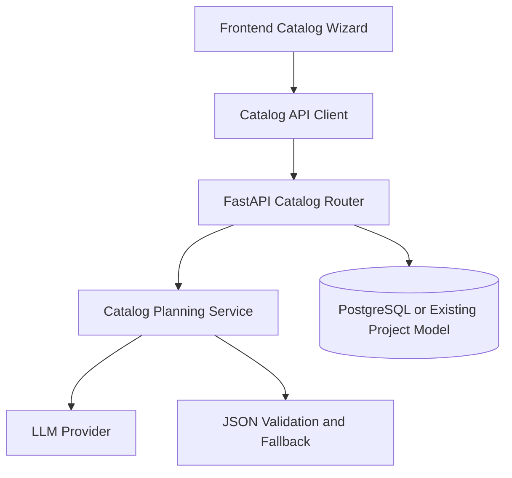

# AI Catalog Builder Progress and Version Log

## 1. Summary

This document is the living source of truth for AI Catalog Builder delivery in Design Studio.
It tracks:

1. Product and technical decisions
2. Milestones and execution progress
3. Version history
4. Risks, acceptance criteria, and next actions

## 2. Feature Scope

The AI Catalog Builder remains inside the existing create or design flow, not as a separate tool.

The mandatory user flow is:

1. Catalog Basics
2. Suggest Structure
3. Style Direction
4. Image Mapping
5. Final JSON Plan

Supported catalog modes:

1. Product catalog
2. Service catalog

Operating rules:

1. AI is assistive only; the user can override output at every step.
2. The system must not assume missing product or service data.
3. Every AI output between steps must be validated structured JSON.
4. Every step must support a safe fallback when AI output is invalid or incomplete.

## 3. Requirements and Constraints

- **REQ-001**: Keep the Catalog Builder inside the existing design flow.
- **REQ-002**: Support both product and service catalog planning.
- **REQ-003**: Generate render-ready structured JSON as the final output.
- **REQ-004**: Allow user override for structure, style, image roles, and copy.
- **REQ-005**: Return `missing_data` when required business information is incomplete.
- **SEC-001**: All new catalog endpoints must remain behind existing authenticated API patterns and rate limiting.
- **SEC-002**: Do not trust client-side input for page structure or assets without schema validation.
- **CON-001**: Fit the current stack: Next.js App Router frontend and FastAPI backend.
- **CON-002**: Reuse robust JSON parsing helpers for LLM output handling.
- **CON-003**: Preserve compatibility with the current single-design flow while catalog flow is introduced.

## 4. Current Decision Snapshot

### Locked Decisions

1. The feature stays in the existing design journey.
2. Catalog flow will be step-based and explicit.
3. Final output is JSON first, renderer second.
4. Product and service flows must branch in structure planning.
5. User override is a first-class requirement, not a future enhancement.

### Open Decisions

1. Whether the final catalog should be stored as a new project type or as an extension of the current project model.
2. Whether step execution stays synchronous in phase 1 or moves to async orchestration for heavier flows.
3. How multi-page catalog output will hand off into the editor in later phases.

## 5. Milestones

| Milestone | Status | Owner | Target | Notes |
|---|---|---|---|---|
| M1 Backend Catalog Domain | In Progress | Backend | TBA | Async LLM-first service added with deterministic fallback and focused tests |
| M2 Frontend Wizard Integration | In Progress | Frontend | TBA | Interview basics, preview summary, image mapping override, final JSON preview, and override controls added |
| M3 Testing and Hardening | In Progress | Frontend + Backend | TBA | Backend unit coverage and initial E2E assertions added |

## 6. Implementation Steps

### Phase 1: Backend Catalog Domain

- GOAL-001: Create the backend API and schema foundation for the catalog planning flow.

| Task | Description | File(s) | Completed |
|---|---|---|---|
| CAT-BE-001 | Add catalog request and response schemas for all steps | `backend/app/schemas/` | x |
| CAT-BE-002 | Add catalog router with step-based endpoints | `backend/app/api/` | x |
| CAT-BE-003 | Add catalog planning service and LLM orchestration | `backend/app/services/` | x |
| CAT-BE-004 | Reuse robust JSON parsing and fallback handling | `backend/app/services/llm_json_utils.py` | x |
| CAT-BE-005 | Register router in backend app bootstrap | `backend/app/main.py` | x |

### Phase 2: Frontend Wizard Integration

- GOAL-002: Build the catalog wizard inside the existing design flow.

| Task | Description | File(s) | Completed |
|---|---|---|---|
| CAT-FE-001 | Extend catalog state in session storage or flow state | `frontend/src/lib/design-brief-session.ts` | x |
| CAT-FE-002 | Add catalog API types and client methods | `frontend/src/lib/api/types.ts`, `frontend/src/lib/api/` | x |
| CAT-FE-003 | Add Catalog Basics step UI and validation | `frontend/src/app/design/new/interview/page.tsx` | x |
| CAT-FE-004 | Add Suggest Structure, Style Direction, and Image Mapping steps | `frontend/src/app/design/new/interview/page.tsx` or new colocated components | x |
| CAT-FE-005 | Add Final JSON Plan review in preview flow | `frontend/src/app/design/new/preview/page.tsx` | x |

### Phase 3: Testing and Hardening

- GOAL-003: Make the feature safe and production-ready.

| Task | Description | File(s) | Completed |
|---|---|---|---|
| CAT-QA-001 | Add backend tests for schemas, fallback, and product or service branching | `backend/tests/` | x |
| CAT-QA-002 | Add frontend E2E coverage for the full catalog flow | `frontend/tests/e2e/` | x |
| CAT-QA-003 | Add telemetry for step completion, drop-off, and override usage | `frontend/src/app/design/new/` | |
| CAT-QA-004 | Review error states and helper copy for missing fields | `frontend/src/app/design/new/` | |

## 7. Architecture Diagram

## 8. API Design

- `POST /api/catalog/plan-structure` — validate catalog basics and return a proposed page structure.
  Request: `{ catalog_type, total_pages, goal, tone, target_audience?, language?, business_context? }`
  Response: `{ suggested_structure, missing_data, warnings }`

- `POST /api/catalog/suggest-styles` — return three visual directions for the selected catalog context.
  Request: `{ catalog_type, goal, tone, target_audience?, brand_context?, structure }`
  Response: `{ style_options }`

- `POST /api/catalog/map-images` — classify uploaded images into catalog roles.
  Request: `{ images, catalog_type, structure }`
  Response: `{ image_mapping, unassigned_images, warnings }`

- `POST /api/catalog/generate-copy` — generate page-level copy aligned with selected structure and style.
  Request: `{ catalog_type, tone, selected_style, pages, business_data }`
  Response: `{ page_copy, missing_data, warnings }`

- `POST /api/catalog/finalize-plan` — produce the final render-ready JSON contract.
  Request: `{ basics, selected_style, structure, image_mapping, page_copy, overrides? }`
  Response: `{ schema_version, catalog_type, total_pages, tone, style, pages, missing_data }`

## 9. Database Changes

No database change is locked yet.

Current options under evaluation:

1. Reuse the existing project model and store catalog JSON as a new structured canvas or metadata payload.
2. Add a dedicated catalog entity when multi-page persistence and export become first-class requirements.

If a dedicated persistence model is chosen later:

1. Add Alembic migration for catalog storage.
2. Add indexes for user ownership and updated timestamp.
3. Add schema versioning for future catalog renderer compatibility.

## 10. Frontend Changes

Planned frontend surfaces:

1. Catalog wizard integrated in the existing design interview flow.
2. Step validation and editable review UX.
3. Final JSON preview before handoff.
4. Later: handoff to renderer or editor.

Likely affected areas:

1. `frontend/src/app/design/new/interview/page.tsx`
2. `frontend/src/app/design/new/preview/page.tsx`
3. `frontend/src/lib/design-brief-session.ts`
4. `frontend/src/lib/api/types.ts`
5. `frontend/src/lib/api/`

## 11. Testing Plan

| Test | Type | File |
|---|---|---|
| TEST-001 | pytest unit | `backend/tests/test_catalog_generation_service.py` |
| TEST-002 | pytest route validation | `backend/tests/test_catalog_api.py` |
| TEST-003 | Playwright E2E | `frontend/tests/e2e/catalog-builder.spec.ts` |
| TEST-004 | Playwright preview E2E | `frontend/tests/e2e/catalog-builder-preview.spec.ts` |

## 12. Acceptance Criteria

1. Users cannot proceed when required step fields are incomplete.
2. Product and service catalog paths produce different structure outputs.
3. Image mapping includes confidence and supports manual relabel.
4. Final output is valid render-ready JSON.
5. All step responses remain stable when the LLM returns fenced or chatty JSON.
6. The feature remains compatible with the current design flow while catalog mode is introduced.

## 13. KPI Tracking

1. Completion rate per step
2. Drop-off rate per step
3. Override rate for AI suggestions
4. First valid plan success rate
5. Time to final plan

## 14. Risks and Assumptions

- **RISK-001**: LLM output may drift away from the expected schema.
  Mitigation: strict validation, retry, and deterministic fallback shapes.
- **RISK-002**: Required inputs may create UX friction if surfaced too early.
  Mitigation: progressive disclosure and example-driven helper text.
- **RISK-003**: Image role classification may not be reliable enough on ambiguous assets.
  Mitigation: confidence scores and manual override.
- **ASSUMPTION-001**: The existing design flow can be extended without a full route split in phase 1.
- **ASSUMPTION-002**: Existing authenticated API and rate limit patterns can be reused for catalog endpoints.

## 15. Dependencies

- **DEP-001**: Existing FastAPI auth and rate limiting patterns
- **DEP-002**: Existing LLM client and robust JSON parsing helpers
- **DEP-003**: Existing frontend interview and preview flow surfaces

## 16. Weekly Update Template

Week: YYYY-MM-DD

Overall status: Green / Yellow / Red

### Highlights

1.
2.
3.

### Completed

1.
2.
3.

### In Progress

1.
2.
3.

### Next Week

1.
2.
3.

### Blockers

1.
2.
3.

## 17. Version Log

### v1.0 — Initial Concept

Date: 2026-04-28

1. Five-step catalog flow proposed.
2. JSON output recognized as the core contract.
3. No implementation breakdown yet.

### v1.1 — MVP Direction

Date: 2026-04-28

1. Early direction explored the feature as a lighter standalone domain.
2. Synchronous endpoint-first approach was suggested.
3. This version did not yet reflect the feature's main-product importance.

### v1.2 — Core Feature Alignment

Date: 2026-04-28

1. The feature was aligned as part of the existing create or design flow.
2. Separate tool positioning was rejected.
3. Dedicated catalog APIs became the preferred direction.

### v2.0 — Current Master Plan

Date: 2026-04-28

1. The feature is now treated as a major product capability.
2. The roadmap is split into backend foundation, frontend integration, and hardening.
3. Progress and versioning are consolidated in this document.

### v2.1 — Initial Execution Started

Date: 2026-04-28

1. Backend catalog domain scaffolding added with schemas, routes, services, and focused tests.
2. Frontend API layer scaffolding added with catalog request and response types plus client methods.
3. The feature moved from planned to in progress.

### v2.2 — Interview and Preview Slice

Date: 2026-04-28

1. Catalog basics were added to the interview flow with catalog type and total page selection.
2. Catalog goals now call backend structure and style suggestion endpoints before entering preview.
3. Preview now displays suggested structure and AI style directions from the catalog planning step.

### v2.3 — Final Plan Preview and E2E Guardrail

Date: 2026-04-28

1. Catalog interview now also requests image mapping, generated page copy, and final plan JSON.
2. Preview renders image mapping and final JSON output for catalog mode.
3. Initial Playwright coverage was extended to assert catalog structure, style suggestions, and final JSON visibility.

### v2.4 — Preview Overrides

Date: 2026-04-28

1. Preview now allows style selection override from suggested style options.
2. Users can edit catalog page titles before refreshing the final plan.
3. Refreshing the final plan now persists updated preview state back into session storage.

### v2.5 — LLM-First Backend Catalog Service

Date: 2026-04-28

1. Backend catalog generation service was refactored to async LLM-first execution.
2. Each catalog step now attempts structured JSON generation through the existing LLM client stack before falling back to deterministic local logic.
3. Focused backend pytest coverage remained green after the refactor.

### v2.6 — Image Mapping Override in Preview

Date: 2026-04-28

1. Preview now supports manual override of image role categories.
2. Users can edit target page assignment for each mapped image before refreshing final plan.
3. Refreshed final plan now uses the edited image mapping state, and E2E assertions were extended for the new controls.

### v2.7 — Mapping Guardrail and Catalog API Route Tests

Date: 2026-04-28

1. Preview image mapping input now validates page assignments against the allowed range `1..total_pages`.
2. Final plan refresh is blocked when mapping input is invalid or empty, with inline validation feedback per image.
3. New route-level pytest coverage added for all catalog endpoints under `/api/catalog/*` using dependency overrides for authenticated access.

## 18. Immediate Next Actions

1. Add telemetry events for catalog override interactions and refresh failures.
2. Expand route tests with negative validation cases and permission edge cases.
3. Plan handoff contract from final catalog JSON to multi-page editor renderer.

## 19. Change Log

- 2026-04-28: Initial living progress and version document created.
- 2026-04-28: Backend and frontend API scaffolding started; document updated to v2.1 and status set to In Progress.
- 2026-04-28: Interview and preview integration added for catalog basics, suggested structure, and suggested style directions; document updated to v2.2.
- 2026-04-28: Image mapping, generated copy, final plan preview, and initial E2E coverage added; document updated to v2.3.
- 2026-04-28: Preview override controls for style selection and page title edits added, with refreshable final plan; document updated to v2.4.
- 2026-04-28: Backend catalog service upgraded to async LLM-first execution with parser-backed fallback normalization; document updated to v2.5.
- 2026-04-28: Preview image mapping override controls added and wired into final plan refresh; document updated to v2.6.
- 2026-04-28: Added page-range validation guardrails for image mapping and created catalog API route tests; document updated to v2.7.