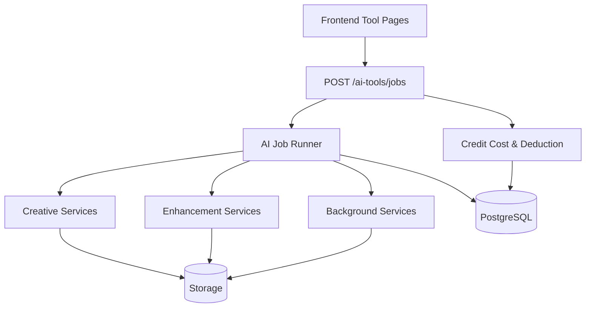

# Implementation Plan: Full Coverage Laporan Bug & Feedback (22Apr26)

## 1. Requirements & Constraints

- REQ-001: Semua temuan bug dan feedback pada tab 22Apr26 harus ter-cover dalam backlog eksekusi.
- REQ-002: Prioritas perbaikan mengikuti dampak bisnis: P0 (billing/failure), P1 (core output quality), P2 (quality polish).
- REQ-003: Satu sumber kebenaran biaya kredit antara backend dan frontend.
- REQ-004: Hasil perbaikan harus tervalidasi oleh test unit backend dan E2E frontend yang relevan.
- SEC-001: Validasi input request async job harus aman (panjang idempotency key, payload type, dan guard cost/refund).
- CON-001: Tidak mengubah kontrak API publik tanpa migration plan.

## 2. Full Coverage Scope

| ID | Area/Fitur | Ringkasan Masalah | Severity | Coverage |
|---|---|---|---|---|
| BUG-001 | ID Photo Maker | Upload foto resolusi tinggi terhambat limit size (5MB) | P1 | Included |
| BUG-002 | ID Photo Maker | Kepala subjek terpotong pada hasil pasfoto | P1 | Included |
| BUG-003 | AI Background Swap | Loading analisis terasa lambat | P1 | Included |
| BUG-004 | AI Background Swap | Validation failed idempotency_key (max 255) | P0 | Included |
| BUG-005 | Auto Retouch | Distorsi mata (hasil tidak natural) | P1 | Included |
| BUG-006 | Batch Photo Processor | Objek terlihat melayang, komposit tidak natural | P1 | Included |
| BUG-007 | AI Product Scene | Produk tidak menyatu dengan background/pencahayaan | P2 | Included |
| BUG-008 | Magic Eraser | Objek sering tidak terhapus bersih | P0 | Included |
| BUG-009 | Magic Eraser | Halusinasi elemen baru (contoh masker) | P1 | Included |
| BUG-010 | Credit & Billing | Biaya UI tidak konsisten dengan biaya proses aktual | P0 | Included |
| BUG-011 | AI Text Banner | Intent user meleset (photoshoot menjadi sale) | P2 | Included |
| BUG-012 | AI Image Upscaler | Hasil upscale tidak signifikan, tetap blurry | P1 | Included |
| BUG-013 | Watermark Placer | Watermark terlalu tidak terlihat | P2 | Included |
| BUG-014 | Generative Expand | Artefak visual (contoh tangan berbulu) | P2 | Included |

## 3. Implementation Steps

### Phase 1: Billing & Job Reliability (P0)

- GOAL-001: Hilangkan mismatch biaya dan failure akibat idempotency key.

| Task | Description | File(s) | Completed |
|---|---|---|---|
| TASK-001 | Tambahkan mekanisme idempotency key hashing/truncation yang konsisten di frontend tool pages | frontend/src/hooks/useToolJobProgress.ts | Yes |
| TASK-002 | Tambahkan guard backend untuk idempotency_key agar tidak gagal validasi ketika input panjang | backend/app/api/ai_tools_routers/jobs.py, backend/app/services/ai_tool_job_service.py | Yes |
| TASK-003 | Samakan tampilan biaya kredit frontend dengan backend source-of-truth (cost constants) | frontend/src/app/tools/text-banner/page.tsx, frontend/src/app/tools/upscaler/page.tsx, frontend/src/app/tools/batch-process/page.tsx | Yes |
| TASK-004 | Audit dan perkuat charged/refund flow pada async jobs | backend/app/api/ai_tools_routers/jobs.py, backend/app/services/credit_service.py | Yes |

### Phase 2: Core AI Output Quality (P1)

- GOAL-002: Tingkatkan kualitas hasil fitur utama yang langsung dirasakan user.

| Task | Description | File(s) | Completed |
|---|---|---|---|
| TASK-005 | Perbaiki pipeline ID Photo untuk high-res input dan framing wajah | backend/app/api/designs_routers/media.py, backend/app/api/ai_tools_routers/enhancement.py, backend/tests/test_id_photo_upload_limits.py | Yes |
| TASK-006 | Optimasi Background Swap latency dan transparansi status proses | backend/app/workers/ai_tool_jobs_background.py, backend/app/services/bg_removal_service.py, frontend/src/app/tools/background-swap/page.tsx | Yes |
| TASK-007 | Kurangi artefak Magic Eraser (failure remove dan hallucination) | backend/app/services/inpaint_service.py, backend/app/workers/ai_tool_jobs_background.py, frontend/src/app/tools/magic-eraser/page.tsx | Yes |
| TASK-008 | Tingkatkan kualitas Upscaler dan validasi output quality gate | backend/app/services/upscale_service.py, backend/app/workers/ai_tool_jobs_enhancement.py, frontend/src/app/tools/upscaler/page.tsx | Yes |
| TASK-009 | Stabilkan hasil Auto Retouch khusus area mata/face detail | backend/app/services/retouch_service.py, frontend/src/app/tools/retouch/page.tsx | Yes |
| TASK-010 | Perbaiki komposit Batch/Product Scene agar tidak melayang | backend/app/services/batch_service.py, backend/app/services/product_scene_service.py, frontend/src/app/tools/batch-process/page.tsx, frontend/src/app/tools/product-scene/page.tsx | Yes |

### Phase 3: Intent Accuracy & Visual Polish (P2)

- GOAL-003: Sempurnakan hasil kreatif agar lebih sesuai ekspektasi user.

| Task | Description | File(s) | Completed |
|---|---|---|---|
| TASK-011 | Perbaiki intent mapping pada Text Banner (anti semantic drift) | backend/app/services/banner_service.py, backend/app/workers/ai_tool_jobs_creative.py, frontend/src/app/tools/text-banner/page.tsx | Yes |
| TASK-012 | Tingkatkan visibilitas Watermark via minimum opacity/scale guard dan UX hint | backend/app/services/watermark_service.py, frontend/src/app/tools/watermark-placer/page.tsx | Yes |
| TASK-013 | Tuning Generative Expand untuk mengurangi artefak anatomi | backend/app/services/outpaint_service.py, backend/app/workers/ai_tool_jobs_background.py, frontend/src/app/tools/generative-expand/page.tsx | Yes |

## 4. Architecture Diagram

## 5. API & Data Validation Focus

- POST /ai-tools/jobs: hardening idempotency_key handling.
- POST /ai-tools/jobs/{job_id}/cancel: refund consistency dan idempotent refund.
- Payload contract per tool: validasi parameter cost-sensitive (quality/scale/operation/file_count).

## 6. Testing Plan

| Test | Type | File |
|---|---|---|
| TEST-001 | pytest unit | backend/tests/test_id_photo_service.py |
| TEST-002 | pytest unit | backend/tests/test_inpaint_service.py |
| TEST-003 | pytest unit | backend/tests/test_upscale_service.py |
| TEST-004 | pytest unit | backend/tests/test_retouch_service.py |
| TEST-005 | pytest unit | backend/tests/test_batch.py |
| TEST-006 | pytest unit | backend/tests/test_product_scene.py |
| TEST-007 | pytest unit | backend/tests/test_watermark.py |
| TEST-008 | pytest unit | backend/tests/test_outpaint_service.py |
| TEST-009 | Playwright E2E | frontend/tests/e2e/tools-background-swap.spec.ts |
| TEST-010 | Playwright E2E | frontend/tests/e2e/tools-magic-eraser.spec.ts |
| TEST-011 | Playwright E2E | frontend/tests/e2e/tools-id-photo.spec.ts |
| TEST-012 | Playwright E2E | frontend/tests/e2e/tools-upscaler.spec.ts |
| TEST-013 | Playwright E2E | frontend/tests/e2e/tools-product-scene.spec.ts |
| TEST-014 | Playwright E2E | frontend/tests/e2e/tools-text-banner.spec.ts |
| TEST-015 | Playwright E2E | frontend/tests/e2e/tools-watermark-placer.spec.ts |
| TEST-016 | Playwright E2E | frontend/tests/e2e/tools-generative-expand.spec.ts |
| TEST-017 | pytest unit | backend/tests/test_ai_tool_job_refund.py |

## 7. Risks & Assumptions

- RISK-001: Tuning model prompt/parameter bisa menaikkan latency.
- RISK-002: Perubahan biaya yang tidak sinkron lintas UI dapat mengganggu trust user.
- RISK-003: Kualitas visual sulit distandarisasi tanpa benchmark image set.
- ASSUMPTION-001: API provider AI tetap tersedia dan tidak berubah kontraknya secara drastis.
- ASSUMPTION-002: Tim memiliki akses environment E2E yang siap autentikasi + worker.

## 8. Definition of Done

- Semua 14 bug di scope memiliki tiket dan status execution path.
- Tidak ada lagi error max_length idempotency_key pada flow normal user.
- Biaya kredit di UI dan backend konsisten.
- Kualitas output P1 meningkat dan tervalidasi lewat test + sample UAT.
- Dokumen ini tersalin ke Notion dan project repo untuk referensi tunggal.

## 9. Execution Update (Final)

- Status batch: closed (bugfix + validasi backend/frontend selesai).
- Perubahan terbaru:
  - Refund flow async jobs: ditambah unit test idempotensi refund/cancel agar tidak double-refund.
  - Background Swap: upload original+mask dibuat paralel agar latency tahap inpaint berkurang.
  - Background Swap async worker: jalur URL-native ditambahkan (`remove_background_from_url` + inpaint reuse `original_url`) untuk menghindari download/re-upload original image yang redundan.
  - Background Swap async worker: fallback otomatis ke jalur byte-based lama jika URL source sementara tidak dapat diakses.
  - Magic Eraser: preprocessing mask (threshold+dilate+soften) untuk memperbaiki kualitas penghapusan objek.
  - Upscaler: penajaman ringan + contrast boost terkontrol pasca hasil model.
  - Upscaler: quality gate dimensi output + fallback upscale lokal bila provider mengembalikan ukuran yang tidak meningkat.
  - Generative Expand: default prompt + guardrails anti halusinasi anatomi/objek baru.
  - Auto Retouch: blending detail asli untuk menekan artefak area mata/wajah.
  - Background Swap: progress phase lebih granular untuk transparansi proses.
- Validasi regresi terbaru:
  - 82 tests passed (suite gabungan layanan AI tools yang terdampak).
  - Targeted backend tests terbaru (pasca optimasi URL-native background swap): 43 passed.
  - Frontend lint passed (`npm run lint`).
  - Playwright chromium passed untuk 8 tool spec utama bugfix: background swap, magic eraser, id photo, upscaler, product scene, text banner, watermark placer, generative expand.
  - Playwright chromium tambahan passed: retouch dan batch process.
- Benchmark latency Background Swap (controlled benchmark, mocked network/model delay, old vs optimized path):
  - Old flow mean: 1779.54 ms
  - New flow mean: 1546.16 ms
  - Improvement mean: 13.11%
  - Old flow median: 1778.48 ms
  - New flow median: 1545.91 ms
  - Improvement median: 13.08%
- Follow-up non-blocking:
  - Validasi benchmark dengan traffic/staging real provider untuk menghitung p50/p95 produksi.
