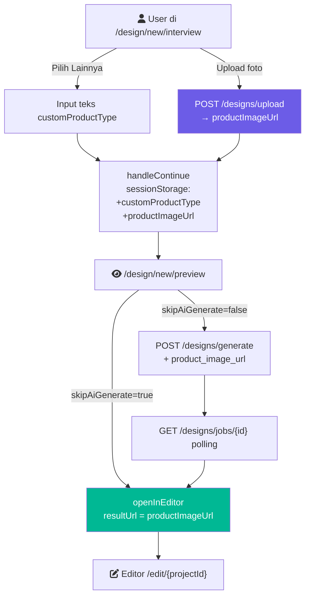

# Implementation Plan: Perbaikan Flow Pembuatan Katalog

## 1. Requirements & Constraints

- **REQ-001**: User dapat mengunggah foto produk sendiri di halaman interview (langkah opsional ke-6)
- **REQ-002**: Opsi "Lainnya" pada jenis produk dapat diisi teks bebas (misal: "Foto Studio", "Maternity Photoshoot")
- **REQ-003**: User dapat memilih untuk menonaktifkan AI generate dan langsung pakai foto produk sebagai asset di editor
- **REQ-004**: Foto produk yang diupload (jika ada) harus dikirim ke `generateDesign()` sebagai `product_image_url` ketika user tetap memilih generate AI
- **SEC-001**: Upload file menggunakan endpoint existing `POST /designs/upload` yang sudah terautentikasi — tidak ada endpoint baru
- **SEC-002**: Validasi tipe file dan ukuran di sisi client sebelum upload (max 10 MB, hanya `image/*`)
- **CON-001**: Tidak ada perubahan backend — semua field (`product_image_url`, `remove_product_bg`) sudah didukung oleh `DesignGenerationRequest`
- **CON-002**: `DesignBriefSessionState` (sessionStorage) diperluas tanpa breaking change — field baru semua optional
- **CON-003**: Upload foto terjadi di interview page, bukan preview, agar user tidak menunggu upload di akhir flow

---

## 2. Implementation Steps

### Phase 1: Extend Session State Type

- GOAL-001: Perluas `DesignBriefSessionState` agar dapat membawa data foto produk dan kategori kustom dari interview ke preview

| Task | Description | File(s) | Completed |
|------|-------------|---------|-----------|
| TASK-001 | Tambah `productImageUrl?: string` dan `customProductType?: string` ke interface `DesignBriefSessionState` | `frontend/src/lib/design-brief-session.ts` | [ ] |

---

### Phase 2: Interview Page — "Lainnya" Bisa Diisi Manual

- GOAL-002: Ketika user memilih chip "Lainnya" pada jenis produk, tampilkan input teks untuk mengisi kategori spesifik

| Task | Description | File(s) | Completed |
|------|-------------|---------|-----------|
| TASK-002 | Tambah state `customProductType: string` (default `""`) di component | `frontend/src/app/design/new/interview/page.tsx` | [ ] |
| TASK-003 | Render `<Input>` kondisional tepat di bawah chip-list ketika `productType === "Lainnya"`, placeholder: `"Contoh: Foto Studio, Maternity Photoshoot..."` | `frontend/src/app/design/new/interview/page.tsx` | [ ] |
| TASK-004 | Update `handleContinue` — sertakan `customProductType` saat menulis ke sessionStorage; gunakan `customProductType || productType` sebagai nilai final | `frontend/src/app/design/new/interview/page.tsx` | [ ] |

---

### Phase 3: Interview Page — Upload Foto Produk (Opsional)

- GOAL-003: Tambahkan card upload foto produk sebagai langkah opsional ke-6 di halaman interview, upload ke backend saat file dipilih, simpan URL ke session

| Task | Description | File(s) | Completed |
|------|-------------|---------|-----------|
| TASK-005 | Tambah state: `productFile: File \| null`, `productPreview: string \| null`, `productImageUrl: string \| null`, `isUploading: boolean`, `uploadError: string \| null` | `frontend/src/app/design/new/interview/page.tsx` | [ ] |
| TASK-006 | Import `useProjectApi` dan destructure `uploadImage` | `frontend/src/app/design/new/interview/page.tsx` | [ ] |
| TASK-007 | Buat handler `handleProductFileSelect(file: File)`: validasi tipe + ukuran → set preview via `URL.createObjectURL` → upload async ke `/designs/upload` → simpan URL ke state; error tidak memblok flow | `frontend/src/app/design/new/interview/page.tsx` | [ ] |
| TASK-008 | Render Card baru **"6. Foto produk (opsional)"** dengan: drag-drop zone + tombol "Pilih Foto", thumbnail preview, badge loading saat upload, tombol hapus (×), pesan error inline | `frontend/src/app/design/new/interview/page.tsx` | [ ] |
| TASK-009 | Update `handleContinue` — sertakan `productImageUrl` ke payload sessionStorage | `frontend/src/app/design/new/interview/page.tsx` | [ ] |

---

### Phase 4: Preview Page — Gunakan Data Baru + Opsi Skip AI

- GOAL-004: Preview page membaca `productImageUrl` dan `customProductType` dari session, memperbarui prompt, menampilkan thumbnail, dan menyediakan toggle skip AI generate

| Task | Description | File(s) | Completed |
|------|-------------|---------|-----------|
| TASK-010 | Update `buildPrompt()` — gunakan `brief.customProductType` jika tersedia, menggantikan mapping `"Lainnya" → "produk umum"` yang generik | `frontend/src/app/design/new/preview/page.tsx` | [ ] |
| TASK-011 | Update `PRODUCT_TYPE_LABEL_MAP` — tambah fallback ke `brief.customProductType` jika key tidak ada di map | `frontend/src/app/design/new/preview/page.tsx` | [ ] |
| TASK-012 | Tambah state `skipAiGenerate: boolean`, inisialisasi `true` jika `brief?.productImageUrl` tersedia, `false` jika tidak | `frontend/src/app/design/new/preview/page.tsx` | [ ] |
| TASK-013 | Tampilkan thumbnail `<Image>` foto produk di kartu brief summary jika `brief.productImageUrl` ada | `frontend/src/app/design/new/preview/page.tsx` | [ ] |
| TASK-014 | Render toggle/radio kondisional **"Generate gambar AI"** vs **"Pakai foto produk langsung (tanpa AI)"** — hanya muncul jika `brief.productImageUrl` tersedia | `frontend/src/app/design/new/preview/page.tsx` | [ ] |
| TASK-015 | Update `handleGenerate`: jika `skipAiGenerate === true` → panggil `openInEditor({ resultUrl: brief.productImageUrl, ... })` langsung tanpa `generateDesign()` | `frontend/src/app/design/new/preview/page.tsx` | [ ] |
| TASK-016 | Update `handleGenerate`: jika `skipAiGenerate === false` dan ada `productImageUrl` → pass `product_image_url: brief.productImageUrl` ke `generateDesign()` | `frontend/src/app/design/new/preview/page.tsx` | [ ] |
| TASK-017 | Update label tombol CTA di sticky action bar: `"Buka Editor dengan Foto Ini"` saat `skipAiGenerate=true`, `"Generate Desain"` saat `false` | `frontend/src/app/design/new/preview/page.tsx` | [ ] |

---

### Phase 5: Testing

- GOAL-005: Validasi ketiga skenario perbaikan dengan E2E test

| Task | Description | File(s) | Completed |
|------|-------------|---------|-----------|
| TASK-018 | Tambah E2E test skenario: pilih "Lainnya" → isi input kustom → verifikasi nilai tersimpan di sessionStorage dan muncul di preview | `frontend/tests/e2e/design-brief-interview.spec.ts` | [ ] |
| TASK-019 | Tambah E2E test skenario: upload foto → toggle skip AI → klik CTA → verifikasi redirect ke editor tanpa memanggil `/designs/generate` | `frontend/tests/e2e/design-brief-preview.spec.ts` | [ ] |

---

## 3. Architecture Diagram

---

## 4. API Design

Tidak ada endpoint baru. Memanfaatkan endpoint existing:

### Upload Foto Produk
- **`POST /designs/upload`** — sudah ada di `aiToolsApi.ts`
- Request: `FormData` dengan field `file`
- Response: `{ url: string }`

### Generate dengan Foto Produk
- **`POST /designs/generate`** — field `product_image_url` sudah didukung oleh `DesignGenerationRequest`
- Request tambahan: `{ ..., product_image_url: string, remove_product_bg: false }`

---

## 5. Database Changes

Tidak ada perubahan database dan tidak ada Alembic migration.

---

## 6. Frontend Changes

### Files yang Dimodifikasi

| File | Perubahan |
|------|-----------|
| `frontend/src/lib/design-brief-session.ts` | Extend `DesignBriefSessionState` interface (+2 optional fields) |
| `frontend/src/app/design/new/interview/page.tsx` | Upload card (Phase 3) + "Lainnya" input (Phase 2) + update `handleContinue` |
| `frontend/src/app/design/new/preview/page.tsx` | Skip AI toggle, thumbnail, updated `handleGenerate`, updated CTA label |

### Komponen Baru
Tidak ada komponen baru — semua inline di halaman existing.

### Store Changes (Zustand)
Tidak ada — state ephemeral via sessionStorage.

### Routes Affected
- `/design/new/interview` — penambahan UI
- `/design/new/preview` — penambahan UI dan logika generate

---

## 7. Testing

| Test | Type | File |
|------|------|------|
| TEST-001 | Playwright E2E — pilih "Lainnya" + isi input kustom + verifikasi di preview | `frontend/tests/e2e/design-brief-interview.spec.ts` |
| TEST-002 | Playwright E2E — upload foto + skip AI + redirect ke editor | `frontend/tests/e2e/design-brief-preview.spec.ts` |

---

## 8. Risks & Assumptions

- **RISK-001**: Upload foto di interview page bisa gagal karena network error sebelum user klik "Lanjut". **Mitigasi:** Simpan error di state (`uploadError`), tampilkan pesan retry inline, jangan block tombol "Lanjut" jika upload gagal — foto tetap bersifat opsional.
- **RISK-002**: `openInEditor({ resultUrl: productImageUrl })` dengan URL foto produk mentah (bukan hasil AI) belum pernah diuji. **Mitigasi:** Gunakan field `primaryAsset: { url: productImageUrl }` di `ToolHandoffOptions` jika `resultUrl` tidak cukup untuk meload gambar di editor.
- **RISK-003**: User mungkin bingung dengan toggle "skip AI" jika tidak ada foto yang diupload. **Mitigasi:** Toggle hanya muncul jika `productImageUrl` tersedia.
- **ASSUMPTION-001**: `uploadImage()` di `aiToolsApi.ts` mengembalikan URL permanen yang bisa diakses oleh editor canvas.
- **ASSUMPTION-002**: Flow baru (`/design/new/interview` → `/design/new/preview`) adalah satu-satunya entry point untuk tipe "katalog" yang dikeluhkan user.

---

## 9. Dependencies

- **DEP-001**: `useProjectApi().uploadImage` — sudah tersedia di `frontend/src/lib/api/aiToolsApi.ts`
- **DEP-002**: `useToolHandoff().openInEditor` — sudah tersedia di `frontend/src/hooks/useToolHandoff.ts`
- **DEP-003**: Shadcn `Input` component — sudah tersedia di `frontend/src/components/ui/input.tsx`
- **DEP-004**: `next/image` `<Image>` component — sudah tersedia, untuk thumbnail preview di preview page
