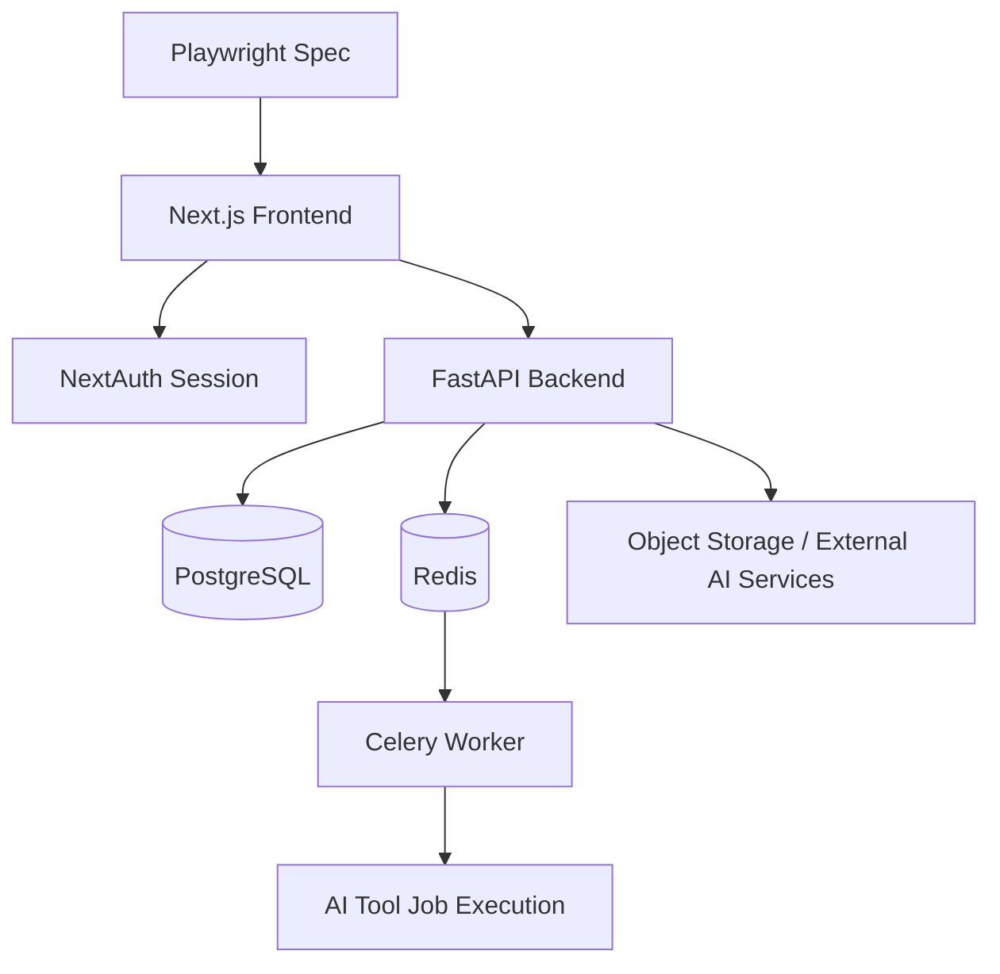

# Implementation Plan: Full Frontend E2E Coverage Expansion

## 1. Requirements & Constraints

- **REQ-001**: Expand Playwright coverage from the current narrow baseline to all major user-facing frontend surfaces.
- **REQ-002**: Preserve the existing intent-first product direction and current user-facing copy in all new tests.
- **REQ-003**: Reuse stable authenticated flows already proven in existing E2E specs instead of reintroducing brittle login patterns.
- **REQ-004**: Cover both happy paths and key blocking states for each major feature area.
- **REQ-005**: Keep new specs aligned with real runtime behavior, especially async AI jobs and credit-gated actions.
- **REQ-006**: Make test data predictable enough that specs can run repeatedly on a local or CI-like environment.
- **SEC-001**: Never rely on unauthenticated shortcuts for protected flows such as projects, tools, assets, brand, create, edit, and settings.
- **SEC-002**: Do not hardcode production secrets or alter production-only behavior for the sake of testing.
- **SEC-003**: Keep any test-only setup isolated to local/CI workflows; do not expose privileged reset capabilities in user-facing production routes.
- **CON-001**: Current E2E coverage exists in [frontend/tests/e2e/critical-journey.spec.ts](frontend/tests/e2e/critical-journey.spec.ts), [frontend/tests/e2e/intent-first-entry.spec.ts](frontend/tests/e2e/intent-first-entry.spec.ts), [frontend/tests/e2e/tools.spec.ts](frontend/tests/e2e/tools.spec.ts), and [frontend/tests/e2e/error-boundary.spec.ts](frontend/tests/e2e/error-boundary.spec.ts).
- **CON-002**: Async tool flows depend on backend health, Redis, and an active Celery worker.
- **CON-003**: Credit-gated tool flows require sufficient credits on the demo test user before execution.
- **CON-004**: Browser coverage currently targets Chromium, Firefox, and WebKit via [frontend/playwright.config.ts](frontend/playwright.config.ts).
- **CON-005**: Avoid broad parallel runs for AI-heavy flows until test isolation, credits, and worker throughput are stabilized.

## 2. Implementation Steps

### Phase 1: Stabilize Shared Test Infrastructure

- GOAL-001: Remove repeated auth/setup logic and make runtime prerequisites explicit.
- GOAL-002: Prevent false negatives caused by missing credits, missing workers, or inconsistent seeded state.

| Task | Description | File(s) | Completed |
|------|-------------|---------|-----------|
| TASK-001 | Extract shared `loginAsDemoUser` helper into a reusable Playwright support module. | `frontend/tests/e2e/critical-journey.spec.ts`, `frontend/tests/e2e/intent-first-entry.spec.ts`, `frontend/tests/e2e/tools.spec.ts`, `frontend/tests/e2e/utils/auth.ts` | |
| TASK-002 | Add shared helper for authenticated navigation and common assertions. | `frontend/tests/e2e/utils/navigation.ts` | |
| TASK-003 | Add documented pre-run checklist for backend, Redis, worker, and credit state. | `frontend/README.md`, `frontend/playwright.config.ts` | |
| TASK-004 | Add deterministic local seed/reset script for demo user credits and baseline state. | `backend/create_test_user.py`, `backend/scripts/`, `frontend/package.json` | |
| TASK-005 | Evaluate whether AI-heavy specs should use a dedicated Playwright tag or project grouping. | `frontend/playwright.config.ts`, `frontend/tests/e2e/` | |

### Phase 2: Cover Auth and Entry Flows

- GOAL-003: Ensure all public entry points and account recovery flows are validated end-to-end.

| Task | Description | File(s) | Completed |
|------|-------------|---------|-----------|
| TASK-006 | Add signup flow coverage from register to first authenticated landing page. | `frontend/tests/e2e/auth-signup-and-onboarding.spec.ts`, `frontend/src/app/register/page.tsx`, `frontend/src/app/projects/page.tsx` | |
| TASK-007 | Add forgot-password request flow coverage with visible success/error states. | `frontend/tests/e2e/password-recovery.spec.ts`, `frontend/src/app/forgot-password/page.tsx` | |
| TASK-008 | Add reset-password form coverage for token validation and password update UX. | `frontend/tests/e2e/password-recovery.spec.ts`, `frontend/src/app/reset-password/page.tsx` | |
| TASK-009 | Add public landing-page smoke coverage for primary CTA routing and key messaging sections. | `frontend/tests/e2e/public-entry.spec.ts`, `frontend/src/app/page.tsx`, `frontend/src/components/landing/` | |

### Phase 3: Expand Core Product Workflow Coverage

- GOAL-004: Validate the highest-value logged-in flows across projects, create, and editor.

| Task | Description | File(s) | Completed |
|------|-------------|---------|-----------|
| TASK-010 | Add project CRUD coverage for create, duplicate, delete, and reopen behaviors. | `frontend/tests/e2e/project-management.spec.ts`, `frontend/src/app/projects/page.tsx`, `frontend/src/components/projects/` | |
| TASK-011 | Add project discovery coverage for search, filter, and sort behavior. | `frontend/tests/e2e/project-search-and-filter.spec.ts`, `frontend/src/app/projects/page.tsx`, `frontend/src/components/projects/` | |
| TASK-012 | Add full brief-interview flow coverage from `/create` through first generated result checkpoint. | `frontend/tests/e2e/design-brief-interview.spec.ts`, `frontend/src/app/create/page.tsx`, `frontend/src/components/create/DesignBriefInterview.tsx`, `frontend/src/components/create/UnifiedResultsView.tsx` | |
| TASK-013 | Add preview-to-editor handoff coverage for selecting a result and continuing into the editor. | `frontend/tests/e2e/create-preview-handoff.spec.ts`, `frontend/src/components/create/UnifiedPreviewEditor.tsx`, `frontend/src/components/create/parts/EditorToolbar.tsx` | |
| TASK-014 | Add editor persistence coverage for save, reopen, and state restoration. | `frontend/tests/e2e/editor-persistence-and-state.spec.ts`, `frontend/src/app/edit/[projectId]/page.tsx`, `frontend/src/components/editor/` | |
| TASK-015 | Add editor utility coverage for at least one high-value panel flow such as background removal or AI prompt panel handoff. | `frontend/tests/e2e/editor-utility-panels.spec.ts`, `frontend/src/components/editor/BackgroundRemovalPanel.tsx`, `frontend/src/components/editor/AIPromptPanel.tsx` | |

### Phase 4: Expand Tools Coverage to All Tool Surfaces

- GOAL-005: Move from two validated tools to the full tool catalog, while separating heavy-runtime flows from lighter navigational checks.

| Task | Description | File(s) | Completed |
|------|-------------|---------|-----------|
| TASK-016 | Add tools hub coverage for card rendering and route transitions to every tool page. | `frontend/tests/e2e/tools-hub-navigation.spec.ts`, `frontend/src/app/tools/page.tsx` | ✅ |
| TASK-017 | Add smoke coverage for retouch flow. | `frontend/tests/e2e/tools-retouch.spec.ts`, `frontend/src/app/tools/retouch/page.tsx` | |
| TASK-018 | Add smoke coverage for product scene flow. | `frontend/tests/e2e/tools-product-scene.spec.ts`, `frontend/src/app/tools/product-scene/page.tsx` | |
| TASK-019 | Add smoke coverage for text banner flow. | `frontend/tests/e2e/tools-text-banner.spec.ts`, `frontend/src/app/tools/text-banner/page.tsx` | |
| TASK-020 | Add smoke coverage for batch process flow with safe local test fixtures. | `frontend/tests/e2e/tools-batch-process.spec.ts`, `frontend/src/app/tools/batch-process/page.tsx` | |
| TASK-021 | Add smoke coverage for ID photo flow. | `frontend/tests/e2e/tools-id-photo.spec.ts`, `frontend/src/app/tools/id-photo/page.tsx` | |
| TASK-022 | Add smoke coverage for magic eraser flow. | `frontend/tests/e2e/tools-magic-eraser.spec.ts`, `frontend/src/app/tools/magic-eraser/page.tsx` | |
| TASK-023 | Add smoke coverage for generative expand flow. | `frontend/tests/e2e/tools-generative-expand.spec.ts`, `frontend/src/app/tools/generative-expand/page.tsx` | |
| TASK-024 | Add smoke coverage for watermark placer flow. | `frontend/tests/e2e/tools-watermark-placer.spec.ts`, `frontend/src/app/tools/watermark-placer/page.tsx` | |
| TASK-025 | Refactor [frontend/tests/e2e/tools.spec.ts](frontend/tests/e2e/tools.spec.ts) into narrower per-tool specs if runtime cost or debugging complexity continues to grow. | `frontend/tests/e2e/tools.spec.ts`, `frontend/tests/e2e/` | |

### Phase 5: Cover Brand, Assets, and Settings Surfaces

- GOAL-006: Validate configuration and library surfaces that support repeated use, not just first-run creation.

| Task | Description | File(s) | Completed |
|------|-------------|---------|-----------|
| TASK-026 | Add brand-kit creation and editing flow coverage. | `frontend/tests/e2e/brand-kit-workflow.spec.ts`, `frontend/src/app/brand/page.tsx`, `frontend/src/components/settings/BrandSettings.tsx`, `frontend/src/components/editor/BrandKitPanel.tsx` | ✅ |
| TASK-027 | Add asset-library flow coverage for viewing, filtering, and reopening assets in downstream workflows. | `frontend/tests/e2e/asset-library-management.spec.ts`, `frontend/src/app/my-assets/page.tsx`, `frontend/src/components/assets/` | ✅ |
| TASK-028 | Add user settings coverage for profile state, credit display, and storage quota panels. | `frontend/tests/e2e/user-settings-and-profile.spec.ts`, `frontend/src/app/settings/page.tsx`, `frontend/src/components/settings/` | ✅ |
| TASK-029 | Add guarded destructive-action coverage for account deletion or equivalent irreversible settings action if supported in local env. | `frontend/tests/e2e/account-destructive-actions.spec.ts`, `frontend/src/app/settings/page.tsx`, `frontend/src/components/settings/` | ✅ |

### Phase 6: Add Cross-Browser, Resilience, and Quality Gates

- GOAL-007: Convert the expanded suite from local smoke coverage into a maintainable regression net.

| Task | Description | File(s) | Completed |
|------|-------------|---------|-----------|
| TASK-030 | Promote stable Chromium specs to Firefox and WebKit in controlled batches. | `frontend/playwright.config.ts`, `frontend/tests/e2e/` | ✅ |
| TASK-031 | Add mobile viewport smoke coverage for login, create, and at least one tool flow. | `frontend/playwright.config.ts`, `frontend/tests/e2e/responsive-design-mobile.spec.ts` | ✅ |
| TASK-032 | Add explicit session-expiry or forced-logout coverage if middleware/session hooks support deterministic testing. | `frontend/tests/e2e/session-expiry-and-reauth.spec.ts`, `frontend/src/app/login/page.tsx`, `frontend/src/middleware.ts` | ✅ |
| TASK-033 | Define CI execution groups: fast smoke, authenticated core, AI-heavy tools, and optional nightly cross-browser. | `frontend/playwright.config.ts`, `frontend/README.md` | ✅ |
| TASK-034 | Add failure triage guidance for trace, screenshot, and runtime dependency diagnosis. | `frontend/README.md`, `docs/features/full-frontend-e2e-expansion/implementation-plan.md` | ✅ |

## 3. Architecture Diagram

## 4. API Design

No new product API is strictly required for the first expansion pass. The plan should prefer existing authenticated routes and deterministic local setup.

Existing API surfaces that the E2E suite will exercise heavily:

- `POST /api/auth/login` — credentials login for protected flows.
- `GET /api/users/me` — session-linked profile and credit state.
- `GET /api/projects/` — project listing, search, and reopen flows.
- `POST /api/designs/*` — create flow clarification, parsing, and generation pipeline.
- `POST /api/tools/jobs` — async tool job creation.
- `GET /api/tools/jobs/:jobId` — async tool progress polling.
- `POST /api/tools/jobs/:jobId/cancel` — async tool cancellation.

Optional test-support interfaces to consider if deterministic setup remains difficult:

- Test-only local script to reset demo user credits and clean seeded assets.
- Test-only CLI wrapper to confirm backend, Redis, and Celery readiness before running heavy specs.

## 5. Database Changes

- No schema change is required for the initial E2E coverage expansion.
- Prefer fixture/state reset scripts over schema edits.
- If test isolation later requires new fixture metadata, add it through Alembic with explicit non-production usage boundaries.
- If demo user seeding remains manual, standardize the reset process against the existing `users` table rather than adding new schema.

## 6. Frontend Changes

- New Playwright support helpers:
  - `frontend/tests/e2e/utils/auth.ts`
  - `frontend/tests/e2e/utils/navigation.ts`
  - `frontend/tests/e2e/utils/fixtures.ts`
- New E2E specs for uncovered feature groups:
  - auth/public
  - projects
  - create/brief interview
  - editor
  - tools hub + per-tool flows
  - brand
  - assets
  - settings
- Minor frontend code changes may still be required to improve testability:
  - Stable accessible labels for interactive controls.
  - Consistent headings and result-state copy.
  - Test-safe handling for onboarding overlays or transient dialogs.
  - Better empty/error states where assertions are currently ambiguous.

## 7. Testing

| Test | Type | File |
|------|------|------|
| TEST-001 | Playwright E2E | `frontend/tests/e2e/critical-journey.spec.ts` |
| TEST-002 | Playwright E2E | `frontend/tests/e2e/intent-first-entry.spec.ts` |
| TEST-003 | Playwright E2E | `frontend/tests/e2e/tools.spec.ts` |
| TEST-004 | Playwright E2E | `frontend/tests/e2e/error-boundary.spec.ts` |
| TEST-005 | Playwright E2E | `frontend/tests/e2e/auth-signup-and-onboarding.spec.ts` |
| TEST-006 | Playwright E2E | `frontend/tests/e2e/password-recovery.spec.ts` |
| TEST-007 | Playwright E2E | `frontend/tests/e2e/public-entry.spec.ts` |
| TEST-008 | Playwright E2E | `frontend/tests/e2e/project-management.spec.ts` |
| TEST-009 | Playwright E2E | `frontend/tests/e2e/project-search-and-filter.spec.ts` |
| TEST-010 | Playwright E2E | `frontend/tests/e2e/design-brief-interview.spec.ts` |
| TEST-011 | Playwright E2E | `frontend/tests/e2e/create-preview-handoff.spec.ts` |
| TEST-012 | Playwright E2E | `frontend/tests/e2e/editor-persistence-and-state.spec.ts` |
| TEST-013 | Playwright E2E | `frontend/tests/e2e/editor-utility-panels.spec.ts` |
| TEST-014 | Playwright E2E | `frontend/tests/e2e/tools-hub-navigation.spec.ts` |
| TEST-015 | Playwright E2E | `frontend/tests/e2e/tools-retouch.spec.ts` |
| TEST-016 | Playwright E2E | `frontend/tests/e2e/tools-product-scene.spec.ts` |
| TEST-017 | Playwright E2E | `frontend/tests/e2e/tools-text-banner.spec.ts` |
| TEST-018 | Playwright E2E | `frontend/tests/e2e/tools-batch-process.spec.ts` |
| TEST-019 | Playwright E2E | `frontend/tests/e2e/tools-id-photo.spec.ts` |
| TEST-020 | Playwright E2E | `frontend/tests/e2e/tools-magic-eraser.spec.ts` |
| TEST-021 | Playwright E2E | `frontend/tests/e2e/tools-generative-expand.spec.ts` |
| TEST-022 | Playwright E2E | `frontend/tests/e2e/tools-watermark-placer.spec.ts` |
| TEST-023 | Playwright E2E | `frontend/tests/e2e/brand-kit-workflow.spec.ts` |
| TEST-024 | Playwright E2E | `frontend/tests/e2e/asset-library-management.spec.ts` |
| TEST-025 | Playwright E2E | `frontend/tests/e2e/user-settings-and-profile.spec.ts` |
| TEST-026 | Playwright E2E | `frontend/tests/e2e/account-destructive-actions.spec.ts` |
| TEST-027 | Playwright E2E | `frontend/tests/e2e/session-expiry-and-reauth.spec.ts` |
| TEST-028 | Playwright E2E | `frontend/tests/e2e/responsive-design-mobile.spec.ts` |

Execution strategy:

- Phase A: Chromium-only fast validation for new specs.
- Phase B: Chromium-only AI-heavy flows with worker and credit reset prerequisites.
- Phase C: Promote stable specs to Firefox and WebKit.
- Phase D: Group the suite into smoke, core, tools-heavy, and nightly sets.

## 8. Risks & Assumptions

- **RISK-001**: AI-heavy flows may fail because of third-party model latency or non-deterministic outputs.
  Mitigation: keep assertions focused on stable UI outcomes, not transient intermediate messages or generated content details.
- **RISK-002**: Demo user state can drift because of spent credits, stale projects, or leftover assets.
  Mitigation: add explicit reset scripts and run them before AI-heavy suites.
- **RISK-003**: WebKit and Firefox may expose auth/input timing issues not seen in Chromium.
  Mitigation: standardize robust login helpers and use web-first assertions.
- **RISK-004**: Heavy tool specs may overload local worker capacity when run in parallel.
  Mitigation: serialize AI-heavy groups or isolate them in a dedicated project/tag.
- **RISK-005**: Existing UI copy and headings may continue to evolve during product cleanup.
  Mitigation: anchor tests on accessible roles and stable intent labels, and avoid brittle text matching where semantics are stronger.
- **ASSUMPTION-001**: Local backend, Redis, and Celery worker can be started before running AI-heavy E2E suites.
- **ASSUMPTION-002**: Demo user credentials remain available for non-destructive local testing.
- **ASSUMPTION-003**: The current product direction keeps intent-first entry as the main create-path baseline.

## 9. Dependencies

- **DEP-001**: Playwright in `frontend/package.json`.
- **DEP-002**: Local Next.js frontend at `http://localhost:3000`.
- **DEP-003**: Local FastAPI backend at `http://localhost:8000`.
- **DEP-004**: Redis on host port `6380` for async job queueing.
- **DEP-005**: Celery worker using `app.workers.celery_app` for AI tool jobs.
- **DEP-006**: Local Postgres with deterministic demo-user state.
- **DEP-007**: Existing frontend route files under `frontend/src/app`.
- **DEP-008**: Existing component surfaces under `frontend/src/components`.

## 10. Recommended Rollout Order

1. Shared test infrastructure and state reset helpers.
2. Project management, full create flow, and editor persistence.
3. Tools hub navigation plus all remaining individual tool smoke specs.
4. Brand, assets, and settings surfaces.
5. Cross-browser promotion and CI grouping.
