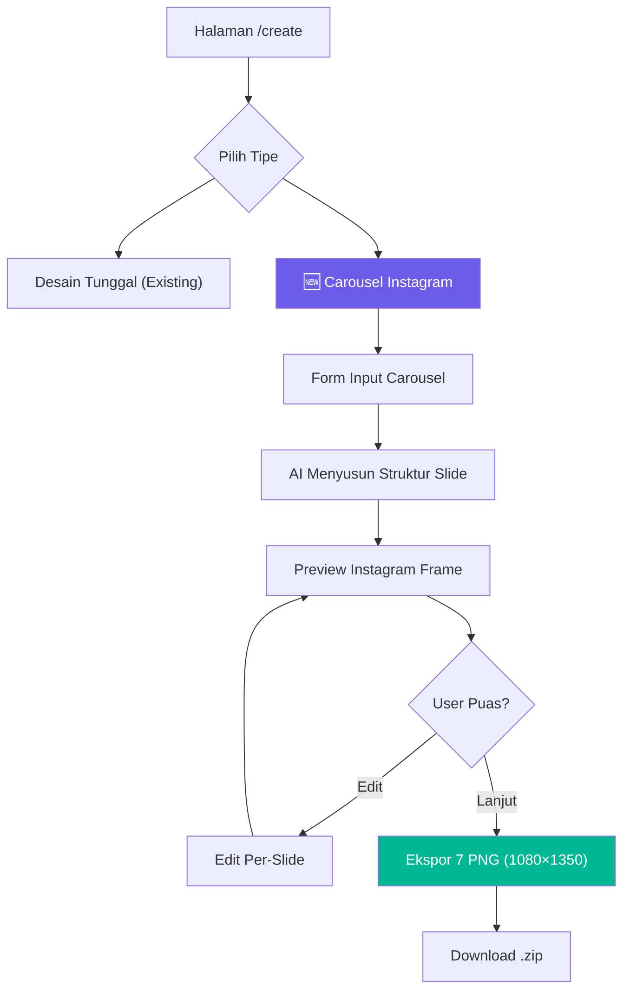
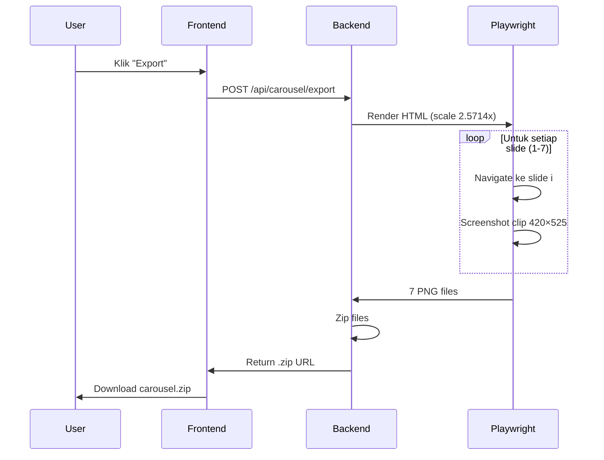

# 📱 Instagram Carousel Generator — Feature Specification

> **Status:** Draft  
> **Author:** SmartDesign Studio Team  
> **Date:** 2026-03-23  
> **Version:** 1.0

---

## 1. Ringkasan Eksekutif

Instagram Carousel Generator adalah fitur baru di SmartDesign Studio yang memungkinkan pengguna membuat carousel Instagram 4:5 (1080×1350px) lengkap — dari ideasi hingga gambar siap posting — hanya dengan memasukkan **topik, warna brand, dan nama brand**.

Fitur ini menambahkan **Path C: Carousel Generation** ke arsitektur SmartDesign Studio yang sudah memiliki dua jalur pembuatan desain (AI-Only dan Template-Preset).

### Mengapa Fitur Ini Penting

| Kompetitor | Kekurangan |
|------------|------------|
| Canva | Desain manual slide per slide, 30-60 menit per carousel |
| ChatGPT / Copy.ai | Hanya menghasilkan teks, bukan desain visual |
| CapCut / Later | Terbatas pada template rigid, customisasi minim |

**Value Proposition:** Ketik topik → AI menyusun narasi 7 slide → desain visual siap ekspor dalam hitungan menit.

---

## 2. User Flow



### Alur Detail

1. **Entry Point** — Pengguna memilih "Carousel Instagram" dari halaman `/create` (card baru di grid 2+1)
2. **Brand Setup** — Mengisi nama brand, handle IG, warna primer, preferensi font, dan tone
3. **Topik Input** — Menulis topik atau pesan utama carousel (misal: "5 Tips UX Design untuk Startup")
4. **AI Generation** — Backend menghasilkan struktur JSON dengan konten 7 slide mengikuti narasi: Hook → Problem → Solution → Features → Details → How-to → CTA
5. **Preview** — Ditampilkan dalam Instagram Frame wrapper lengkap dengan swipe/drag
6. **Edit** — Pengguna bisa mengedit teks per-slide, mengubah urutan, atau request regenerasi slide tertentu
7. **Export** — Backend merender HTML ke PNG via Playwright, mengembalikan `.zip` berisi 7 gambar

---

## 3. Arsitektur Teknis

### 3.1 Integrasi dengan Stack SDS

```
┌──────────────────────────────────────────┐
│            Next.js Frontend              │
│  ┌────────────────────────────────────┐  │
│  │  CarouselGenerator (React)         │  │
│  │  ├─ BrandSetupForm                 │  │
│  │  ├─ CarouselPreview                │  │
│  │  │   ├─ IgPreviewFrame             │  │
│  │  │   ├─ CarouselSlide (×7)         │  │
│  │  │   ├─ ProgressBar                │  │
│  │  │   └─ SwipeArrow                 │  │
│  │  └─ SlideEditor (inline)           │  │
│  └────────────────────────────────────┘  │
└──────────┬───────────────────────────────┘
           │ REST API
┌──────────▼───────────────────────────────┐
│          FastAPI Backend                 │
│  ┌────────────────────────────────────┐  │
│  │  /api/carousel/generate            │  │
│  │  /api/carousel/export              │  │
│  │  /api/carousel/regenerate-slide    │  │
│  └────────────────────────────────────┘  │
│  ┌──────────┬──────────┬──────────────┐  │
│  │ Gemini   │ Celery   │ Playwright   │  │
│  │ (Narasi) │ (Queue)  │ (Export)     │  │
│  └──────────┴──────────┴──────────────┘  │
└──────────────────────────────────────────┘
```

### 3.2 Posisi dalam Arsitektur SDS

| Aspek | Path A: AI-Only | Path B: Template-Preset | **Path C: Carousel** |
|-------|----------------|------------------------|---------------------|
| **Output** | 1 gambar tunggal | 1 gambar tunggal | 5–10 gambar slide |
| **Layout** | AI-Dynamic | Human-Defined | Predefined Patterns |
| **Canvas** | Konva.js editor | Konva.js editor | HTML/CSS render |
| **Aspek Rasio** | 1:1, 4:5, 9:16 | Sesuai template | Fixed 4:5 |
| **Export** | Frontend (Canvas) | Frontend (Canvas) | **Backend (Playwright)** |
| **AI Role** | Parse teks + generate bg | Parse + template mapping | **Susun narasi multi-slide** |

> [!IMPORTANT]
> Carousel menggunakan **HTML/CSS render** (bukan Konva.js Canvas) karena kebutuhan tipografi presisi tinggi dengan Google Fonts dan layout multi-slide yang lebih cocok ditangani oleh mesin rendering browser.

---

## 4. Sistem Desain Carousel

### 4.1 Color Token System

Dari **1 warna primer** pengguna, sistem menurunkan 6 token warna:

```
Input: Primary Brand Color (misal: #6C5CE7)
                ↓
┌─────────────────────────────────────────────────┐
│  BRAND_PRIMARY  = #6C5CE7  (aksen utama)        │
│  BRAND_LIGHT    = #A29BFE  (primary + 20% L)    │
│  BRAND_DARK     = #4834D4  (primary - 30% L)    │
│  LIGHT_BG       = #F8F7FF  (off-white, tinted)  │
│  LIGHT_BORDER   = #EEEDFA  (LIGHT_BG - 1 shade) │
│  DARK_BG        = #0F0E2A  (near-black, tinted) │
└─────────────────────────────────────────────────┘
```

**Aturan Turunan Warna:**
- `LIGHT_BG` — Off-white dengan tint dari primary (warm primary → cream, cool primary → gray-white). Tidak pernah pure `#FFFFFF`.
- `DARK_BG` — Near-black dengan tint dari temperatur brand (warm → `#1A1918`, cool → `#0F172A`).
- `LIGHT_BORDER` — Satu shade lebih gelap dari `LIGHT_BG`.
- **Brand Gradient** — `linear-gradient(165deg, BRAND_DARK 0%, BRAND_PRIMARY 50%, BRAND_LIGHT 100%)`

### 4.2 Typography System

Pasangan font dimuat dari Google Fonts berdasarkan preferensi tone pengguna:

| Tone | Heading Font | Body Font |
|------|-------------|-----------|
| Editorial / Premium | Playfair Display | DM Sans |
| Modern / Clean | Plus Jakarta Sans (700) | Plus Jakarta Sans (400) |
| Warm / Approachable | Lora | Nunito Sans |
| Technical / Sharp | Space Grotesk | Space Grotesk |
| Bold / Expressive | Fraunces | Outfit |
| Classic / Trustworthy | Libre Baskerville | Work Sans |
| Rounded / Friendly | Bricolage Grotesque | Bricolage Grotesque |

**Skala Ukuran (Fixed):**

| Elemen | Size | Weight | Spacing |
|--------|------|--------|---------|
| Heading | 28–34px | 600 | -0.3 to -0.5px, line-height 1.1 |
| Body | 14px | 400 | line-height 1.5 |
| Tag/Label | 10px | 600 | letter-spacing 2px, uppercase |
| Step Number | 26px | 300 | — |
| Small Text | 11–12px | — | — |

### 4.3 Slide Background Alternation

Slide-slide bergantian antara `LIGHT_BG` dan `DARK_BG` untuk membangun ritme visual:

```
Slide 1 (Hero)     → LIGHT_BG
Slide 2 (Problem)  → DARK_BG
Slide 3 (Solution) → Brand Gradient
Slide 4 (Features) → LIGHT_BG
Slide 5 (Details)  → DARK_BG
Slide 6 (How-to)   → LIGHT_BG
Slide 7 (CTA)      → Brand Gradient
```

---

## 5. Struktur Slide & Narasi

### 5.1 Arsitektur Narrative Arc

Setiap carousel mengikuti struktur narasi 7 slide (bisa flex 5–10):

| # | Tipe | Background | Tujuan |
|---|------|------------|--------|
| 1 | **Hero** | LIGHT_BG | Hook — pernyataan bold, logo lockup |
| 2 | **Problem** | DARK_BG | Pain point — apa yang rusak/frustrasi |
| 3 | **Solution** | Brand Gradient | Jawaban — apa yang menyelesaikannya |
| 4 | **Features** | LIGHT_BG | Apa yang didapatkan — daftar fitur + ikon |
| 5 | **Details** | DARK_BG | Kedalaman — spesifikasi, diferensiator |
| 6 | **How-to** | LIGHT_BG | Langkah — workflow bernomor |
| 7 | **CTA** | Brand Gradient | Call to action — logo, tagline, tombol. **Tanpa arrow.** |

**Aturan Narasi:**
- Slide pertama harus *menghentikan scroll* — value proposition atau klaim bold, bukan deskripsi
- Slide terakhir selalu CTA di brand gradient — tanpa swipe arrow, progress bar 100%
- Urutan bisa disesuaikan dengan topik — tidak semua carousel butuh slide "Problem"

### 5.2 Elemen UI per Slide

#### Progress Bar (semua slide)
- Posisi: bottom absolute, full width
- Track: 3px, rounded
- Fill: `((slideIndex+1) / totalSlides) * 100%`
- Adaptif: light slides → `BRAND_PRIMARY` fill; dark slides → `#fff` fill

#### Swipe Arrow (semua slide KECUALI slide terakhir)
- Chevron SVG di tepi kanan
- Background gradient fade transparan → subtle tint
- **Dihilangkan di slide terakhir** sebagai sinyal akhir carousel

#### Tag / Category Label
- Uppercase, 10px, letter-spacing 2px
- Warna adaptif per background type

#### Logo Lockup (slide pertama & terakhir)
- Brand icon (lingkaran 40px) + nama brand
- Atau inisial jika tanpa logo

### 5.3 Komponen Reusable

| Komponen | Kegunaan | Slide Tipikal |
|----------|----------|---------------|
| Strikethrough Pills | "Yang digantikan" | Problem |
| Tag Pills | Label fitur/kategori | Features, Details |
| Prompt / Quote Box | Kutipan, testimoni | Solution |
| Feature List | Ikon + label + deskripsi | Features |
| Numbered Steps | Workflow bernomor | How-to |
| Color Swatches | Customisasi branding | Details |
| CTA Button | Tombol aksi | CTA (hanya slide terakhir) |

---

## 6. Preview System (Instagram Frame)

Sebelum ekspor, carousel ditampilkan dalam bungkusan Instagram Frame agar pengguna bisa melihat pengalaman akhir:

```
┌─────────────────────────┐
│ ○ brand_handle          │  ← IG Header (avatar + handle)
│ ● Following             │
├─────────────────────────┤
│                         │
│    ┌───────────────┐    │
│    │               │    │
│    │  SLIDE 1/7    │    │  ← 4:5 Viewport (420×525px)
│    │               │    │     Swipeable / Draggable
│    │               │    │
│    └───────────────┘    │
│                         │
│     ● ○ ○ ○ ○ ○ ○       │  ← Dot indicators
│                         │
│  ♡  💬  ↗  ▭           │  ← Action icons
│                         │
│  brand_handle Carousel  │  ← Caption
│  description...         │
│  2 HOURS AGO            │
└─────────────────────────┘
```

**Spesifikasi:**
- Frame: **420px wide** (fixed, jangan diubah — ekspor bergantung pada lebar ini)
- Viewport: 4:5 aspect ratio (420×525px)
- Interaksi: Pointer-based swipe/drag untuk navigasi antar slide
- Dot indicators terupdate saat swipe

---

## 7. Sistem Ekspor

### 7.1 Strategi: Backend Rendering via Playwright

Berbeda dari ekspor desain tunggal SDS yang menggunakan Konva.js Canvas di frontend, carousel menggunakan **Playwright di backend** karena:

1. **Presisi Tipografi** — Google Fonts dirender oleh mesin rendering browser sesungguhnya, bukan canvas bitmap
2. **Konsistensi** — Headless Chromium memberikan output identik dengan preview
3. **Skalabilitas** — Proses berat (render 7 slide) dijalankan di server, bukan di browser pengguna

### 7.2 Mekanisme Scaling

```
HTML Layout (Preview)          Export Output
┌──────────┐                   ┌────────────────┐
│  420px   │  × 2.5714 DPR    │   1080px       │
│  ×       │  ─────────────►  │   ×            │
│  525px   │  device_scale_   │   1350px       │
│          │  factor           │                │
└──────────┘                   └────────────────┘
```

- **Viewport:** 420×525px (sama persis dengan preview)
- **device_scale_factor:** `1080 / 420 = 2.5714`
- **Output:** 1080×1350px PNG per slide (standar Instagram)
- Layout, font sizes, spacing **tidak berubah** — hanya resolusi yang meningkat

### 7.3 Proses Ekspor



### 7.4 Aturan Ekspor Krusial

| Aturan | Alasan |
|--------|--------|
| ✅ Gunakan Python untuk generate HTML | Shell scripts mengkorupsi `$`, backtick, angka |
| ✅ Embed gambar sebagai Base64 | HTML harus self-contained untuk headless browser |
| ✅ Pertahankan viewport 420px | Mengubah ke 1080px akan me-reflow seluruh layout |
| ✅ `wait_for_timeout(3000)` saat load | Google Fonts butuh waktu untuk dimuat |
| ✅ `transition: none` saat navigate slide | Mencegah animasi swipe terekam di screenshot |
| ✅ Hide elemen IG Frame saat export | Hanya slide content yang diekspor |
| ✅ Self-host fonts di production | CDN Google bisa gagal di server yang di-firewall |

---

## 8. API Endpoints (Backend)

### 8.1 Generate Carousel

```
POST /api/carousel/generate
```

**Request:**
```json
{
  "topic": "5 Tips UX Design untuk Startup",
  "brand_name": "DesignCo",
  "ig_handle": "@designco.id",
  "primary_color": "#6C5CE7",
  "font_style": "modern",
  "tone": "professional",
  "logo_type": "initial",
  "num_slides": 7
}
```

**Response:**
```json
{
  "carousel_id": "car_abc123",
  "brand_tokens": {
    "primary": "#6C5CE7",
    "light": "#A29BFE",
    "dark": "#4834D4",
    "light_bg": "#F8F7FF",
    "light_border": "#EEEDFA",
    "dark_bg": "#0F0E2A"
  },
  "fonts": {
    "heading": "Plus Jakarta Sans",
    "body": "Plus Jakarta Sans"
  },
  "slides": [
    {
      "index": 0,
      "type": "hero",
      "background": "light",
      "tag": "UX DESIGN",
      "heading": "Startup Anda Kehilangan User\nKarena UX yang Buruk",
      "body": null,
      "show_logo": true,
      "show_arrow": true,
      "items": null
    },
    {
      "index": 1,
      "type": "problem",
      "background": "dark",
      "tag": "MASALAH",
      "heading": "80% User Uninstall\nDalam 3 Hari Pertama",
      "body": "Navigasi membingungkan, loading lambat, dan onboarding yang tidak jelas membuat user frustrasi.",
      "show_logo": false,
      "show_arrow": true,
      "items": ["Navigasi rumit", "Loading > 3 detik", "Tanpa onboarding"]
    }
  ]
}
```

### 8.2 Regenerate Single Slide

```
POST /api/carousel/regenerate-slide
```

**Request:**
```json
{
  "carousel_id": "car_abc123",
  "slide_index": 2,
  "instruction": "Buat lebih fokus ke solusi teknologi, bukan konsultasi"
}
```

### 8.3 Export Carousel

```
POST /api/carousel/export
```

**Request:**
```json
{
  "carousel_id": "car_abc123"
}
```

**Response:**
```json
{
  "task_id": "task_xyz789",
  "status": "processing"
}
```

Polling via:
```
GET /api/carousel/export/task_xyz789
```

**Completed Response:**
```json
{
  "status": "completed",
  "download_url": "https://storage.example.com/exports/carousel_abc123.zip",
  "slides": [
    { "index": 1, "url": "https://storage.example.com/exports/slide_1.png" },
    { "index": 2, "url": "https://storage.example.com/exports/slide_2.png" }
  ]
}
```

---

## 9. Database Schema

### Tabel `carousels`

| Kolom | Tipe | Keterangan |
|-------|------|------------|
| `id` | UUID | Primary key |
| `user_id` | UUID | FK ke `users` |
| `topic` | TEXT | Topik carousel |
| `brand_name` | VARCHAR(100) | Nama brand |
| `ig_handle` | VARCHAR(50) | Handle Instagram |
| `primary_color` | VARCHAR(7) | Hex warna primer |
| `brand_tokens` | JSONB | 6 token warna turunan |
| `font_style` | VARCHAR(20) | Enum tone/gaya |
| `heading_font` | VARCHAR(50) | Nama Google Font heading |
| `body_font` | VARCHAR(50) | Nama Google Font body |
| `logo_type` | VARCHAR(20) | `initial` / `svg` / `none` |
| `logo_data` | TEXT | SVG path atau null |
| `slides_data` | JSONB | Array struktur semua slide |
| `html_content` | TEXT | HTML lengkap yang di-render |
| `status` | VARCHAR(20) | `draft` / `exported` |
| `created_at` | TIMESTAMP | — |
| `updated_at` | TIMESTAMP | — |

### Tabel `carousel_exports`

| Kolom | Tipe | Keterangan |
|-------|------|------------|
| `id` | UUID | Primary key |
| `carousel_id` | UUID | FK ke `carousels` |
| `celery_task_id` | VARCHAR(255) | ID task Celery |
| `status` | VARCHAR(20) | `pending` / `processing` / `completed` / `failed` |
| `zip_url` | TEXT | URL file .zip di Backblaze |
| `slide_urls` | JSONB | Array URL per slide |
| `created_at` | TIMESTAMP | — |

---

## 10. Roadmap Pengembangan

### Phase 1: MVP — Carousel Generator (Standalone)
**Target:** Fitur carousel berfungsi end-to-end

- [ ] Backend: Endpoint `/api/carousel/generate` + integrasi Gemini untuk narasi slide
- [ ] Backend: Color token derivation logic (1 warna → 6 token)
- [ ] Frontend: Form input brand + topik
- [ ] Frontend: Komponen React untuk slide rendering (HTML/CSS)
- [ ] Frontend: Instagram Frame preview wrapper dengan swipe
- [ ] Frontend: Inline text editing per slide
- [ ] Backend: Playwright export pipeline via Celery
- [ ] Backend: `.zip` packaging + upload ke Backblaze
- [ ] Frontend: Export UI + download flow

### Phase 2: Integrasi Penuh dengan SDS
**Target:** Carousel menjadi bagian natural dari flow SDS

- [ ] Tambah kategori `carousel` di template catalog
- [ ] Simpan carousel sebagai "project" di halaman "Desain Saya"
- [ ] Integrasi credit system (deduct per generasi)
- [ ] Riwayat carousel + duplikasi
- [ ] Brand profile persistence (simpan brand settings antar sesi)

### Phase 3: Variasi & Ekspansi
**Target:** Lebih banyak layout, lebih banyak format

- [ ] 3+ variasi layout per slide type (split-screen, full-image, card-based)
- [ ] Style presets (Minimal, Bold, Editorial, Playful) — mirip AI Style di desain tunggal
- [ ] Smart image integration: AI-generated background per slide via Fal.ai
- [ ] Support gambar produk / screenshot yang diunggah user
- [ ] LinkedIn carousel support (ukuran 1080×1080 atau 1080×1920)
- [ ] Instagram Story support (9:16, 1080×1920)
- [ ] Instagram Reels cover (9:16)

### Phase 4: Advanced Features
**Target:** Fitur premium dan differensiator

- [ ] Brand kit system — simpan multiple brand profiles
- [ ] A/B testing: generate 2 versi hook slide, biarkan user pilih
- [ ] Analytics integration — track carousel mana yang performa terbaik
- [ ] Collaboration — share preview link untuk review tim
- [ ] Bulk generation — input 5 topik, generate 5 carousel sekaligus
- [ ] API publik untuk integrasi third-party

---

## 11. Pertimbangan Teknis & Edge Cases

### 11.1 Teks Overflow
AI bisa menghasilkan teks yang terlalu panjang. Mitigasi:
- CSS `display: -webkit-box; -webkit-line-clamp: {N}; overflow: hidden;` pada blok deskripsi
- Batasan karakter di prompt AI: heading max 60 karakter, body max 150 karakter

### 11.2 Gambar User (Cropping)
Gambar yang diunggah user bisa memiliki rasio apapun. Mitigasi:
- CSS `object-fit: cover; border-radius: 8px;` dengan dimensi fixed
- Preview crop sebelum insert ke slide

### 11.3 Kontras Warna
Warna primer yang sangat terang (kuning cerah) atau sangat gelap bisa membuat teks tidak terbaca. Mitigasi:
- Validasi kontras WCAG AA (rasio minimal 4.5:1) pada setiap kombinasi teks/background
- Fallback ke warna teks alternatif jika kontras gagal

### 11.4 Font Loading di Headless Browser
Google Fonts bisa gagal dimuat di server yang di-firewall atau lambat. Mitigasi:
- **Self-host font files** di production (download subset dari Google Fonts)
- Fallback timeout + system font fallback chain

### 11.5 Concurrent Export Load
Banyak user mengekspor carousel bersamaan bisa membebani server. Mitigasi:
- Celery queue dengan rate limiting
- Max 3 concurrent Playwright instances per worker
- Cache HTML yang sudah di-render (jika user tidak mengubah konten)

---

## 12. Metrik Keberhasilan

| Metrik | Target | Cara Ukur |
|--------|--------|-----------|
| Waktu generasi (topik → preview) | < 10 detik | Backend timing logs |
| Waktu ekspor (preview → .zip) | < 30 detik | Celery task duration |
| Tingkat kepuasan visual | > 80% user tidak edit setelah generasi pertama | Analytics: edit rate |
| Adopsi fitur | > 20% user mencoba carousel dalam 30 hari | Feature usage tracking |
| Completion rate | > 70% yang mulai form sampai ekspor | Funnel analytics |

---

## 13. Risiko & Mitigasi

| Risiko | Dampak | Probabilitas | Mitigasi |
|--------|--------|-------------|----------|
| Output visual monoton | User bosan, churn | Medium | Phase 3: variasi layout & style presets |
| Playwright memory leak di production | Server crash | Medium | Graceful shutdown per request, max lifetime |
| Google Fonts rate limit | Ekspor gagal | Low | Self-host font files |
| AI narasi terlalu generic | User harus edit banyak | Medium | Fine-tune prompt + contoh output berkualitas |
| Biaya komputasi Playwright | Margin tipis | Medium | Cache, queue optimization, auto-scaling |

---

## Lampiran A: Referensi Arsitektur SDS

Dokumen ini didesain agar selaras dengan arsitektur SmartDesign Studio yang ada:

- **Stack:** Next.js 14 (React 19) + FastAPI + PostgreSQL + Celery/Redis
- **AI Services:** Google Gemini (text generation), Fal.ai (image generation)
- **Storage:** Backblaze B2 (S3-compatible)
- **Design Tokens:** HSL-based semantic variables di `globals.css`
- **Template Engine:** `templateEngine.ts` dengan proportional coordinates (0.0-1.0)
- **Existing Flows:** Path A (AI-Only) dan Path B (Template-Preset)

Fitur Carousel Generator ditambahkan sebagai **Path C** yang komplementer, bukan pengganti, dari flow yang sudah ada.
