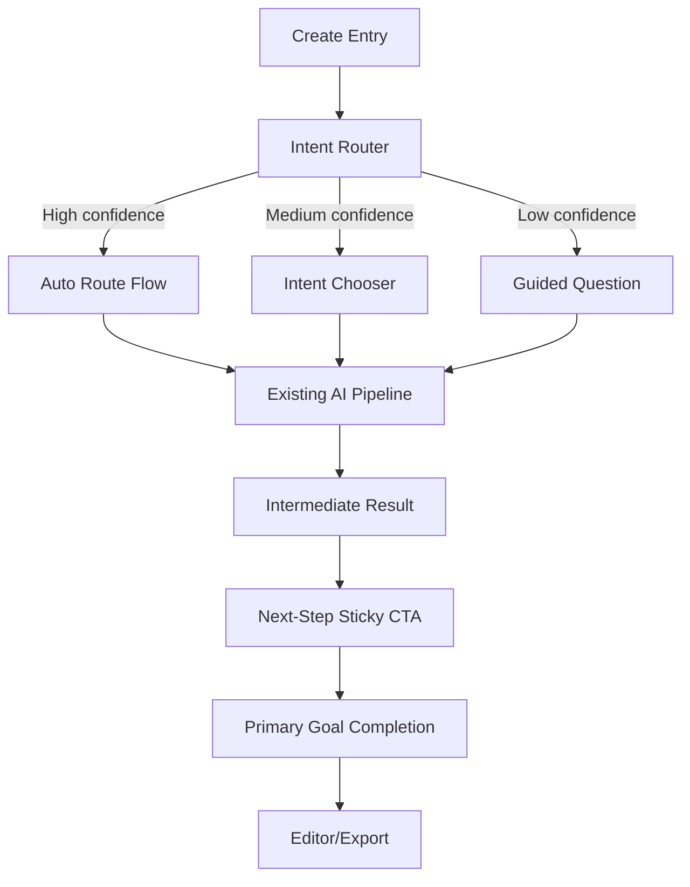

# Implementation Plan: Intent-First UX Rollout

## 1. Scope & Non-Goals

### In scope
- Ubah entry experience menjadi intent-first (goal-first).
- Hilangkan dead-end setelah intermediate result (contoh remove background).
- Tambahkan intent routing ringan (classifier + confidence + fallback chooser).
- Tambahkan recovery actions dan funnel analytics untuk validasi perubahan.

### Out of scope
- Rewrite total arsitektur backend/worker/queue.
- Ganti model AI utama atau storage architecture.
- Rebuild total editor/canvas engine.

---

## 2. Requirements & Constraints

- **REQ-001**: User harus bisa memilih tujuan utama lewat 3 entry point (Buat Iklan dari Foto, Rapikan Foto, Buat Konten dari Teks).
- **REQ-002**: Tidak boleh ada success state yang berhenti tanpa next action.
- **REQ-003**: Intent confidence harus punya 3 mode: auto-route, chooser, guided fallback.
- **REQ-004**: Semua error utama wajib punya recovery CTA.
- **REQ-005**: Funnel event wajib bisa mengukur continuation dari intermediate ke tujuan akhir.

- **SEC-001**: Tidak expose internal stack trace ke UI.
- **SEC-002**: Semua request tetap lewat auth/rate-limit existing.

- **CON-001**: Preserve existing endpoints and worker jobs where possible.
- **CON-002**: Rollout harus pakai feature flag.
- **CON-003**: Mobile usability tidak boleh regress.

---

## 3. Architecture Delta (Minimal Change)

Kunci perubahan:
- Tambah decision layer tipis di frontend orchestration.
- Reuse endpoint existing pada [frontend/src/lib/api/aiToolsApi.ts](frontend/src/lib/api/aiToolsApi.ts), [frontend/src/lib/api/adCreatorApi.ts](frontend/src/lib/api/adCreatorApi.ts), [backend/app/api/ad_creator.py](backend/app/api/ad_creator.py).
- Tambah instrumentasi event pada transisi kunci.

---

## 4. Work Breakdown by Team

## 4.1 Product

| Task ID | Task | Output | Priority |
|---|---|---|---|
| P-01 | Finalisasi intent taxonomy (3 utama + fallback) | Spec intent v1 | P0 |
| P-02 | Definisikan copy non-teknis per state | UX copy matrix | P0 |
| P-03 | Definisikan KPI rollout | Metrics baseline + target | P0 |
| P-04 | Definisikan experiment plan A/B | Experiment backlog | P1 |

## 4.2 Frontend

| Task ID | Task | File(s) kandidat | Priority |
|---|---|---|---|
| F-01 | Tambah 3 intent entry cards di create flow | [frontend/src/app/create/page.tsx](frontend/src/app/create/page.tsx) | P0 |
| F-02 | Tambah intent chooser dialog (confidence menengah) | [frontend/src/app/create/page.tsx](frontend/src/app/create/page.tsx) | P0 |
| F-03 | Tambah next-step sticky CTA setelah result tool | [frontend/src/components/editor/BackgroundRemovalPanel.tsx](frontend/src/components/editor/BackgroundRemovalPanel.tsx), [frontend/src/components/editor/SmartAdPanel.tsx](frontend/src/components/editor/SmartAdPanel.tsx) | P0 |
| F-04 | Ubah copy tool-first jadi goal-first | [frontend/src/components/editor/BackgroundRemovalPanel.tsx](frontend/src/components/editor/BackgroundRemovalPanel.tsx), [frontend/src/components/editor/SmartAdPanel.tsx](frontend/src/components/editor/SmartAdPanel.tsx), [frontend/src/app/create/page.tsx](frontend/src/app/create/page.tsx) | P0 |
| F-05 | Intent router client (rule-based v1) | [frontend/src/app/create/hooks/useCreateDesign.ts](frontend/src/app/create/hooks/useCreateDesign.ts) | P1 |
| F-06 | Unified progress tracker lintas flow | [frontend/src/components/create/GenerationProgress.tsx](frontend/src/components/create/GenerationProgress.tsx) | P1 |
| F-07 | Error recovery sheet + alternative actions | [frontend/src/components/feedback/InlineErrorBanner.tsx](frontend/src/components/feedback/InlineErrorBanner.tsx) + new component | P1 |
| F-08 | Event tracking integration | create flow + tools panels | P1 |

## 4.3 Backend

| Task ID | Task | File(s) kandidat | Priority |
|---|---|---|---|
| B-01 | Expose lightweight endpoint for optional intent assist (opsional) | new `/api/designs/intent-route` (optional) | P1 |
| B-02 | Standardize error payload for recoverable UI actions | existing routers | P0 |
| B-03 | Tambah metadata response untuk next recommended action (opsional) | design/tool endpoints | P1 |
| B-04 | Tambah analytics hooks server-side (if needed) | middleware/services logging | P1 |

Catatan: backend changes dibuat minimal. Bila router v1 cukup di frontend, B-01 bisa di-skip di fase awal.

## 4.4 QA

| Task ID | Task | Output | Priority |
|---|---|---|---|
| Q-01 | Test matrix 12 skenario wajib | QA scenario sheet | P0 |
| Q-02 | Regression test create/edit/tools | checklist + defect log | P0 |
| Q-03 | Mobile sanity flow | iOS/Android browser results | P0 |
| Q-04 | Event validation | event payload audit | P1 |

---

## 5. Milestones & Timeline

## Sprint A (Week 1) - P0 Ship
- F-01, F-03, F-04
- P-01, P-02, P-03
- B-02
- Q-01, Q-02, Q-03

**Milestone A success criteria**
- Tidak ada dead-end setelah remove background/tool success.
- User selalu melihat 1 next primary action.

## Sprint B (Week 2) - P1 Core
- F-02, F-05, F-06, F-07, F-08
- B-03 (opsional)
- Q-04

**Milestone B success criteria**
- 3-mode intent routing berjalan stabil.
- Recovery actions aktif untuk error utama.

## Sprint C (Week 3) - Optimization
- P-04 + experiment execution
- Iterasi copy/CTA berdasar event funnel

**Milestone C success criteria**
- KPI naik sesuai target minimal.

---

## 6. KPI Targets

Baseline harus diukur sebelum rollout.

| Metric | Baseline | Target 30 hari |
|---|---:|---:|
| Intermediate -> Primary Goal Continuation | TBD | >= 50% |
| Create Flow Completion Rate | TBD | >= 35% |
| Export Completion Rate | TBD | >= 85% |
| Drop-off after Intermediate Success | TBD | < 20% |
| Time to First Ad (median) | TBD | turun >= 20% |

---

## 7. Rollout Strategy

1. Feature flag: `intent_first_entry_v1`
2. Internal dogfood (team only)
3. 10% user rollout
4. 50% rollout
5. 100% rollout jika KPI dan error budget aman

Rollback condition:
- completion turun >10% dari baseline selama 48 jam
- spike error kritis >2x baseline

---

## 8. Testing Strategy

### Functional tests
- 12 skenario wajib dari blueprint.
- Verifikasi setiap success intermediate punya next action.

### UX tests
- 5 user non-teknis diminta menyelesaikan: upload foto -> jadi iklan -> export.
- Catat titik kebingungan dan waktu penyelesaian.

### Technical checks
- No new blocking errors di create/editor flow.
- Event payload sesuai schema.

---

## 9. Risks & Mitigations

| Risk | Level | Mitigation |
|---|---|---|
| Router salah intent | Medium | confidence threshold + chooser fallback |
| Flow makin panjang | Medium | progressive disclosure + default otomatis |
| Copy tidak konsisten | Low | copy matrix terpusat (P-02) |
| Regression create flow | Medium | QA matrix + feature flag rollout |
| Data tracking tidak lengkap | Medium | event audit sebelum 50% rollout |

---

## 10. Definition of Done

- [ ] 3 intent utama berjalan end-to-end sampai export.
- [ ] Tidak ada success state yang dead-end.
- [ ] Error utama punya recovery action.
- [ ] Event funnel aktif dan tervalidasi.
- [ ] KPI awal menunjukkan perbaikan (atau setidaknya tidak regress) pada 10%-50% rollout.

---

## 11. Next Immediate Actions (This Week)

1. Product review 60 menit: kunci intent taxonomy + copy matrix.
2. Frontend implement P0 (F-01/F-03/F-04).
3. QA jalankan Q-01/Q-02/Q-03.
4. Deploy behind feature flag ke internal users.
