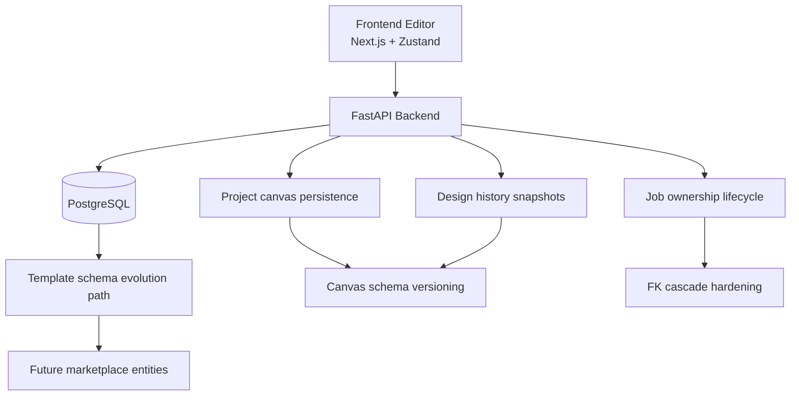

# Implementation Plan: Platform Hardening Priorities


## Related docs

- [System Architecture](../../architecture/system-architecture.md)
- [Data Model Overview](../../architecture/data-model.md)
- [Deployment Topology](../../architecture/deployment-topology.md)
- [Design Generation Sequence](../../architecture/design-generation-sequence.md)
- [Template Marketplace Plan](../template-marketplace/implementation-plan.md)

## 1. Requirements & Constraints

- **REQ-001**: User deletion must clean up `Job` records safely and consistently.
- **REQ-002**: Project canvas payloads and history snapshots must support forward evolution without breaking older data.
- **REQ-003**: Current `Template` model must remain backward-compatible for system templates while preparing a clean path toward community marketplace support.
- **REQ-004**: Existing frontend editor save/load flows must remain functional during rollout.
- **SEC-001**: Authorization checks for project, history, and account deletion must remain server-side.
- **SEC-002**: Migration steps must avoid accidental data loss outside intended cascade behavior.
- **CON-001**: Public API shape should change incrementally; avoid breaking existing editor clients.
- **CON-002**: Alembic migrations must be reversible where practical.
- **CON-003**: Template marketplace work in this plan is design-first, not full implementation.

## 2. Implementation Steps

### Phase 1: Fix `Job` Lifecycle Integrity

- GOAL-001: Remove manual-only cleanup dependency for `Job` ownership and make account deletion safer.

| Task | Description | File(s) | Completed |
|------|-------------|---------|-----------|
| TASK-001 | Update `Job` foreign keys to use explicit cascade policy for `user_id`, and evaluate the same for `project_id`. | `backend/app/models/job.py` | ✅ |
| TASK-002 | Add Alembic migration to alter `jobs.user_id` and `jobs.project_id` foreign keys safely. | `backend/alembic/versions/<revision>_harden_job_foreign_keys.py` | ✅ |
| TASK-003 | Simplify delete-account flow after FK hardening and keep defensive logging. | `backend/app/api/users.py` | ✅ |
| TASK-004 | Audit project deletion behavior to ensure `Job` records do not become orphaned. | `backend/app/api/projects.py` | ✅ |
| TASK-005 | Add regression tests for deleting a user with jobs and deleting a project referenced by jobs. | `backend/tests/test_user_account_deletion.py`, `backend/tests/test_project_lifecycle.py` | ◑ (user deletion done) |

### Phase 2: Introduce Canvas Schema Versioning

- GOAL-002: Make saved canvas payloads and history snapshots version-aware.

| Task | Description | File(s) | Completed |
|------|-------------|---------|-----------|
| TASK-006 | Add explicit schema version fields to persistence layer for projects and design history. | `backend/app/models/project.py`, `backend/app/models/design_history.py` | ✅ |
| TASK-007 | Add Alembic migration for `projects.canvas_schema_version` and `design_history.canvas_schema_version`. | `backend/alembic/versions/<revision>_add_canvas_schema_version.py` | ✅ |
| TASK-008 | Extend project request/response schemas to accept and return schema version metadata. | `backend/app/schemas/project.py` | ✅ |
| TASK-009 | Extend history request/response schemas to accept and return schema version metadata. | `backend/app/api/history.py` | ✅ |
| TASK-010 | Update create/update project endpoints to persist schema version with canvas state. | `backend/app/api/projects.py` | ✅ |
| TASK-011 | Update history snapshot creation flow to persist schema version for snapshot payloads. | `backend/app/api/history.py` | ✅ |
| TASK-012 | Define a frontend serializer/helper that exports current editor state with a stable schema version constant. | `frontend/src/lib/api/types.ts`, `frontend/src/store/useCanvasStore.ts` | ✅ (via `frontend/src/lib/canvasPersistence.ts`) |
| TASK-013 | Update project save/load flow to send and read schema version explicitly. | `frontend/src/lib/api/projectApi.ts`, `frontend/src/components/editor/EditorTopBar.tsx`, `frontend/src/app/edit/[projectId]/page.tsx` | ✅ |
| TASK-014 | Add backward-compatible loader rules for payloads with no schema version (treat as v1). | `frontend/src/store/useCanvasStore.ts` | ✅ (normalization on load path) |
| TASK-015 | Add backend and frontend tests for v1 legacy payloads and current-version payloads. | `backend/tests/test_projects_api.py`, `backend/tests/test_history_api.py`, `frontend/tests/e2e/editor-canvas-versioning.spec.ts` | ◑ (backend done, frontend pending) |

### Phase 3: Prepare Template Marketplace Schema Direction

- GOAL-003: Produce a clean schema direction for future community template features without breaking current system templates.

| Task | Description | File(s) | Completed |
|------|-------------|---------|-----------|
| TASK-016 | Document current `Template` limitations and target marketplace entities/ownership model. | `docs/architecture/data-model.md`, `docs/features/platform-hardening/implementation-plan.md` | ✅ |
| TASK-017 | Draft target ERD for community templates, moderation, favorites, and usage stats. | `docs/features/template-marketplace/implementation-plan.md` | ✅ |
| TASK-018 | Define preferred migration strategy: extend `Template` minimally vs add dedicated marketplace tables. | `docs/features/template-marketplace/implementation-plan.md` | ✅ |
| TASK-019 | Identify API boundary changes required for submission, approval, publish/unpublish, and listing scopes. | `docs/features/template-marketplace/implementation-plan.md` | ✅ |
| TASK-020 | Defer code implementation until roadmap item enters active sprint. | `docs/business/roadmap_2026/strategic_roadmap.md` | ✅ |

## 3. Architecture Diagram



## 4. API Design

### Existing endpoints to extend

- `POST /api/projects/` — accept `canvas_schema_version` together with `canvas_state`
- `PUT /api/projects/{project_id}` — update `canvas_state` and `canvas_schema_version`
- `GET /api/projects/{project_id}` — return `canvas_schema_version`
- `POST /api/history/` — accept `canvas_schema_version` for snapshots
- `GET /api/history/{project_id}` — return `canvas_schema_version` per snapshot
- `DELETE /api/users/me` — same endpoint, simpler internals after FK hardening

### Request shape changes

#### Project payload

```json
{
  "title": "Promo Ramadhan",
  "status": "draft",
  "aspect_ratio": "1:1",
  "canvas_state": {
    "elements": [],
    "backgroundUrl": null
  },
  "canvas_schema_version": 2
}
```

#### History payload

```json
{
  "project_id": "uuid",
  "background_url": "https://...",
  "text_layers": [],
  "generation_params": {},
  "canvas_schema_version": 2
}
```

### Response compatibility rule

- if `canvas_schema_version` is missing in stored legacy data, API should return `1`
- frontend should interpret missing version as legacy v1

## 5. Database Changes

### Migration set A — `Job` FK hardening

- Alter `jobs.user_id` foreign key to `ON DELETE CASCADE`
- Evaluate `jobs.project_id` as one of:
  - `ON DELETE SET NULL` if historical jobs should be preserved after project deletion, or
  - `ON DELETE CASCADE` if job lifecycle must strictly follow project lifecycle

**Preferred default:**
- `jobs.user_id` → `ON DELETE CASCADE`
- `jobs.project_id` → `ON DELETE SET NULL`

Reason: account deletion should fully clean owned jobs, while project deletion may not need to erase historical generation audit immediately.

### Migration set B — canvas schema versioning

- New column: `projects.canvas_schema_version` (`Integer`, default `1`, non-null after backfill)
- New column: `design_history.canvas_schema_version` (`Integer`, default `1`, non-null after backfill)
- Backfill legacy rows to version `1`

### Template marketplace prep

No schema migration in this plan yet. Output is design documentation only.

## 6. Frontend Changes

- Define `CURRENT_CANVAS_SCHEMA_VERSION` constant
- Serialize editor state with explicit version metadata on save
- Treat missing version as legacy `1`
- Keep current `useCanvasStore` shape compatible while adding load-time normalization
- Update API typings for project and history payloads/responses

### Files likely affected

- `frontend/src/store/useCanvasStore.ts`
- `frontend/src/lib/canvasPersistence.ts`
- `frontend/src/lib/api/types.ts`
- `frontend/src/lib/api/projectApi.ts`
- `frontend/src/components/editor/EditorTopBar.tsx`
- `frontend/src/app/edit/[projectId]/page.tsx`
- `frontend/src/app/create/hooks/useCreateDesign.ts`

## 7. Testing

| Test | Type | File |
|------|------|------|
| TEST-001 | pytest API | `backend/tests/test_user_account_deletion.py` ✅ |
| TEST-002 | pytest API | `backend/tests/test_project_lifecycle.py` ⏳ |
| TEST-003 | pytest API | `backend/tests/test_project_schema_versioning.py` ✅ |
| TEST-004 | pytest API | `backend/tests/test_history_schema_versioning.py` ✅ |
| TEST-005 | migration verification | `backend/alembic/versions/9b2f7c1d4e8a_harden_job_foreign_keys.py` ✅ |
| TEST-006 | Playwright E2E | `frontend/tests/e2e/editor-canvas-versioning.spec.ts` ⏳ |
| TEST-007 | frontend unit/integration | `frontend/src/store/useCanvasStore.test.ts` ⏳ |

### Acceptance criteria

- deleting a user removes or safely detaches all owned `Job` rows according to FK policy
- deleting a project does not leave invalid FK references in `jobs`
- legacy projects with no version metadata still load in editor
- newly saved projects and history snapshots always persist `canvas_schema_version`
- no current template browsing flow breaks during documentation-only marketplace prep

### Current sync note (2026-03-23)

- Phase 1: mostly complete, with one remaining regression test for project deletion path.
- Phase 2: implementation complete; backend verification present, frontend versioning tests still pending.
- Phase 3: documentation scope complete.

## 8. Risks & Assumptions

- **RISK-001**: Changing FK behavior can affect existing delete flows unexpectedly.  
  **Mitigation**: add migration tests and run delete-path regression tests.
- **RISK-002**: Legacy canvas payloads may have inconsistent shapes beyond just missing version metadata.  
  **Mitigation**: treat versioning as first step and add normalization helpers for known legacy shapes.
- **RISK-003**: `jobs.project_id` policy choice can affect audit retention expectations.  
  **Mitigation**: confirm whether historical job trace should survive project deletion before migration merge.
- **RISK-004**: Template marketplace design may drift if roadmap scope changes.  
  **Mitigation**: keep phase 3 as design artifact only until scope is approved.
- **ASSUMPTION-001**: Existing editor payloads can be interpreted as schema version `1`.
- **ASSUMPTION-002**: Account deletion should be authoritative and remove user-owned async job traces.
- **ASSUMPTION-003**: Current template system remains system-owned only until marketplace work starts.

## 9. Dependencies

- **DEP-001**: Alembic for schema migration generation and rollback
- **DEP-002**: SQLAlchemy FK support and migration-safe constraint naming
- **DEP-003**: Existing FastAPI project/history endpoints
- **DEP-004**: Frontend editor state in Zustand (`useCanvasStore`)

## 10. Delivery Recommendation

### Sprint 1
- complete Phase 1
- create migration for `Job` FK hardening
- ship delete-account regression tests

### Sprint 2
- complete Phase 2
- add `canvas_schema_version` persistence + backward compatibility
- ship editor/versioning tests

### Sprint 3
- complete Phase 3 as design artifact
- decide target schema direction for template marketplace before coding

## 11. Definition of Done

This plan is complete when:
- `Job` lifecycle no longer depends on fragile manual cleanup alone,
- project/history payloads are version-aware and backward-compatible,
- template marketplace has a documented schema direction before implementation begins.
