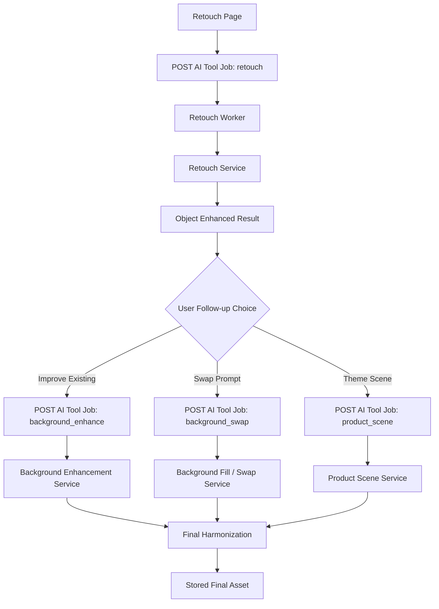

# Implementation Plan: Quick Retouch + Background Enhancement


## 1. Requirements & Constraints

- REQ-001: Quick Retouch harus menghasilkan perubahan visual yang jelas pada objek tanpa membuat wajah atau produk terlihat palsu.
- REQ-002: Pengalaman user harus sederhana, idealnya satu flow yang bisa meningkatkan objek dan background secara berurutan.
- REQ-003: User harus bisa memilih antara memperbaiki background asli atau mengganti background sepenuhnya.
- REQ-004: Hasil akhir harus menjaga konsistensi lighting, tone, dan shadow antara objek dan background.
- REQ-005: Retouch level harus dipahami user sebagai preset visual, bukan parameter teknis seperti `fidelity`.
- REQ-006: Flow baru harus kompatibel dengan job system yang sudah ada di backend untuk `retouch`, `background_swap`, dan `product_scene`.
- REQ-007: Sistem harus tetap punya fallback aman ketika provider AI premium tidak tersedia.
- SEC-001: Semua request harus tetap melalui jalur job yang sudah memiliki validasi auth dan credit accounting di [backend/app/api/ai_tools_routers/jobs.py](backend/app/api/ai_tools_routers/jobs.py).
- SEC-002: Prompt atau parameter background tidak boleh berasal dari HTML/raw script dan harus divalidasi ketat di backend.
- CON-001: Stack frontend tetap Next.js App Router di `frontend/src/app/` dan state global tidak memakai React Context.
- CON-002: Backend utama tetap FastAPI + worker job async; perubahan sebaiknya memperluas payload dan service yang ada, bukan membuat orkestrasi terpisah yang kompleks.
- CON-003: Fallback lokal saat ini berbasis OpenCV di [backend/app/services/retouch_service.py](backend/app/services/retouch_service.py); pendekatan ini bisa ditingkatkan bertahap tetapi jangan diasumsikan setara beauty model premium.

## 2. Product Flow

### Flow Summary

User upload satu foto, lalu memilih tujuan visual yang mudah dipahami. Sistem memperbaiki objek lebih dulu, kemudian menawarkan peningkatan background sebagai langkah lanjutan yang relevan terhadap foto tersebut.

### UX Goals

- Mengurangi keputusan teknis di awal.
- Menonjolkan hasil yang terasa berbeda dalam 1-2 klik.
- Menjaga agar user tidak perlu pindah tool manual kecuali memang ingin mode advanced.

### Proposed End-to-End Flow

#### Stage 1: Upload

- User upload foto di [frontend/src/app/tools/retouch/page.tsx](frontend/src/app/tools/retouch/page.tsx).
- Sistem mendeteksi kategori ringan dari gambar: `portrait`, `product`, `food`, `general`.
- Kategori dipakai untuk memilih preset default dan rekomendasi background berikutnya.

#### Stage 2: Retouch Preset Selection

- Ganti pilihan sekarang `Natural`, `Seimbang`, `Maksimal` dengan preset yang lebih jelas secara visual:
  - `Clean Natural`
  - `Glow`
  - `Studio Pop`
  - `Beauty+`
- Tambahkan `Intensity` slider 0-100.
- Tambahkan opsi `Natural texture` untuk mengurangi risiko hasil terlalu plasticky.

#### Stage 3: Object Enhancement Job

- Saat user submit, frontend mengirim job `retouch` dengan payload preset baru.
- Job retouch fokus pada objek terlebih dulu: tone balancing, local contrast, selective smoothing, sharpen detail penting, dan color cleanup.

#### Stage 4: Smart Background Recommendation

- Setelah hasil retouch muncul, tampilkan CTA lanjutan langsung di halaman hasil:
  - `Perbaiki background asli`
  - `Ganti ke scene baru`
- CTA ini kontekstual, bukan tool terpisah yang mengharuskan user kembali ke galeri tools.

#### Stage 5A: Improve Existing Background

- Cocok untuk portrait atau foto produk yang background aslinya masih usable.
- Sistem menjalankan enhancement non-destruktif pada background:
  - exposure rebalance
  - white balance alignment
  - distraction suppression
  - selective blur / depth separation
  - background desaturation ringan
  - edge cleanup agar objek lebih pop

#### Stage 5B: Replace Background

- Jika background asli jelek, user pilih mode replace.
- Sistem arahkan ke dua jenis output:
  - `Background Swap` untuk prompt bebas atau suggestion-based flow di [frontend/src/app/tools/background-swap/page.tsx](frontend/src/app/tools/background-swap/page.tsx)
  - `Product Scene` untuk theme-based generation di [frontend/src/app/tools/product-scene/page.tsx](frontend/src/app/tools/product-scene/page.tsx)

#### Stage 6: Final Harmonization

- Setelah background diperbaiki atau diganti, lakukan harmonisasi ringan:
  - relight strength
  - shadow grounding
  - subject/background color temperature alignment
  - vignette lokal bila perlu

### Recommended UI Changes

| Area | Change | File(s) | Completed |
|------|--------|---------|-----------|
| Retouch landing | Ubah copy agar menjual hasil objek + opsi background lanjutan | `frontend/src/app/tools/retouch/page.tsx` | |
| Retouch controls | Tambahkan preset visual + intensity slider + natural texture toggle | `frontend/src/app/tools/retouch/page.tsx` | |
| Retouch result | Tambahkan CTA `Improve Background` dan `Generate New Scene` | `frontend/src/app/tools/retouch/page.tsx` | |
| Cross-tool flow | Pre-fill parameter saat berpindah ke background swap/product scene | `frontend/src/app/tools/background-swap/page.tsx`, `frontend/src/app/tools/product-scene/page.tsx` | |
| Job orchestration state | Simpan state rekomendasi dan chaining job di hook progress | `frontend/src/hooks/useToolJobProgress.ts` | |

## 3. Implementation Steps

### Phase 1: Retouch V2 API Contract

- GOAL-001: Menjadikan retouch berbasis preset dan intensity, bukan satu angka fidelity.

| Task | Description | File(s) | Completed |
|------|-------------|---------|-----------|
| TASK-001 | Definisikan schema payload retouch v2 | `backend/app/api/ai_tools_routers/jobs.py` | |
| TASK-002 | Tambahkan parser preset ke service retouch | `backend/app/services/retouch_service.py` | |
| TASK-003 | Pertahankan backward compatibility untuk payload lama berbasis `fidelity` | `backend/app/services/retouch_service.py` | |
| TASK-004 | Tambahkan test unit untuk mapping preset ke parameter teknis | `backend/tests/test_retouch_service.py` | |

### Phase 2: Background Enhancement Mode

- GOAL-002: Menambahkan mode perbaikan background asli tanpa selalu mengganti background.

| Task | Description | File(s) | Completed |
|------|-------------|---------|-----------|
| TASK-005 | Buat service `enhance_background_context` untuk improve background existing | `backend/app/services/bg_removal_service.py` atau service baru `backend/app/services/background_enhancement_service.py` | |
| TASK-006 | Tambahkan job type baru `background_enhance` atau extend `background_swap` dengan `mode=enhance` | `backend/app/workers/ai_tool_jobs_background.py`, `backend/app/api/ai_tools_routers/jobs.py` | |
| TASK-007 | Tambahkan upload/saving flow hasil background enhancement | `backend/app/workers/ai_tool_jobs_background.py` | |
| TASK-008 | Tambahkan test unit dan integration path | `backend/tests/test_image_service_fallback.py`, `backend/tests/test_ai_tools.py` | |

### Phase 3: Frontend Guided Flow

- GOAL-003: Mengubah retouch tool menjadi guided flow, bukan tool tunggal yang berhenti di before/after.

| Task | Description | File(s) | Completed |
|------|-------------|---------|-----------|
| TASK-009 | Ubah preset UI retouch dan tambahkan slider intensity | `frontend/src/app/tools/retouch/page.tsx` | |
| TASK-010 | Tambahkan hasil analisis kategori gambar untuk rekomendasi lanjutan | `frontend/src/app/tools/retouch/page.tsx` | |
| TASK-011 | Tambahkan CTA background enhancement di result step | `frontend/src/app/tools/retouch/page.tsx` | |
| TASK-012 | Tambahkan parameter prefill untuk background swap | `frontend/src/app/tools/background-swap/page.tsx` | |
| TASK-013 | Tambahkan parameter prefill untuk product scene | `frontend/src/app/tools/product-scene/page.tsx` | |

### Phase 4: Harmonization and Premium Finish

- GOAL-004: Menjaga hasil akhir terlihat premium dan menyatu.

| Task | Description | File(s) | Completed |
|------|-------------|---------|-----------|
| TASK-014 | Tambahkan relight/shadow harmonization setelah replace/enhance background | `backend/app/services/bg_removal_service.py`, `backend/app/services/product_scene_service.py` | |
| TASK-015 | Tambahkan parameter subject-background tone alignment | `backend/app/services/bg_removal_service.py` | |
| TASK-016 | Tambahkan regression tests untuk alpha edge, tone, dan output format | `backend/tests/test_bg_removal_service.py`, `backend/tests/test_retouch_service.py` | |

## 4. Backend Preset Proposal

### 4.1 Retouch Presets

Preset di bawah ini adalah bahasa produk. Backend menerjemahkannya menjadi parameter teknis.

| Preset | Target | Visual Result | Default Intensity |
|--------|--------|---------------|-------------------|
| `clean_natural` | Semua foto | Lebih bersih, natural, tidak terlalu halus | 35 |
| `glow` | Portrait, beauty, selfie | Kulit lebih rata, tone hangat, subjek lebih hidup | 55 |
| `studio_pop` | Produk, portrait formal, katalog | Kontras rapi, detail naik, warna lebih mewah | 60 |
| `beauty_plus` | Beauty/selfie close-up | Smoothing lebih kuat, brightening selektif, polished look | 75 |

### 4.2 Retouch Parameter Model

Gunakan kontrak payload berikut untuk `retouch`:

```json
{
  "image_url": "https://...",
  "output_format": "jpeg",
  "preset": "glow",
  "intensity": 55,
  "preserve_texture": true,
  "category_hint": "portrait",
  "background_followup": "suggest"
}
```

### 4.3 Internal Retouch Controls

Service di [backend/app/services/retouch_service.py](backend/app/services/retouch_service.py) sebaiknya memetakan preset ke kontrol internal seperti berikut.

| Internal Parameter | Range | Purpose |
|-------------------|-------|---------|
| `face_restore_strength` | 0.0-1.0 | Kekuatan restorasi wajah/provider AI |
| `skin_smoothing` | 0.0-1.0 | Smoothing area kulit |
| `tone_equalization` | 0.0-1.0 | Meratakan luminance dan warna kulit/objek |
| `local_contrast` | 0.0-1.0 | Membuat objek lebih pop |
| `detail_sharpen` | 0.0-1.0 | Menjaga mata, alis, bibir, tekstur produk |
| `under_eye_lift` | 0.0-1.0 | Brightening selektif area bawah mata |
| `highlight_protect` | 0.0-1.0 | Menjaga highlight agar tidak washout |
| `saturation_balance` | 0.0-1.0 | Menjaga warna tidak kusam atau terlalu neon |

### 4.4 Mapping Example

| Preset | face_restore_strength | skin_smoothing | tone_equalization | local_contrast | detail_sharpen | under_eye_lift | highlight_protect | saturation_balance |
|--------|------------------------|----------------|-------------------|----------------|----------------|----------------|-------------------|-------------------|
| `clean_natural` | 0.30 | 0.20 | 0.35 | 0.30 | 0.35 | 0.10 | 0.55 | 0.25 |
| `glow` | 0.45 | 0.40 | 0.50 | 0.35 | 0.30 | 0.30 | 0.60 | 0.35 |
| `studio_pop` | 0.35 | 0.25 | 0.45 | 0.55 | 0.60 | 0.05 | 0.70 | 0.45 |
| `beauty_plus` | 0.55 | 0.65 | 0.55 | 0.30 | 0.25 | 0.40 | 0.65 | 0.30 |

### 4.5 Intensity Adjustment Rules

- `intensity` 0-100 tidak mengubah semua parameter secara linear.
- Prioritaskan perubahan berikut:
  - `skin_smoothing` naik cepat untuk portrait presets.
  - `local_contrast` dan `detail_sharpen` naik lebih besar untuk `studio_pop`.
  - `highlight_protect` tidak boleh turun terlalu rendah agar hasil tetap aman.
- Formula aman awal:

$$
adjusted = base + ((intensity - defaultIntensity) / 100) \times weight
$$

Dengan clamp untuk semua parameter pada rentang aman masing-masing.

### 4.6 Background Enhancement Presets

Tambahkan preset khusus background agar objek dan latar punya bahasa visual yang selaras.

| Preset | Use Case | Effect |
|--------|----------|--------|
| `soft_clean` | Portrait indoor, selfie | Bersihkan clutter, soft blur ringan, tone lebih tenang |
| `bright_airy` | Beauty, fashion, home | Background lebih terang dan fresh |
| `moody_depth` | Produk premium, kopi, kosmetik | Background lebih gelap, depth lebih kuat, subjek lebih menonjol |
| `studio_neutral` | Catalog product | Tone netral, bayangan bersih, distraction minimum |
| `warm_lifestyle` | Food, cafe, skincare | Warmth naik sedikit, ambience lebih hidup |

### 4.7 Background Payload Proposal

```json
{
  "image_url": "https://...",
  "mode": "enhance",
  "preset": "studio_neutral",
  "intensity": 50,
  "keep_structure": true,
  "depth_blur_strength": 0.25,
  "relight_strength": 0.35,
  "shadow_strength": 0.40,
  "color_match_strength": 0.50
}
```

### 4.8 Background Internal Controls

| Internal Parameter | Range | Purpose |
|-------------------|-------|---------|
| `background_exposure` | -1.0 to 1.0 | Naik/turunkan exposure latar |
| `background_saturation` | 0.0-1.0 | Menenangkan atau menghidupkan warna |
| `clutter_suppression` | 0.0-1.0 | Menurunkan distraksi detail kecil |
| `depth_blur_strength` | 0.0-1.0 | Separation antara objek dan background |
| `relight_strength` | 0.0-1.0 | Menyamakan arah cahaya objek-background |
| `shadow_strength` | 0.0-1.0 | Contact shadow/grounding |
| `color_match_strength` | 0.0-1.0 | Menyamakan white balance dan color cast |
| `edge_cleanup_strength` | 0.0-1.0 | Mengurangi halo di tepi objek |

## 5. API Design

### Option A: Extend Existing `retouch` Job

- `POST /api/tools/jobs`
- `tool_name: "retouch"`
- Payload baru:

```json
{
  "image_url": "https://...",
  "output_format": "jpeg",
  "preset": "glow",
  "intensity": 55,
  "preserve_texture": true,
  "followup_recommendation": true
}
```

Response job tetap mengikuti kontrak yang ada.

### Option B: Add Dedicated Background Enhancement Job

- `POST /api/tools/jobs`
- `tool_name: "background_enhance"`
- Payload:

```json
{
  "image_url": "https://...",
  "mode": "enhance",
  "preset": "soft_clean",
  "intensity": 45,
  "keep_structure": true,
  "relight_strength": 0.3,
  "shadow_strength": 0.4
}
```

### Recommended Choice

- Pertahankan `retouch` sebagai job pertama.
- Tambahkan job baru `background_enhance` untuk improve existing background.
- Tetap gunakan `background_swap` dan `product_scene` untuk mode replace/generate.

Alasannya:

- semantics lebih jelas
- credit model lebih mudah diatur
- worker logic tidak tercampur antara improve dan replace
- UI bisa memberi CTA yang tegas sesuai intent user

## 6. Frontend Changes

- Route yang terdampak utama: [frontend/src/app/tools/retouch/page.tsx](frontend/src/app/tools/retouch/page.tsx).
- Integrasi lanjutan perlu mempertimbangkan prefill ke [frontend/src/app/tools/background-swap/page.tsx](frontend/src/app/tools/background-swap/page.tsx) dan [frontend/src/app/tools/product-scene/page.tsx](frontend/src/app/tools/product-scene/page.tsx).
- API layer perlu diperluas di `frontend/src/lib/api/aiToolsApi.ts` untuk payload preset/intensity dan job baru `background_enhance`.
- Result step pada retouch harus menampilkan dua CTA sekunder dengan copy yang outcome-oriented:
  - `Rapikan Background`
  - `Bikin Scene Baru`

## 7. Architecture Diagram



## 8. Database Changes

- Tidak perlu perubahan skema wajib untuk fase awal jika payload tetap fleksibel di `payload_json` job.
- Opsional tahap lanjut:
  - tambah `tool_subtype` atau `preset_name` di hasil untuk analytics funnel
  - tambah `source_job_id` untuk chain retouch -> background_enhance

Jika dilakukan, gunakan Alembic migration terpisah.

## 9. Testing

| Test | Type | File |
|------|------|------|
| TEST-001 | Mapping preset retouch | `backend/tests/test_retouch_service.py` |
| TEST-002 | Backward compatibility fidelity lama | `backend/tests/test_retouch_service.py` |
| TEST-003 | Background enhance payload validation | `backend/tests/test_ai_tools.py` |
| TEST-004 | Worker flow untuk background enhance | `backend/tests/test_bg_removal_service.py` atau test worker baru |
| TEST-005 | Retouch result CTA rendering | `frontend/src/app/tools/retouch/page.tsx` component test jika tersedia |
| TEST-006 | End-to-end guided flow | `frontend/tests/e2e/retouch-background-flow.spec.ts` |

## 10. Risks & Assumptions

- RISK-001: Jika smoothing terlalu agresif, hasil portrait akan terlihat seperti filter murah.
  Mitigasi: default preset konservatif, texture preservation aktif default.
- RISK-002: Replace background tanpa harmonisasi akan terlihat tempelan.
  Mitigasi: shadow grounding dan color temperature matching wajib di final pass.
- RISK-003: User bingung memilih antara 3 tool yang mirip.
  Mitigasi: gunakan guided CTA dari hasil retouch, bukan menyuruh user kembali ke galeri tools.
- RISK-004: OpenCV fallback sulit menghasilkan beauty-grade output sendiri.
  Mitigasi: fokus fallback sebagai safe enhancement, sementara efek premium memakai provider AI saat tersedia.
- ASSUMPTION-001: Jalur job async saat ini cukup untuk menampung chaining sederhana antar tool.
- ASSUMPTION-002: Credit policy untuk `background_enhance` bisa ditentukan terpisah dari `background_swap` dan `product_scene`.

## 11. Dependencies

- DEP-001: fal.ai tetap menjadi kandidat utama untuk enhancement/generation premium.
- DEP-002: Jika ingin beauty-grade portrait retouch, kemungkinan perlu model face parsing/landmark atau provider tambahan di masa lanjut.
- DEP-003: Untuk rollout awal, implementasi bisa dimulai tanpa dependency baru dengan memperbaiki pipeline lokal dan kontrak payload.

## 12. Recommended Rollout Order

1. Retouch preset + intensity di frontend dan backend.
2. CTA hasil retouch menuju background follow-up.
3. Job baru `background_enhance` untuk improve existing background.
4. Harmonization layer untuk background replace dan product scene.
5. Analytics funnel untuk mengukur preset dan follow-up mana yang paling dipakai.