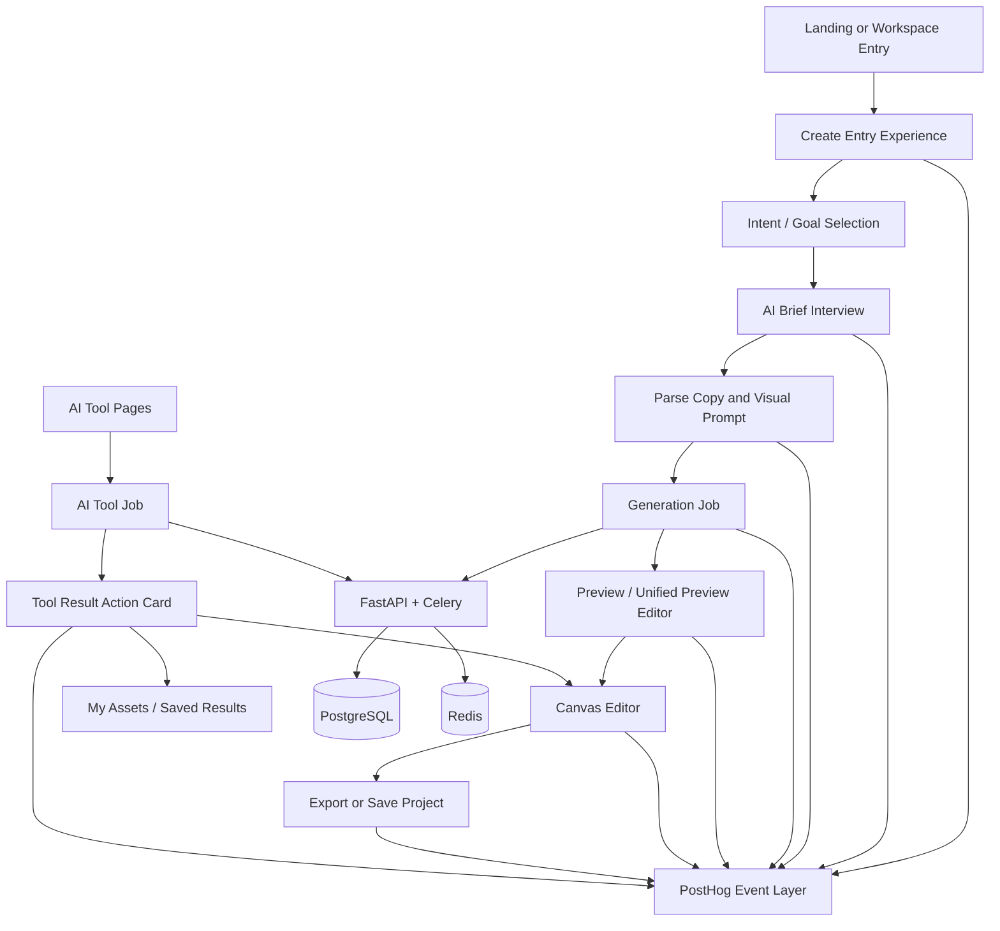

# Implementation Plan: Ready-to-Export Core Workflow


## Related Documents

- `docs/features/ready-to-export-core-workflow/uiux-breakdown.md` — current UI/UX relevance audit, keep-refactor-archive decisions, and two-week UI/UX cut.

## 1. Requirements & Constraints

- REQ-001: SmartDesign must be positioned in-product as an AI design workflow for UMKM, not as a disconnected collection of AI tools.
- REQ-002: The primary create journey must optimize for one end state: a design that is ready to export after minimal editing.
- REQ-003: The create funnel must emit analytics for entry, clarification, parsing, generation, preview, editor continuation, save, and export.
- REQ-004: Every successful AI tool result must present a primary next action and must not end in a dead-end success state.
- REQ-005: Tool results must support continuation into the canvas editor whenever the output is visually reusable.
- REQ-006: Product instrumentation must make it possible to compute ready-to-export session rate, preview completion rate, continue-to-editor rate, retry rate, and median time to first export.
- REQ-007: Existing authenticated routes, Celery job handling, and current backend API surface should be preserved as much as possible.
- REQ-008: Rollout must be guarded by feature flags and must not regress current create, edit, and export flows.
- SEC-001: No new analytics or workflow metadata may expose secrets or internal tokens in the browser.
- SEC-002: Backend responses that add workflow metadata must remain authenticated and rate-limited where applicable.
- CON-001: The current Next.js App Router, FastAPI, Celery, PostgreSQL, and Redis architecture stays in place.
- CON-002: The plan should favor additive changes over deep rewrites in order to preserve current shipping functionality.
- CON-003: Mobile usability must not regress for create flow entry, progress states, result actions, and export actions.
- CON-004: README, PRD, event naming, and UI copy must stay aligned with the chosen product direction.

## 2. Implementation Steps

### Phase 1: Funnel Foundation and Product Surface Alignment

- GOAL-001: Establish one consistent product language and one measurable workflow baseline before optimizing deeper UX.

| Task | Description | File(s) | Completed |
|------|-------------|---------|-----------|
| TASK-001 | Add a rollout flag for the ready-to-export workflow changes so create flow changes can ship safely behind configuration. | `frontend/src/lib/feature-flags.ts` | |
| TASK-002 | Introduce a centralized event helper layer for product funnel events instead of scattering raw event names across hooks and components. | `frontend/src/lib/analytics/productEvents.ts` | |
| TASK-003 | Normalize create-flow event emission for entry, analyze, parse, generate, preview, proceed-to-editor, save, and failure states. | `frontend/src/app/create/hooks/useCreateDesign.ts` | |
| TASK-004 | Update create entry copy and CTA hierarchy to emphasize outcome-oriented language rather than tool-first language. | `frontend/src/app/create/page.tsx` | |
| TASK-005 | Align landing-page messaging and primary CTA language with the workflow positioning chosen in PRD. | `frontend/src/app/page.tsx` | |
| TASK-006 | Update the tools hub to frame AI tools as supporting utilities and route users toward editor continuation where appropriate. | `frontend/src/app/tools/page.tsx` | |
| TASK-007 | Update shared header or badges where necessary so credits, projects, and tools reinforce the workflow narrative instead of isolated feature usage. | `frontend/src/components/layout/AppHeader.tsx`, `frontend/src/components/credits/CreditBadge.tsx`, `frontend/src/components/credits/StorageBadge.tsx` | |

### Phase 2: Core Create Flow Optimization

- GOAL-002: Reduce ambiguity and drop-off in the create journey from first input to preview/editor.

| Task | Description | File(s) | Completed |
|------|-------------|---------|-----------|
| TASK-008 | Refactor create-step entry UI so the primary paths map clearly to `create design from brief`, `improve product photo`, and `continue existing work`. | `frontend/src/app/create/page.tsx`, `frontend/src/app/create/types.ts` | |
| TASK-009 | Rework sidebar input copy, helper text, and empty states so users understand what to enter and what result they should expect. | `frontend/src/components/create/SidebarInputForm.tsx` | |
| TASK-010 | Rework sidebar actions so the next step is always explicit, especially across `input`, `brief`, `results`, and `preview` states. | `frontend/src/components/create/SidebarActionBar.tsx` | |
| TASK-011 | Improve clarification UX so users see it as guided assistance instead of friction, including better skip behavior and retry recovery. | `frontend/src/components/create/DesignBriefInterview.tsx` | |
| TASK-012 | Improve prompt review and result review states so users understand what AI generated and what they can change before spending more effort. | `frontend/src/components/create/UnifiedResultsView.tsx`, `frontend/src/components/create/VisualPromptEditor.tsx` | |
| TASK-013 | Ensure preview/editor handoff is robust whether the source is fresh generation, redesign, or imported AI tool output. | `frontend/src/components/create/UnifiedPreviewEditor.tsx`, `frontend/src/app/create/hooks/useCreateDesign.ts` | |
| TASK-014 | Make local create-state persistence resilient so retries and back-navigation do not destroy in-progress sessions. | `frontend/src/app/create/hooks/useCreateDesign.ts` | |
| TASK-015 | Standardize inline and modal error states for insufficient credits, storage limits, validation errors, and backend failures. | `frontend/src/components/feedback/InlineErrorBanner.tsx`, `frontend/src/components/feedback/ErrorModal.tsx`, `frontend/src/app/create/hooks/useCreateDesign.ts` | |

### Phase 3: Tool-to-Editor Integration

- GOAL-003: Convert AI tool successes into workflow continuation instead of isolated one-off outcomes.

| Task | Description | File(s) | Completed |
|------|-------------|---------|-----------|
| TASK-016 | Create a shared success-action component that standardizes `Continue to Editor`, `Save`, `Retry`, and `Back to Tools` actions. | `frontend/src/components/tools/ResultActionCard.tsx` | |
| TASK-017 | Standardize result CTA behavior for background and scene tools. | `frontend/src/app/tools/background-swap/page.tsx`, `frontend/src/app/tools/product-scene/page.tsx`, `frontend/src/app/tools/generative-expand/page.tsx` | |
| TASK-018 | Standardize result CTA behavior for enhancement tools. | `frontend/src/app/tools/retouch/page.tsx`, `frontend/src/app/tools/upscaler/page.tsx`, `frontend/src/app/tools/id-photo/page.tsx`, `frontend/src/app/tools/watermark-placer/page.tsx` | |
| TASK-019 | Standardize result CTA behavior for creative tools and batch outputs. | `frontend/src/app/tools/magic-eraser/page.tsx`, `frontend/src/app/tools/text-banner/page.tsx`, `frontend/src/app/tools/batch-process/page.tsx` | |
| TASK-020 | Extend tool API client helpers to emit continuation events and to normalize result metadata consumed by the shared success-action component. | `frontend/src/lib/api/aiToolsApi.ts`, `frontend/src/lib/api/types.ts` | |
| TASK-021 | Normalize tool-result persistence and listing so users can reopen outputs from `My Assets` and continue into the create/editor workflow. | `frontend/src/app/my-assets/page.tsx`, `frontend/src/app/create/hooks/useCreateDesign.ts` | |
| TASK-022 | Standardize backend success payload metadata for AI tool responses, including `result_id`, `source_tool`, and `can_continue_to_editor` fields where applicable. | `backend/app/api/ai_tools_routers/background.py`, `backend/app/api/ai_tools_routers/enhancement.py`, `backend/app/api/ai_tools_routers/creative.py`, `backend/app/api/ai_tools_routers/results.py` | |

### Phase 4: Ready-to-Export Measurement and Readiness Operations

- GOAL-004: Make the agreed north-star metric measurable and establish an operational readiness loop.

| Task | Description | File(s) | Completed |
|------|-------------|---------|-----------|
| TASK-023 | Add export event instrumentation, including export format, source flow, editor state, and elapsed time bucket. | `frontend/src/components/editor/ExportDialog.tsx`, `frontend/src/components/editor/EditorTopBar.tsx`, `frontend/src/lib/analytics/productEvents.ts` | |
| TASK-024 | Capture editor interaction signals needed for an edit-dependency proxy, such as layer edits, text edits, manual uploads, and undo/redo counts. | `frontend/src/components/editor/CanvasWorkspace.tsx`, `frontend/src/components/editor/StageCanvas.tsx`, `frontend/src/components/editor/HistoryPanel.tsx` | |
| TASK-025 | Add backend-side support for storing lightweight workflow metadata on projects or history snapshots when saves happen. | `backend/app/api/projects.py`, `backend/app/api/history.py`, `backend/app/models/project.py`, `backend/app/models/design_history.py` | |
| TASK-026 | Define and implement a manual readiness review store for sampled outputs if product ops needs in-app persistence instead of Notion-only review. | `backend/app/models/design_readiness_review.py`, `backend/app/schemas/design_readiness_review.py`, `backend/app/api/internal/readiness_reviews.py`, `backend/alembic/versions/add_design_readiness_reviews.py` | |
| TASK-027 | Add a product-ops review rubric document and score interpretation guide to support consistent manual evaluation across clarity, focus, technical integrity, context fit, and usability. | `docs/uat/visual-readiness-review.md` | |
| TASK-028 | Add feature-flag rollout and observability checks for the new workflow events and result actions before broad rollout. | `frontend/src/lib/feature-flags.ts`, `frontend/src/app/providers.tsx`, `backend/app/main.py` | |

### Phase 5: QA, Rollout, and KPI Review

- GOAL-005: Ship the new workflow safely and validate it against the north-star and supporting KPIs.

| Task | Description | File(s) | Completed |
|------|-------------|---------|-----------|
| TASK-029 | Expand the critical journey E2E test to cover brief-to-preview and preview-to-editor transitions. | `frontend/tests/e2e/critical-journey.spec.ts` | |
| TASK-030 | Add E2E coverage for tool success states that must always expose a next action. | `frontend/tests/e2e/tools.spec.ts`, `frontend/tests/e2e/ready-to-export-tools.spec.ts` | |
| TASK-031 | Add E2E coverage for intent-first create entry and fallback behavior behind the feature flag. | `frontend/tests/e2e/intent-first-entry.spec.ts`, `frontend/tests/e2e/ready-to-export-create.spec.ts` | |
| TASK-032 | Add backend tests for standardized AI tool response metadata and project/history workflow metadata persistence. | `backend/tests/test_ai_tools.py`, `backend/tests/test_history_schema_versioning.py`, `backend/tests/test_project_schema_versioning.py` | |
| TASK-033 | Run rollout through internal users first, then staged exposure with KPI review gates after 10%, 50%, and 100% rollout. | `docs/features/ready-to-export-core-workflow/rollout-checklist.md` | |

## 3. Architecture Diagram



## 4. API Design

### Existing API surface to preserve

- `POST /api/designs/clarify`
- `POST /api/designs/parse`
- `POST /api/designs/generate`
- `GET /api/designs/jobs/{job_id}`
- `POST /api/tools/*`
- `GET /api/tools/results*`
- `POST /api/projects/`
- `POST /api/history/`

### Response contract changes to add

- `POST /api/tools/<tool>` should return:
  - `url: string`
  - `result_id: string`
  - `source_tool: string`
  - `can_continue_to_editor: boolean`
  - `next_recommended_action: "continue_to_editor" | "save_result" | "retry"`

- `GET /api/tools/results` should expose enough metadata for continuation UX:
  - `id: string`
  - `tool_type: string`
  - `result_url: string`
  - `created_at: datetime`
  - `can_continue_to_editor: boolean`

- `POST /api/projects/` and `PUT /api/projects/{id}` should optionally accept workflow metadata:
  - `source_flow?: "create" | "tool" | "template"`
  - `source_tool?: string | null`
  - `ready_to_export_candidate?: boolean`

- `POST /api/history/` should optionally store workflow metadata:
  - `event_source?: string`
  - `step_name?: string`
  - `editor_action_count?: number`

### Optional internal API for sampled review operations

- `POST /api/internal/readiness-reviews`
  - Request:
    ```json
    {
      "source_type": "project",
      "source_id": "uuid",
      "clarity": 4,
      "focus": 3,
      "technical_integrity": 4,
      "context_fit": 3,
      "usability": 4,
      "notes": "CTA masih perlu diperjelas"
    }
    ```
  - Response:
    ```json
    {
      "id": "uuid",
      "mean_score": 3.6,
      "created_at": "ISO-8601"
    }
    ```

## 5. Database Changes

- No required schema changes for Phase 1, Phase 2, and most of Phase 3.
- Recommended lightweight metadata additions:
  - `projects.source_flow` nullable string
  - `projects.source_tool` nullable string
  - `design_history.event_source` nullable string
  - `design_history.step_name` nullable string
  - `design_history.editor_action_count` nullable integer
- Optional product-ops schema in Phase 4:
  - New table: `design_readiness_reviews`
  - Suggested columns:
    - `id`
    - `source_type`
    - `source_id`
    - `clarity`
    - `focus`
    - `technical_integrity`
    - `context_fit`
    - `usability`
    - `notes`
    - `reviewer_email`
    - `created_at`
- Alembic migration if optional table is implemented:
  - `alembic revision --autogenerate -m "add_design_readiness_reviews"`
- Indexes if optional table is implemented:
  - `(source_type, source_id)` composite index
  - `created_at` index for review sampling queries

## 6. Frontend Changes

- New modules
  - `frontend/src/lib/analytics/productEvents.ts`
  - `frontend/src/components/tools/ResultActionCard.tsx`
- Updated routes
  - `frontend/src/app/page.tsx`
  - `frontend/src/app/create/page.tsx`
  - `frontend/src/app/tools/page.tsx`
  - tool route pages under `frontend/src/app/tools/*`
- Updated create flow
  - `frontend/src/app/create/hooks/useCreateDesign.ts`
  - `frontend/src/components/create/SidebarInputForm.tsx`
  - `frontend/src/components/create/SidebarActionBar.tsx`
  - `frontend/src/components/create/DesignBriefInterview.tsx`
  - `frontend/src/components/create/UnifiedResultsView.tsx`
  - `frontend/src/components/create/UnifiedPreviewEditor.tsx`
- Updated editor surface
  - `frontend/src/components/editor/ExportDialog.tsx`
  - `frontend/src/components/editor/CanvasWorkspace.tsx`
  - `frontend/src/components/editor/StageCanvas.tsx`
  - `frontend/src/components/editor/HistoryPanel.tsx`
- Updated API clients
  - `frontend/src/lib/api/aiToolsApi.ts`
  - `frontend/src/lib/api/projectApi.ts`
  - `frontend/src/lib/api/types.ts`

## 7. Testing

| Test | Type | File |
|------|------|------|
| TEST-001 | Playwright E2E | `frontend/tests/e2e/critical-journey.spec.ts` |
| TEST-002 | Playwright E2E | `frontend/tests/e2e/tools.spec.ts` |
| TEST-003 | Playwright E2E | `frontend/tests/e2e/intent-first-entry.spec.ts` |
| TEST-004 | Playwright E2E | `frontend/tests/e2e/ready-to-export-create.spec.ts` |
| TEST-005 | Playwright E2E | `frontend/tests/e2e/ready-to-export-tools.spec.ts` |
| TEST-006 | pytest API | `backend/tests/test_ai_tools.py` |
| TEST-007 | pytest API | `backend/tests/test_history_schema_versioning.py` |
| TEST-008 | pytest API | `backend/tests/test_project_schema_versioning.py` |
| TEST-009 | pytest API | `backend/tests/test_llm_service.py` |
| TEST-010 | Manual product review | `docs/uat/visual-readiness-review.md` |

### Manual verification checklist

- Verify every create success path has one obvious next action.
- Verify every tool success path has a `Continue to Editor` or equivalent primary action when appropriate.
- Verify export events are emitted with the correct flow source.
- Verify retry flows preserve user input and do not silently reset state.
- Verify mobile create flow keeps the main CTA visible through input, brief, and preview states.

## 8. Risks & Assumptions

- RISK-001: Tool-to-editor integration may expose inconsistencies in how tool outputs are represented across routes.
  - Mitigation: standardize success payload shape in backend before tightening frontend result actions.
- RISK-002: Additional instrumentation may create duplicate or noisy events.
  - Mitigation: centralize event names and payload builders in one frontend analytics module.
- RISK-003: Create-flow copy changes may improve clarity for new users but confuse existing repeat users.
  - Mitigation: ship behind feature flag and compare funnel baselines.
- RISK-004: Optional readiness review persistence may overcomplicate the initial delivery.
  - Mitigation: treat the review table as Phase 4 optional, not a prerequisite for earlier phases.
- RISK-005: Editor interaction tracking may degrade performance if implemented naively.
  - Mitigation: batch or debounce client-side signals and avoid emitting per-pixel or per-drag events.
- ASSUMPTION-001: The existing PostHog setup remains the main analytics destination for frontend funnel events.
- ASSUMPTION-002: The current create flow and tool result pages are stable enough for additive refactor rather than rewrite.
- ASSUMPTION-003: Product ops can start with sampled manual readiness review before automating any in-app dashboard.

## 9. Dependencies

- DEP-001: Existing PostHog frontend integration in `frontend/src/app/providers.tsx`
- DEP-002: Existing NextAuth-protected workspace routing via `frontend/src/proxy.ts`
- DEP-003: Existing Celery job orchestration and FastAPI job status endpoints
- DEP-004: Existing project, history, and AI tool result persistence models
- DEP-005: Existing Playwright E2E suite and backend pytest suite

## 10. Rollout Gates

### Gate A: Internal validation

- Create funnel events visible and non-duplicated
- At least one tool route continues into editor successfully
- No regression in project save / reopen flow

### Gate B: Limited rollout

- Feature flag enabled for internal and small external cohort
- Preview completion rate does not regress by more than 10%
- Export completion rate is flat or improving
- Tool success dead-end rate trends downward

### Gate C: Broad rollout

- Ready-to-export session rate is measurable
- Continue-to-editor rate from tools has a stable baseline
- Major error classes have observable recovery paths

## 11. Definition of Done

- The product surface consistently frames SmartDesign as a workflow, not a disconnected tool suite.
- The create funnel emits the agreed event set from entry through export.
- Every AI tool success state exposes a non-dead-end next action.
- Tool result continuation into create/editor works for the prioritized tool routes.
- Export instrumentation supports ready-to-export session rate calculation.
- Required regression tests pass across create, editor, and tool flows.
- README, PRD, and rollout documentation are aligned with the shipped behavior.