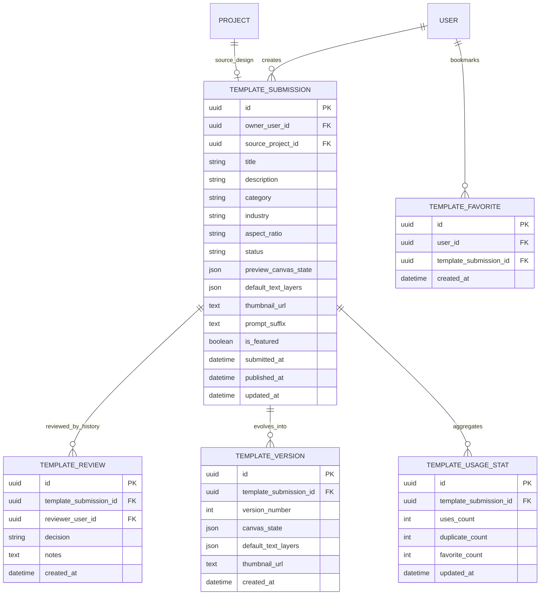

# Implementation Plan: Template Marketplace & Community Templates

## Related docs

- [Strategic Roadmap](../../business/roadmap_2026/strategic_roadmap.md)
- [System Architecture](../../architecture/system-architecture.md)
- [Data Model Overview](../../architecture/data-model.md)
- [Platform Hardening Plan](../platform-hardening/implementation-plan.md)

## 1. Requirements & Constraints

- **REQ-001**: Existing system templates must continue to work without migration pain for current users.
- **REQ-002**: Users must be able to submit their own designs as marketplace templates.
- **REQ-003**: Community templates require moderation before becoming public.
- **REQ-004**: Template ownership, publication state, and usage stats must be modeled explicitly.
- **REQ-005**: Frontend must distinguish between system templates, user-owned templates, and public community templates.
- **SEC-001**: Only the owner may edit or withdraw their unpublished submission.
- **SEC-002**: Only admins/moderators may approve, reject, or feature submissions.
- **SEC-003**: Template payloads must be validated server-side before publication.
- **CON-001**: Current `templates` table should remain readable during transition.
- **CON-002**: Marketplace implementation should be incremental; phase 1 is architecture/schema preparation.
- **CON-003**: Asset URLs and thumbnails should continue using object storage, not database blobs.

## 2. Proposed Product Scope

### Phase A — Community Submission MVP
- user can publish a project as a template submission
- admin can review and approve/reject
- public users can browse approved community templates

### Phase B — Marketplace Quality Layer
- featured templates
- favorites/bookmarks
- usage/download counters
- industry/category filters

### Phase C — Creator Ecosystem
- creator profile
- template versioning
- moderation notes/history
- payout/reward hooks if monetization is added later

## 3. Recommended Data Model Direction

### Recommended approach

Keep the existing `templates` table for **system templates** and introduce dedicated marketplace tables instead of overloading one table with all concerns.

### Why

- system templates and user submissions have different lifecycles
- moderation metadata does not belong in the current minimal table
- easier rollback if community marketplace scope changes
- cleaner ownership, audit, and analytics boundaries

## 4. Target ERD

## 5. Publication State Model

### `TemplateSubmission.status`

Recommended states:
- `draft`
- `submitted`
- `in_review`
- `approved`
- `rejected`
- `published`
- `archived`

### Notes

- `approved` and `published` may be collapsed into one state in MVP if moderation workflow stays simple.
- `archived` is useful for creator withdrawal or admin takedown without hard delete.

## 6. Database Changes

### New tables

| Table | Purpose |
|---|---|
| `template_submissions` | root marketplace entity |
| `template_reviews` | moderation decisions and notes |
| `template_versions` | optional editable revision history |
| `template_favorites` | user bookmarks |
| `template_usage_stats` | aggregated counters |

### Existing table kept

| Table | Role after migration |
|---|---|
| `templates` | system-owned curated templates only |

### Index recommendations

- `template_submissions(status, category)`
- `template_submissions(owner_user_id)`
- `template_submissions(published_at desc)`
- unique `(user_id, template_submission_id)` on favorites
- unique `(template_submission_id, version_number)` on versions

## 7. API Design

### Creator-facing endpoints

- `POST /api/template-submissions/` — create submission from a project
- `GET /api/template-submissions/mine` — list own submissions
- `GET /api/template-submissions/{id}` — get submission detail
- `PUT /api/template-submissions/{id}` — edit draft submission
- `POST /api/template-submissions/{id}/submit` — send to moderation
- `POST /api/template-submissions/{id}/withdraw` — archive/withdraw submission

### Public endpoints

- `GET /api/community-templates/` — browse published templates
- `GET /api/community-templates/{id}` — detail page
- `POST /api/community-templates/{id}/favorite` — favorite template
- `DELETE /api/community-templates/{id}/favorite` — unfavorite template
- `POST /api/community-templates/{id}/use` — duplicate/use template in editor

### Moderator/admin endpoints

- `GET /api/admin/template-submissions/queue` — moderation queue
- `POST /api/admin/template-submissions/{id}/approve`
- `POST /api/admin/template-submissions/{id}/reject`
- `POST /api/admin/template-submissions/{id}/feature`
- `POST /api/admin/template-submissions/{id}/unfeature`

## 8. Backend Implementation Steps

### Phase 1: Schema foundation

| Task | Description | File(s) | Completed |
|------|-------------|---------|-----------|
| TASK-001 | Add new SQLAlchemy models for submission, review, favorite, usage stats. | `backend/app/models/` | |
| TASK-002 | Add Alembic migration for marketplace tables and indexes. | `backend/alembic/versions/<revision>_template_marketplace_foundation.py` | |
| TASK-003 | Add Pydantic schemas for create/update/review/list payloads. | `backend/app/schemas/` | |

### Phase 2: Creator workflow

| Task | Description | File(s) | Completed |
|------|-------------|---------|-----------|
| TASK-004 | Add endpoint to publish an existing project as template submission. | `backend/app/api/template_submissions.py` | |
| TASK-005 | Validate required canvas structure, title, category, and thumbnail. | `backend/app/services/template_submission_service.py` | |
| TASK-006 | Persist preview snapshot and derived text-layer defaults from project canvas. | `backend/app/services/template_submission_service.py` | |

### Phase 3: Moderation workflow

| Task | Description | File(s) | Completed |
|------|-------------|---------|-----------|
| TASK-007 | Add moderation queue endpoints. | `backend/app/api/admin_template_submissions.py` | |
| TASK-008 | Record approve/reject decision history. | `backend/app/services/template_review_service.py` | |
| TASK-009 | Promote approved templates into public listing state. | `backend/app/services/template_review_service.py` | |

### Phase 4: Public marketplace flow

| Task | Description | File(s) | Completed |
|------|-------------|---------|-----------|
| TASK-010 | Add public listing/filter endpoint. | `backend/app/api/community_templates.py` | |
| TASK-011 | Add favorite endpoint and usage counters. | `backend/app/api/community_templates.py`, `backend/app/services/template_metrics_service.py` | |
| TASK-012 | Add duplicate/use-template flow into project creation. | `backend/app/api/community_templates.py`, `backend/app/api/projects.py` | |

## 9. Frontend Changes

### Creator UX
- add `Publish as Template` action in editor or project card
- add creator form: title, description, category, industry, thumbnail
- add `My Templates` page for submission status tracking

### Public UX
- add community template tab or route in template browser
- add favorites/bookmark toggle
- add badges: featured, approved, creator-owned

### Admin UX
- simple moderation queue page
- approve/reject modal with notes

### Files likely affected
- `frontend/src/components/templates/TemplateBrowser.tsx`
- `frontend/src/components/editor/EditorTopBar.tsx`
- `frontend/src/app/projects/page.tsx`
- `frontend/src/app/templates/page.tsx`
- `frontend/src/lib/api/`
- `frontend/src/store/`

## 10. Migration Strategy

### Recommended rollout

1. keep current `templates` endpoint unchanged
2. add new community-template endpoints alongside it
3. expose marketplace UI behind feature flag if needed
4. later unify browsing experience in frontend once both sources are stable

### Why this rollout is safer

- avoids breaking existing create flow
- keeps current template seeding/tests stable
- lets moderation/admin tools evolve independently

## 11. Testing

| Test | Type | File |
|------|------|------|
| TEST-001 | pytest model/API | `backend/tests/test_template_submissions.py` |
| TEST-002 | pytest moderation | `backend/tests/test_template_reviews.py` |
| TEST-003 | pytest metrics | `backend/tests/test_template_usage_stats.py` |
| TEST-004 | Playwright creator flow | `frontend/tests/e2e/template-submission.spec.ts` |
| TEST-005 | Playwright public browse/use flow | `frontend/tests/e2e/community-templates.spec.ts` |

### Minimum acceptance criteria

- creator can submit project as template
- reviewer can approve or reject submission
- approved template appears in public list only after approval
- user can use approved template to create a project
- existing system templates continue to load unchanged

## 12. Risks & Assumptions

- **RISK-001**: Overloading the current `templates` table would create lifecycle ambiguity.  
  **Mitigation**: keep system templates and community templates separate.
- **RISK-002**: Community submissions may contain poor-quality or unsafe content.  
  **Mitigation**: mandatory moderation and validation before publication.
- **RISK-003**: Template canvas payloads may drift with editor schema changes.  
  **Mitigation**: reuse `canvas_schema_version` strategy from platform hardening work.
- **ASSUMPTION-001**: A project can be used as the source artifact for marketplace submissions.
- **ASSUMPTION-002**: Initial moderation can be done by internal admin only, without creator messaging automation.

## 13. Recommendation

If this feature enters implementation soon, the first coding milestone should be:

1. add schema foundation,
2. add creator submission endpoint,
3. add basic moderation queue,
4. ship public read-only listing after approval flow is stable.

This keeps the rollout controlled and prevents marketplace complexity from leaking into the current curated template system too early.
